<h1>Generative AI building blocks</h1>

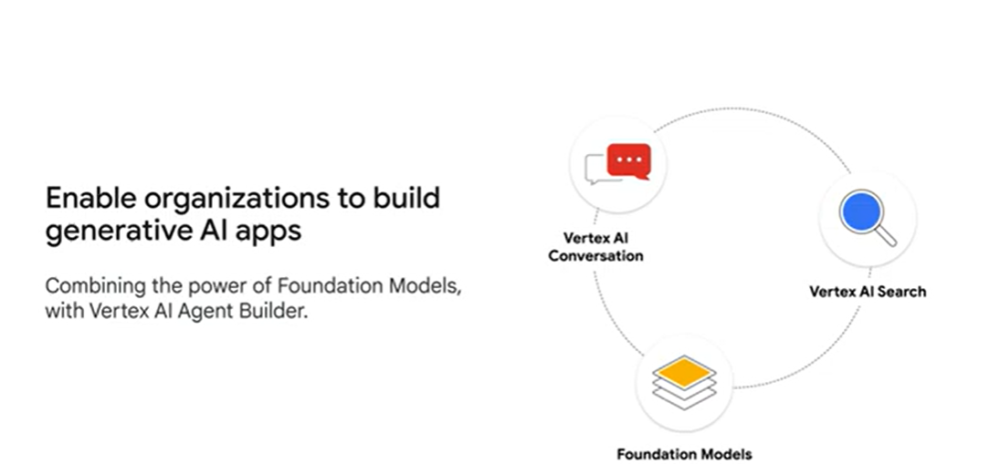
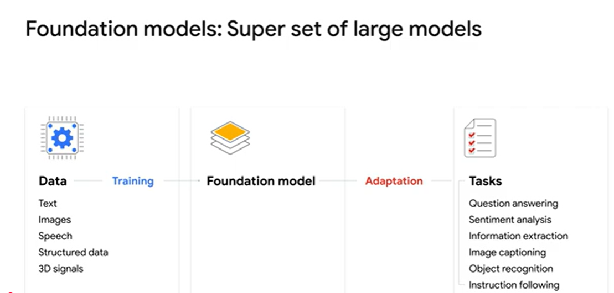

<b>Vertex AI Conversation</b> is a type of artificial intelligence that can simulate human conversation.
With Vertex AI Conversation you can answer complex questions out-of-the-box and easily add transactional capabilities, 
such as multi-turn conversations that build upon context, and completing API transactions.

<b>Vertex AI Search </b>is an offering from Google Cloud that lets organizations quickly build generative AI powered search engines for customers and employees.
You can easily customize these results according to your business needs, such as responding to single independent queries with a lot of results, and fine-grain control over results ranking.

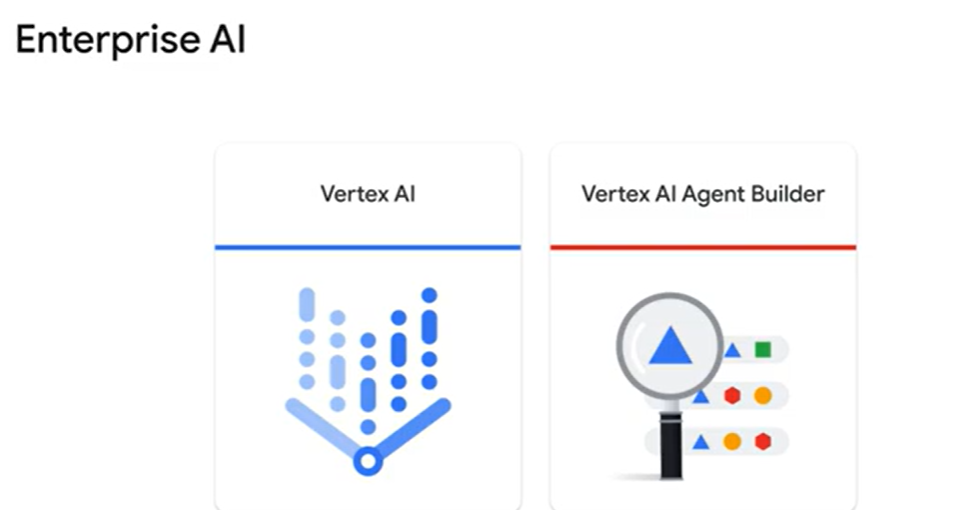

<b>Vertex AI </b>is an end-to-end Machine Learning platform that allows you to serve and tune Foundational Models to meet your customer’s specific needs.

<b>Vertex AI Agent Builder</b> which enables fast application development leveraging the power of search, immersive conversational experiences and foundation models with enterprise controls.

You can build Generative AI experiences for external users on your websites, or internal enterprise or technical applications.

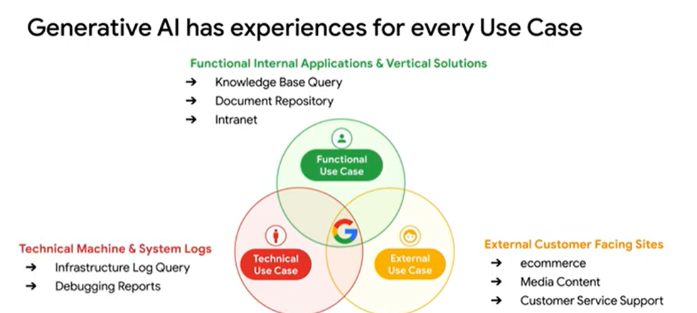

<b>External Use Cases </b>that are scoped around servicing customers external to the Enterprise, for example, ecommerce, Media Serving, and Customer Service Support.

<b>Functional Use Cases</b> that are scoped around servicing internal applications and vertical solutions, typically around knowledge workers, such as Knowledge Bases, Document Repositories and Intranets.

<b>Technical Use Cases</b> that are scoped around servicing machine generated data and systems automation, including Infrastructure Logging and Debugging reports.

<h2>Google has two main types of Generative AI products, consumer and enterprise products</h2>

There are <b>consumer</b> products such as Google AI Studio, previously known as Maker Suite, which is a browser-based IDE for prototyping with
generative models, and the Gemini app, previously known as Bard, a chat application that answers user questions and assists them with tasks.

Both the Gemini app and Google AI Studio are consumer products that use Gmail as the login, and the
data that you submit when interacting with these products is owned by Google and used to improve the Gemini model.

 Google Cloud builds <b>enterprise</b>  products.

Vertex AI and Vertex AI Agent Builder cater to enterprises that need to control access to data.
And although Vertex AI includes LLMs such as Gemini, your data is not collected or used to train the models.

Why is this important?

Several large organizations have shut off their employees’ access to consumer AI products because they were concerned about the questions their employees were asking and the information they were sharing.
Using enterprise products gives you control of your data.You don’t want other organizations to know what data your LLMs are being trained on, or to have access to that data, or to know about the output.
Fraud and security are really important.

Google Cloud provides solutions for these concerns, and gives you access to state of the art models as they roll out, providing easy integration into your existing data and applications without having to build new connections.

<h4>So, let’s talk about what differentiates Vertex AI and Vertex AI Agent Builder.</h4>

<b>Vertex AI</b> provides Generative AI APIs that provide end-to-end support across multiple modalities.

<b>Vertex AI Studio</b>, developers can tune and deploy foundation models for their use cases by using a simple web interface.

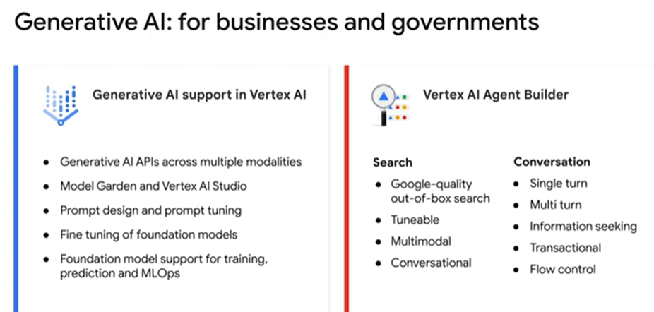
<h3>if you are an Enterprise looking for a Generative AI solution, how do you decide which product to use?</h3>

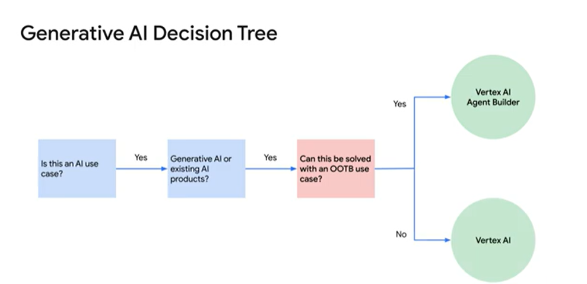
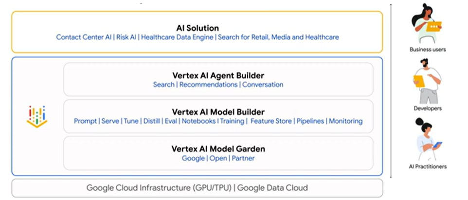

<h1>Different solutions within Vertex AI Agent Builder for search and recommendations.</h1>

With access to Google Cloud’s no-code conversational and search tools powered by foundation models, organizations can get started with a few clicks.
They can quickly build high-quality experiences that can be integrated into their applications and websites.

There are three key elements to Vertex AI Agent Builder: 

<ul>
<li><b>Search</b> where you can build a Google-quality search engine on your own data and embed a search bar in your web page or application.</li>
<li><b>Personalized self-serve customer experiences,</b> such as building a state-of-the-art recommendation engine on your own data that can suggest content similar to the content that the user is currently viewing.</li>
<li><b>Vertex AI Agents,</b> which complements Dialogflow CX with an LLM-based chatbot trained on links or documents, so that your end users can have conversations about the content.</li>
</ul>

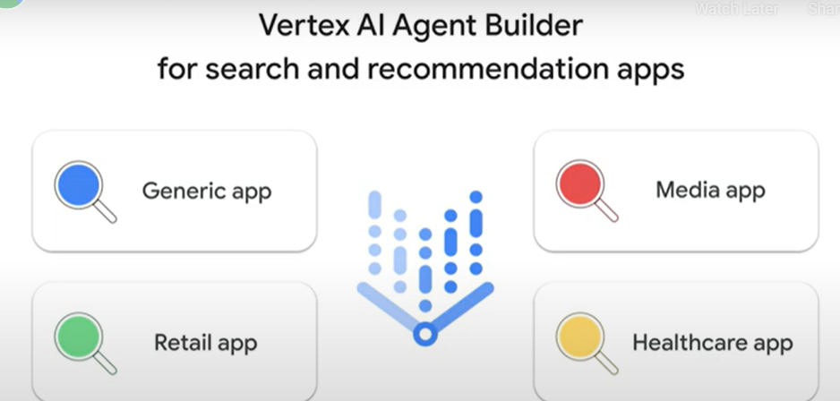
<h3>our key types of apps in Vertex AI Agent Builder:</h3>
<ol>
<li><b>Generic apps</b> enable you to search and recommend websites, structured data, and unstructured data, such as documents.</li>
<li><b>Media apps</b> allow you to search and recommend media content, such as movies, podcasts, music, and more.</li>
<li><b>Retail App</b>  enables you to provide search capabilities for your online stores.</li>
<li><b>Healthcare apps</b> allow you to search your data in Fast Healthcare Interoperability Resources, or FHIR format.</li>
</ol>

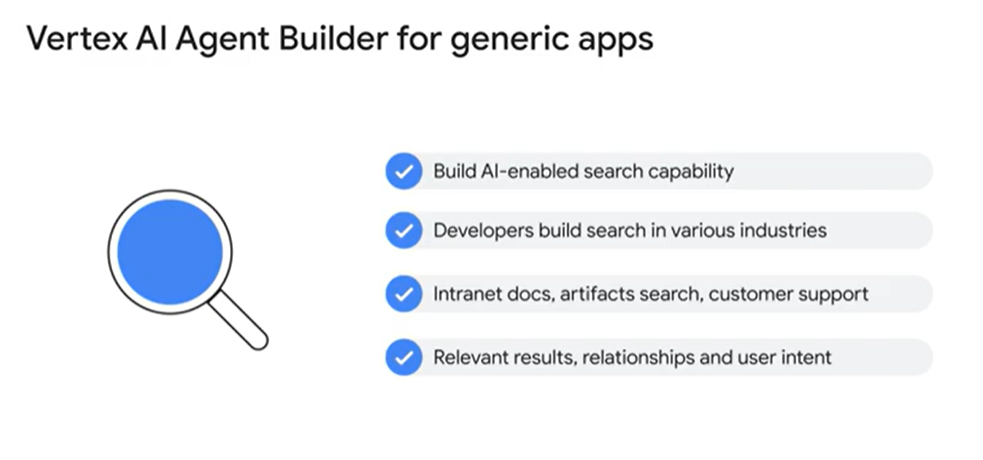
<h3>Vertex AI Search.</h3>
- Used to Build an AI-enabled search capability and embedded vertical solution.
- Developers and Data Scientists from a wide range of industries have started to use Vertex AI
- Search… for use cases such as Intranet document, Artifacts Search, Customer Support, and Manufacturing Inventory Search.
- Vertex AI Search for generic apps helps deliver more relevant results than traditional keyword-based search techniques by using Natural Language processing and machine learning techniques.

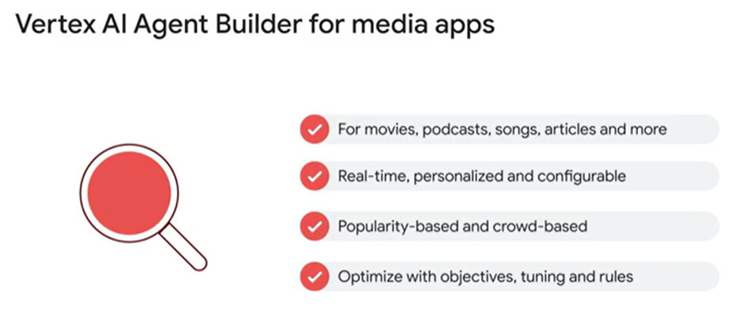
<h3>Vertex AI Agent Builder for media apps</h3>
- It works great for media resources such as movies, podcasts, songs, articles and more.
- It’s a real-time, personalized and configurable service, that allows you to reduce friction when delivering omnichannel experiences.
- It offers several machine learning popularity-based and crowd-based algorithms to search and recommend content.
- As well as different metrics to optimize results, so that you can improve conversion, click-through rates, watch duration time and other metrics, with custom configuration and recurring tuning to provide best up-to-date results.

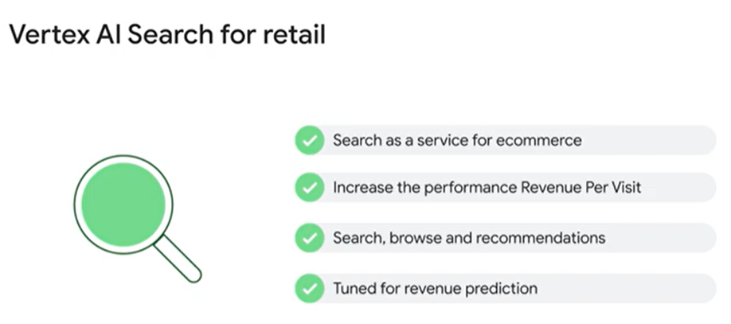
<h3>Vertex AI Search for retail</h3>
- It’s industry-specific for ecommerce and external catalog services optimized for ecommerce transactions.
- Suppose you’re an ecommerce business looking to use a fully-managed service to increase the performance of the Revenue Per Visit of your digital properties.
- Vertex AI Search for retail is an Industry solution for retailers and ecommerce; providing personalized product search, browsing, and recommendations.
- It is tuned for retail through large language models, which means it is not tuned for clicks or conversion prediction, but rather revenue prediction with access to Google shopping data.

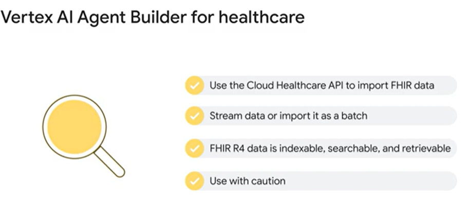
<h3>Vertex AI Agent Builder for healthcare</h3>
- Use the Cloud Healthcare API to import FHIR data into a data store.
- Use the Cloud Healthcare API to import FHIR data into a data store.
- Vertex AI Search supports a subset of FHIR R4 resources as indexable, searchable, and retrievable.Resources include allergies, and intolerances, condition, diagnostics, studies, medications, observations, patients procedures and more.
- Use with caution: End users are not allowed to use it for clinical purposes.

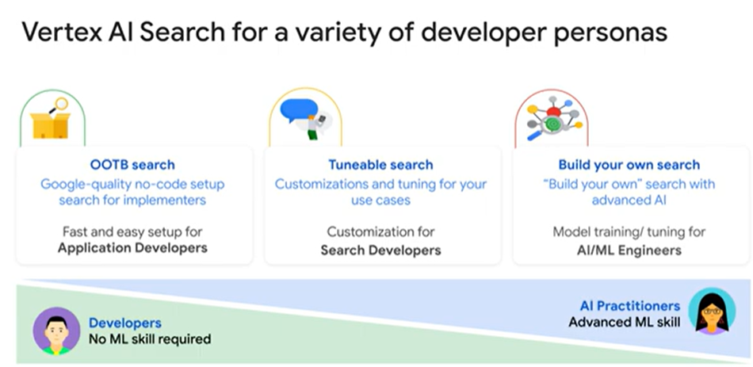
<h5>Google Cloud’s out-of-the-box search products are fast and easy to set up even if your application developers have no Machine Learning experience.</h5>
<h5>To develop a customized or tuned search product, your developers should have a firm understanding of Machine Learning.</h5>
<h5>Create a fully custom built Search product, you will require AI practitioners with advanced machine learning abilities in model training and tuning.</h5>

<h2>Vertex AI overview</h2>

Vertex AI is Google Clouds end-to-end platform for Generative AI. Vertex AI helps developers and data science teams, across businesses, fast track Generative AI model development and deployment.

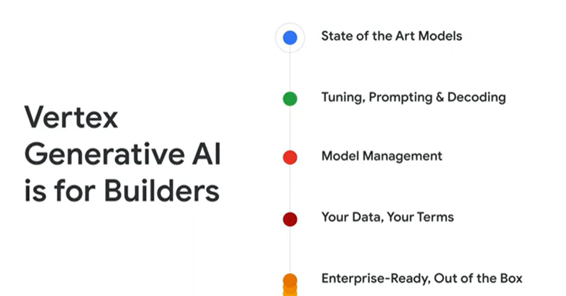

You can accelerate time to value, ensure security, and maximize reliability, by building on top of Google Clouds world class infrastructure and services.

These include: 

- State of the Art Models, built on Google research and continuous innovation.
- Tuning, Prompting and Decoding - You can customize LLMs for your domain and use case, optimize your queries, and adapt your model to act in a certain way.
- Model Management - enables you to leverage Vertex AI’s rich MLOps capabilities for model evaluation, model management and deployment.
- It’s your data, on your terms - You can control and protect your data at every step of training and deployment.
- It is all Enterprise-Ready, Out of the Box.

Vertex AI has been offering practitioners a convenient ML platform for training, deploying, and managing custom ML models for years.
Now, Google Cloud offers exciting tools to enable enterprises to build and deploy Generative AI solutions to fit their business needs.
Model Garden is a repository, where you can access Google Cloud’s state of the art foundation models, as well as third party and open source models.
Some models have been pretrained for specific tasks like translation, speech to text, image, video and natural language.
Model Garden helps enterprise practitioners discover models and launch their own AI projects.

<h1>The Vertex AI Model Garden</h1>

It gives you a single place to search, discover, and interact with enterprise-ready foundation models, task-specific solutions, open source and third party models.
You can choose the right model for your use case, ML expertise and budget.In Model Garden, you can initiate a variety of workflows.
You can: Use a model directly by calling it’s API.

Access the model directly in Jupyter Notebooks, through Vertex AI Workbench.
Or deploy the model through a training Pipeline.

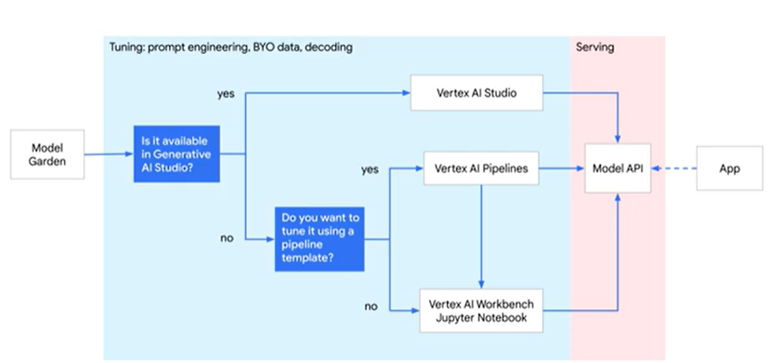

Task-specific solutions are pre-built models that are ready to use off the shelf, for natural language, vision, speech, Document AI, and other modalities.
Task-specific LLM prompts will take you to the Prompt Gallery within Vertex AI Studio.

<h1>Vertex AI Studio</h1>

With Vertex AI Studio, developers can tune models, enhance the model with their company’s data,
perform prompt engineering, and deploy foundation models for their use cases, through a simple user interface.You can test sample prompts, design your own prompts, and customize foundation models, to handle tasks that meet your application’s needs.

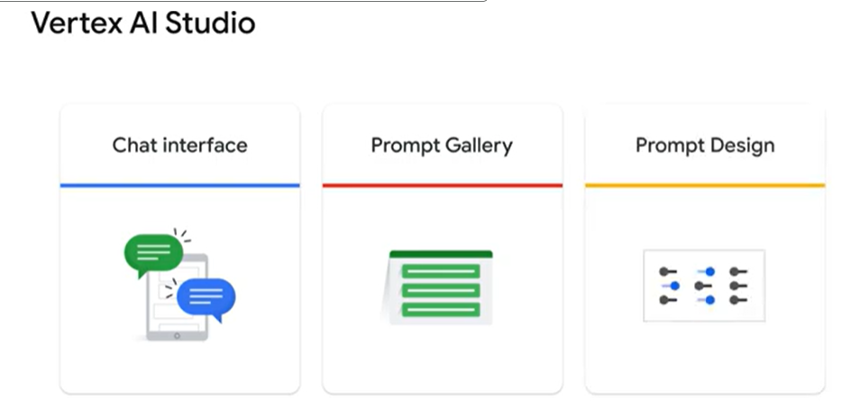
- A Chat interface to interact with models,
- A Prompt gallery to explore sample use cases,
- Prompt design studio to tune models

Once the model is ready, Google Cloud's off the shelf APIs, allow developers to easily call upon pre-trained models, to quickly solve real-world problems.

<h1>Introduction to  Foundation Models</h1>

Google Cloud’s Foundation models all rely on <b> PaLM or Gemini.</b>

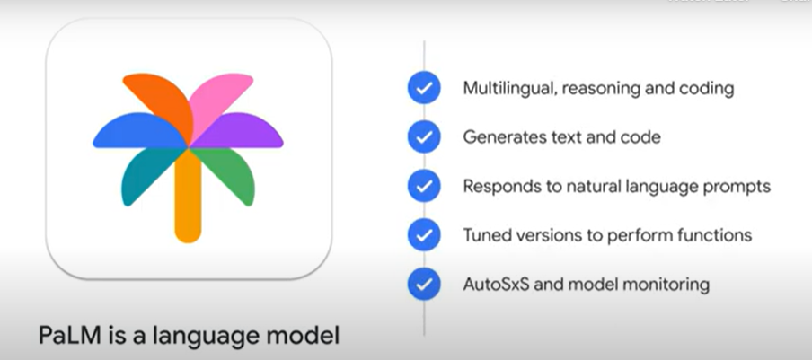

<b>PaLM </b>is a state-of-the-art language model with improved multilingual, reasoning, and coding capabilities, that generates text and code in response to natural language prompts.

PaLM 2 also offers full support for MLOps services on Vertex AI, such as auto side-by-side comparison and model monitoring.

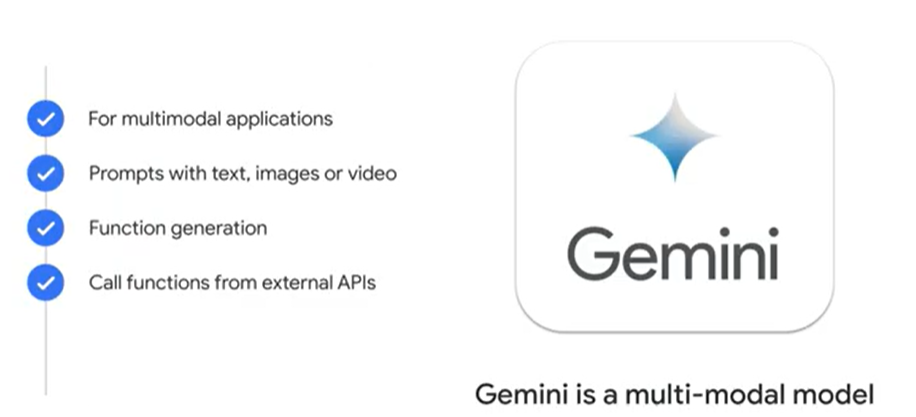

<b>Gemini</b> is Google’s all powerful multi-modal model.

Gemini models accept prompts that include, text, images, or video, and then returns a text response.Gemini also supports function calling, which lets developers pass a description of a function, and then the
model calls that function for you, allowing it to extend it’s capabilities with external APIs and services.

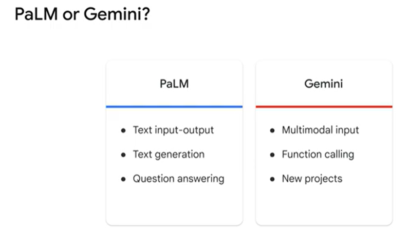

If you require a multimodal model you should use Gemini.Also, if you are starting new projects you should use Gemini, however at the time of this recording, all
the features and capabilities you have with PaLM are not yet available with Gemini, such as tuning, embeddings, and others.

- <h4>PaLM API for Text:</h4>
is fine-tuned for language tasks, such as classification, summarization, and entity extraction.

- <h4> API for chat: </h4>Is fine tuned for multi turn chat, where the model keeps track of previous messages in the chat and uses it as context for generating new responses.
- <h4>PaLM API for Text and Chat provides:</h4>
Custom language tasks in a few sentences, facilitating zero and few-shot prompting, with a gallery of pre-built prompts.

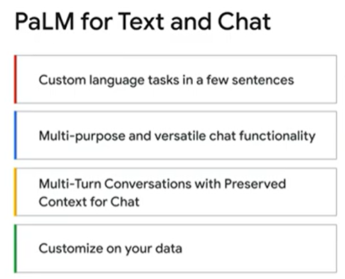

<b>Multi-purpose and versatile chat functionality</b>, which is an in-browser assistant to ask questions, summarize text, brainstorm ideas, and much more.

<b>Multi-Turn Conversations with Preserved Context for Chat.</b> : That means, your data is never shared, and model outputs are checked across 16 safety attributes, such as hate speech, toxicity, violence, obscenity, and weapons.

It's common to use the <b>Embeddings API</b> for Text, when searching documents or classifying text.The model generates numerical values, called text embeddings, that can help other models understand the context of the words within a document.
Embeddings API for Text, can extract semantic information from unstructured data, to improve recommendation engines, ad targeting systems, image classification and image search.

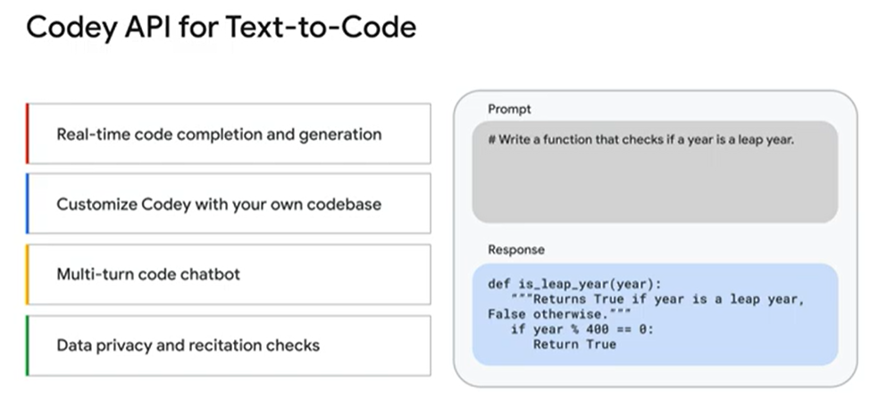

Another product is <b>Codey</b>, which accelerates software development, By providing real-time code completion and generation, with low latency code assistance,Your code will never be shared with Google or anyone else.

This code generation model supports multiple coding languages, including Go, Google Standard SQL, Java, Javascript, Python, and Typescript.

It enables a wide variety of coding tasks, helping developers to work faster and close skills gaps.

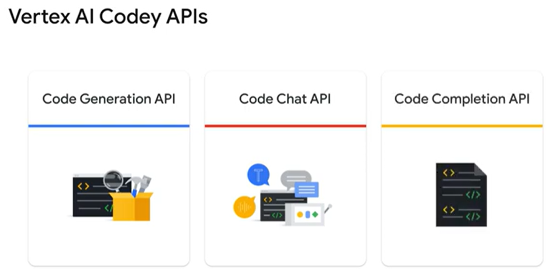
- <b> The code generation API</b> which generates code based on a natural language description of the desired code.For example, it can generate a unit test for a function.
- <b>The code chat API</b> which can power a chatbot to provide assistance with code-related questions.For example, you can use it to help with debugging code.
- <b>Code completion API</b> that provides code autocompletion suggestions as you write code. 

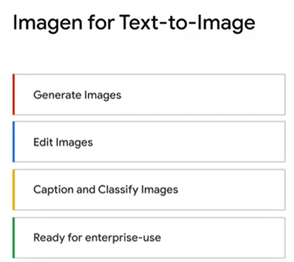

 Imagen is a vision model for image generation, editing, captioning, and question answer use cases.As part of your prompts, Gemini can take multiple images or a video and provide answers about your inputs, whereas Imagen can only take one image as input.

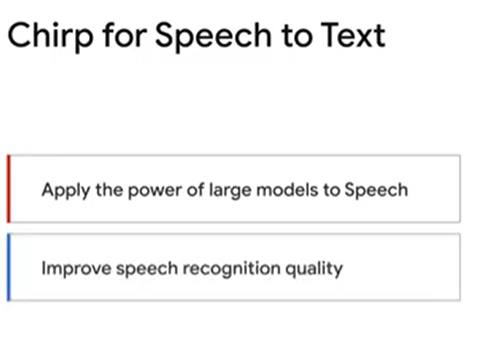

Chirp enables you to build voice-enabled applications for global audiences by: Applying the power of large models to Speech,
through self supervised training on millions of hours of audio, to create the first 2 billion parameter speech model.
Chirp also improves speech recognition quality, by achieving 98% accuracy on English, and over 300% relative improvement
in tail languages, bringing the quality of all the world’s languages closer to that of widely spoken languages.
And, you can now build conversational experiences in any language.
