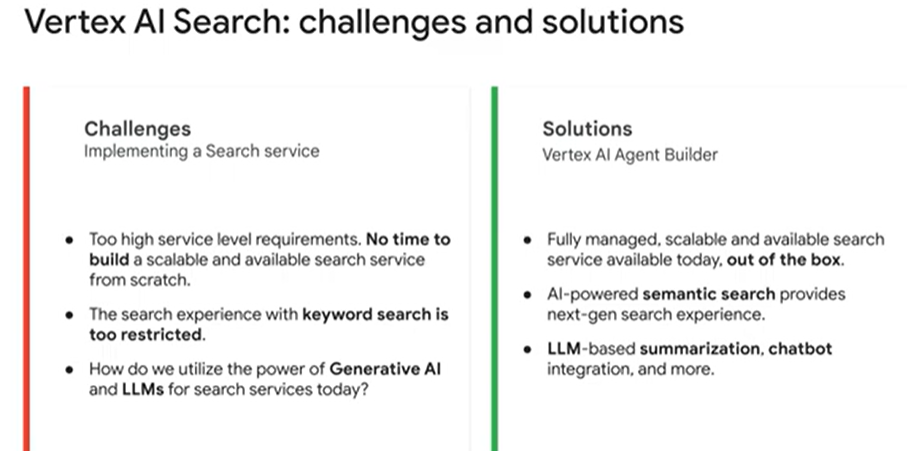
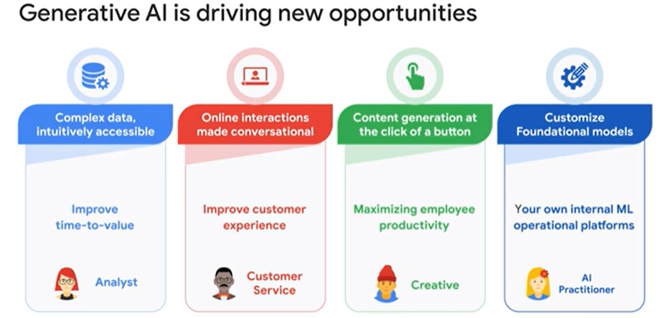
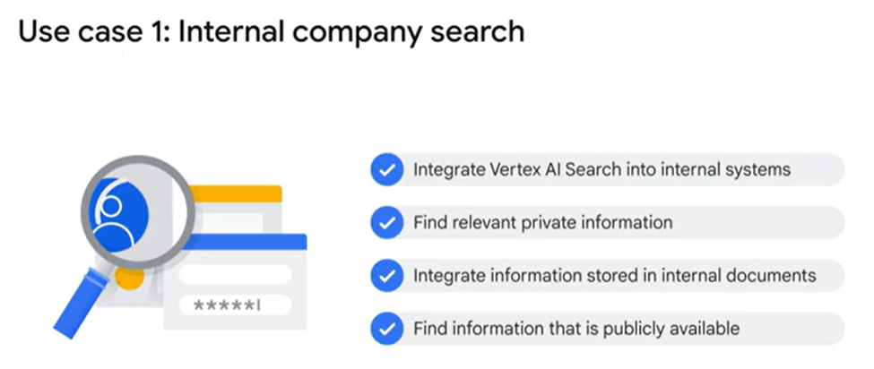

<h1>Vertex AI Search with Generative AI in more detail</h1>

There are three main challenges when implementing a search service for an enterprise.

<ol>
<li>The service level requirements for any enterprise search service is high.Most organizations <b>don’t have the time or budget to build service </b>
that is capable of handling large amounts of data in a wide variety of formats, all while being scalable and available 24 7.</li>
<li>The second challenge is that <b>traditional keyword search is too restricted</b>, especially for users who are familiar with AI powered search and recommendations on social media platforms and other apps. </li>
<li>how to take advantage of Generative AI and Large Language Models or LLMs, that are the pinnacle of information retrieval technology.</li>
</ol>

<h5>Vertex AI Agent Builder supports creating search engines and chat interfaces.</h5>

<b>Vertex AI Search</b> is an out of the box solution, which means you can deploy a fully managed search engine quickly.

Vertex AI Search provides LLM based summarization, multimodal search, and chatbot integration, utilizing the latest in Generative AI technology.

One of the greatest features of Vertex AI Agent Builder is its ease of use for developers.
This is driving new opportunities, with the added benefits of operational efficiencies, cost savings, and value creation.or any type of analyst, whether that's a business analyst or a market analyst, Vertex AI Search will improve time-to-value
as you take large corpora of complex data and are able to search, navigate, extract insights, and understand that information.
For example, LLMs can enable you to process market reports going back 30 years, and this is what could make the difference.

<b>For any type of analyst,</b> whether that's a business analyst or a market analyst, Vertex AI Search will improve time-to-value
as you take large corpora of complex data and are able to search, navigate, extract insights, and understand that information.

<b>For Customer Service operations</b> you can greatly improve the customer experience by making your online interactions more natural, conversational, and rewarding.

<b>When considering maximizing employee productivity</b> and creative solutions, the ability to generate content at the click of a button is a game-changer.

<b>And for the more sophisticated user,</b> like an AI practitioner that really wants to integrate systems into their existing platforms; the ability to 
integrate with Vertex AI and customize foundational models enables you to incorporate state of the art generative capabilities into your own internal platforms.

<h1>Use cases for Vertex AI Search: an intranet website search.</h1>

A simple prompt in the search field returns a variety of both internal and external resources in a single user interface.
Google Cloud wants to enable developers to imagine and build Generative Search Experiences for many Industry Applications.

<h5>That’s why with Vertex AI Search you can easily build a solution that includes: A conversational search field, A synthesized summary, With source citation and attribution built-in, And personal recommendations to further related data resources.</h5>

