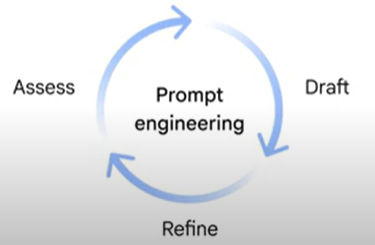
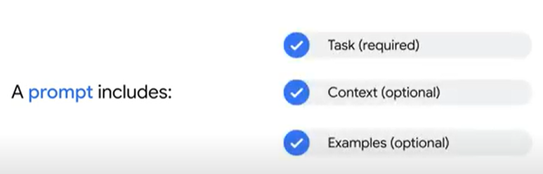
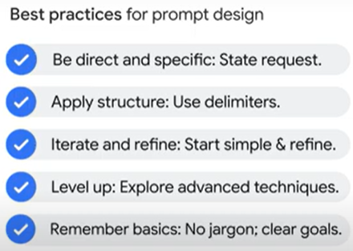
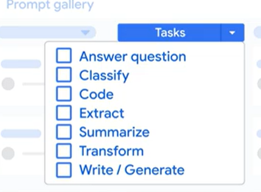
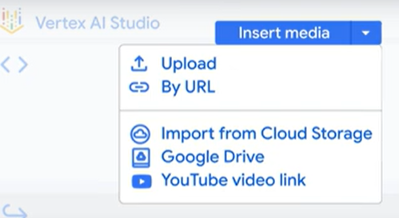
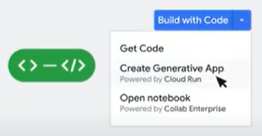
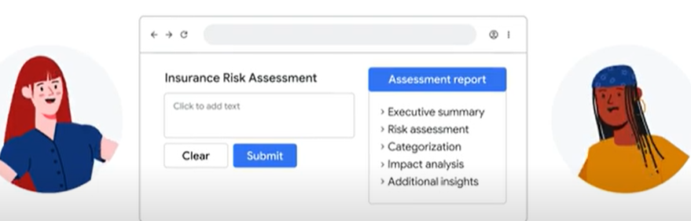

<h3>Everything starts with a prompt.</h3>

When you first use Vertex AI Studio, you tell the AI what you want to do. You can ask a question or give an instruction using natural language.
This is called a <b>prompt</b>.

<h5>Prompt is a natural language request to an AI model.</h5>

Once the model receives the prompt, it generates text, code, images, videos, music, and more.

<h5>This process of creating prompts to get the response you want is called prompt design.</h5>

<h5>And the iterative process of repeatedly drafting and refining prompts and assessing the model's responses is called prompt engineering.</h5>

Generally, a prompt includes one or more of the following key components-- task, context, and examples.

- 
<b>Task </b> It's what you want the model to do, core of your prompt.Depending on the complexity of the task, you may only need to provide the task itself.<b>This is called zero-shot prompting.</b>

- 
<b>Context, often called system instructions: </b>It provides background information, helping the AI model understand the request and generate a more relevant and accurate response.

- 
<b>Examples: </b>You may need to show the AI how to respond. <b>This is known as few-shot prompting.</b>

<b> Prompt gallery </b>providing search by keyword; filter them by modality, like text, image, and video; by task, like code, summarize, and classify; and by features, like prompting with YouTube videos and live streaming.

Vertex AI Studio supports <b>multimodal prompts and outputs.</b> She could embed multimedia elements in the prompt, such as documentation, like docs or PDFs, images, videos, and even YouTube videos.

Click the <b>Build With Code button and Create Generative App.</b>And voila, Vertex AI Studio automatically generates a web-based application.

