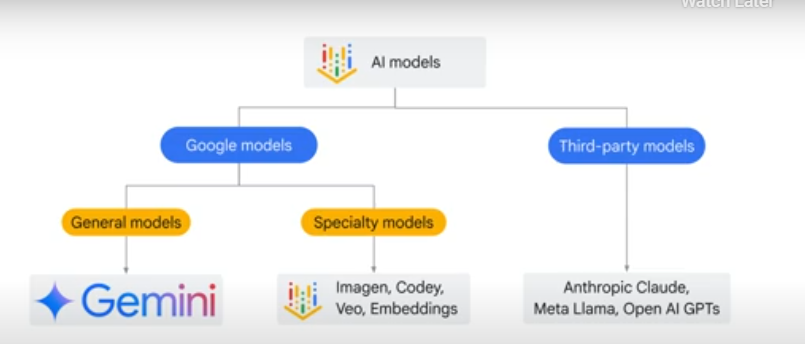
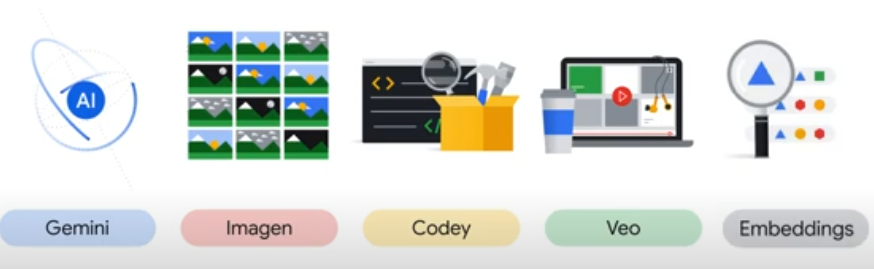
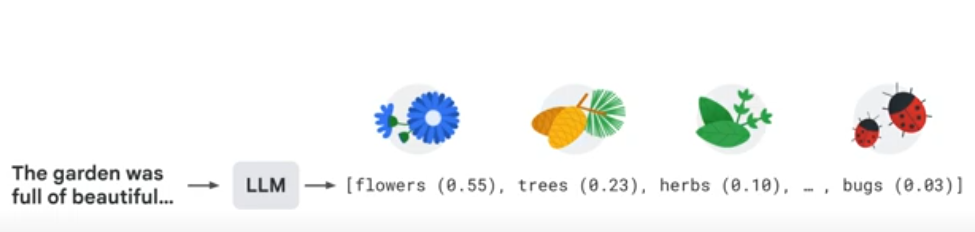
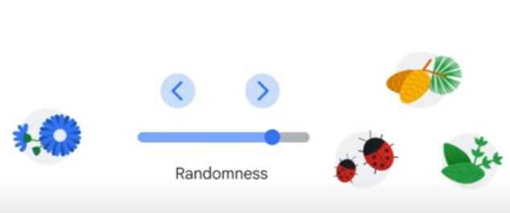
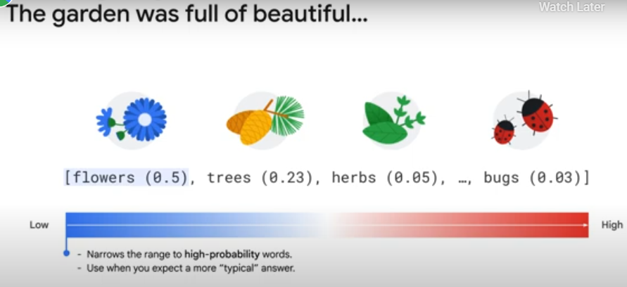
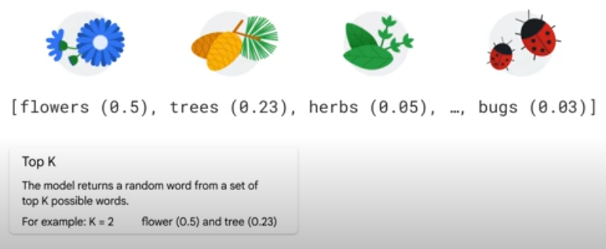
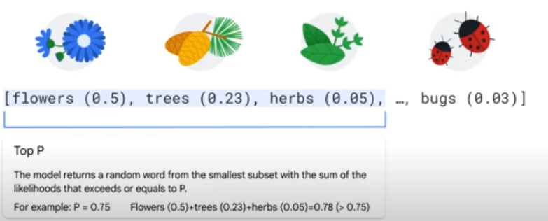

Vertex AI Studio provides you with access to both Google models and third-party models.

Now, how to choose the most appropriate Google model depends on your task.

- For <b>general</b> purposes and multimodal data use cases, the Gemini family, such as Gemini Flash or Gemini Pro, is your best option.
- Use Imagen for <b>image generation</b>
- Codey for <b>code completion</b>
- Veo for video processing
- Embeddings models for semantic search and data representation.

After model selection, the next step is to specify parameters, like temperature, top P, and top K.These parameters control the randomness of
These parameters control the randomness of the model's responses by adjusting how output tokens are selected.

The strategy used to select the next word impacts the outcome.

Always choosing the most probable word may result in repetitive texts and ignore other possibilities, while random sampling can yield unlikely responses such as bug.

By adjusting model parameters to control the degree of randomness, you can balance between predictability and variety, which enables you to find the ideal strategy for specific task.

<h4>Let's talk about the parameters mentioned earlier.</h4>

<b>Temperature</b> this is a number used to control the degree of randomness in generated output.
A low temperature setting narrows the range of possible output to words with high probability and that are more typical.

Another parameter is top K. Top K allows the model to randomly select a word from the top K most probable words where K equals a number.

Top P allows the model to return a random word from the smallest subset with the sum of likelihoods that exceeds or
equals P. For example, a P of 0.75 means sampling from a set of words that have a cumulative probability greater than 0.75.In this case, it would include three words-- flowers, trees, and herbs. This way, the size of the word set can dynamically increase and decrease according
to the probability distribution of the next word on the list. 
