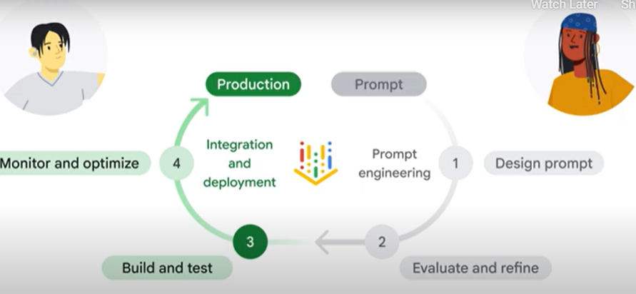
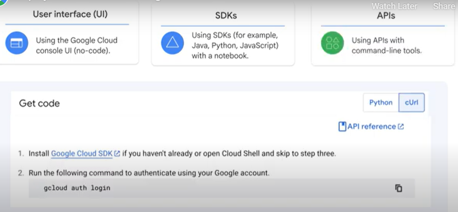
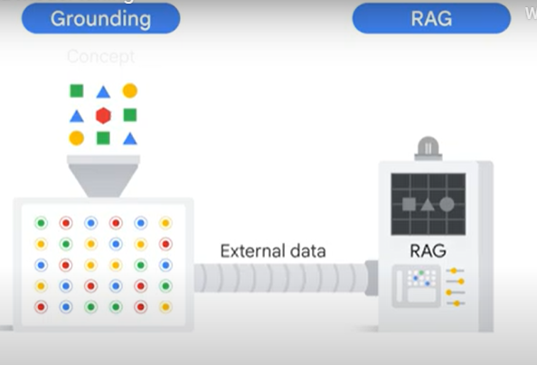
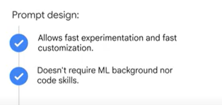
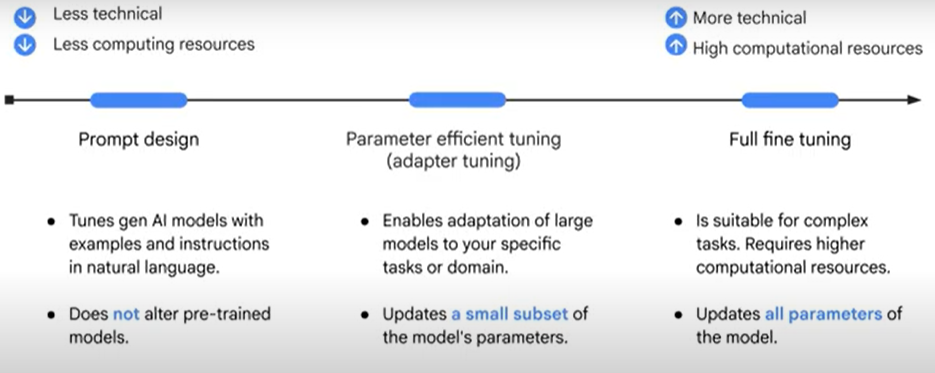
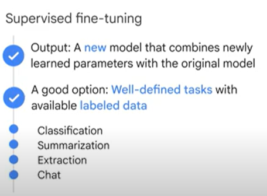
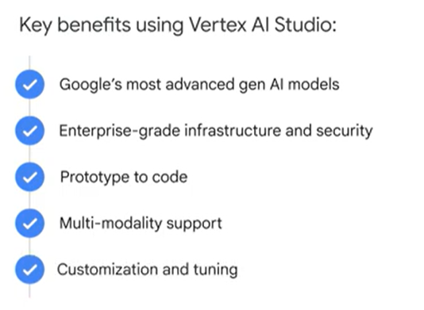

We are now at the second half of the prompt-to-production lifecycle, from built and test to monitor and optimize.

Bea and Ann quickly tested their ideas by simply clicking the Create Generative App button and built their own app.
However, what if they wanted to customize the application or integrate its feature into other applications?

Vertex AI Studio provides this flexibility by automatically generating the code for you.Besides the User Interface, or UI, which requires no code to explore and test prompts, Vertex AI Studio also provides two other approaches to access AI models.

<h5>Simply click Build with Code, and you'll find the code describing the prompt and its parameters.</h5>

- The first approach is through using predefined SDKs in different languages.You can open a notebook with the SDKs code of your preferred programming languages like Python.
- The other approach is through using APIs together with command line tools like cURL or client URL.

Integrated development environment with <b>Cloud Run and Cloud Shell</b> streamlines production and removes the need to worry about the underlying cloud architecture that supports application deployment.

And how can you ensure the gen AI models produce accurate results with updated information?

One way is through <b>grounding and RAG</b>, or <b>Retrieval-Augmented Generation.</b>

But grounding links AI models to reliable external data sources, ensuring that their responses are checked against the most current information.
And RAG is one way to implement grounding.

Think of grounding as a fact-checker that prevents outdated and wrong information.

<h3>Model tuning</h3>

Model tuning is another way to enhance gen AI accuracy by providing the model with the training data set a specific downstream task examples.

So when constructing your prompt, you can now opt to ground the results either through Google real-time 
search for the most current information or your own data to instruct the AI with field-specific knowledge.

You have different options to customize and tune a generative AI model, ranging from less technical methods, like prompt You are already familiar with prompt design, which lets you tune a gen AI model with examples and instructions in natural language.

<b>Remember that prompt design does not alter the parameters of the AI model.</b>Instead, it improves the model's ability to respond appropriately by guiding it how to react.

- 
For more complex tasks that require tailored results, consider customizing an AI model with either <b>parameter-efficient tuning or full fine tuning.</b>Parameter-efficient tuning, also called adapter tuning, enables efficient adaptation of large models to your specific tasks or domain.

- <b>Full fine tuning</b> is ideal for highly complex tasks, as it can achieve higher quality results.However, this method requires more computational resources for both tuning and serving, as it updates all the model's parameters.

<h3>Supervised fine tuning </h3>

Supervised fine tuning improves model performance by teaching it a new skill. It uses data containing hundreds of labeled examples to teach the model to mimic a desired behavior or task.

Supervised fine tuning is a good option for well-defined tasks with available labeled data.

