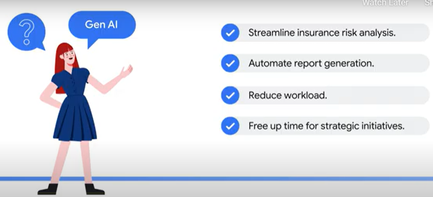
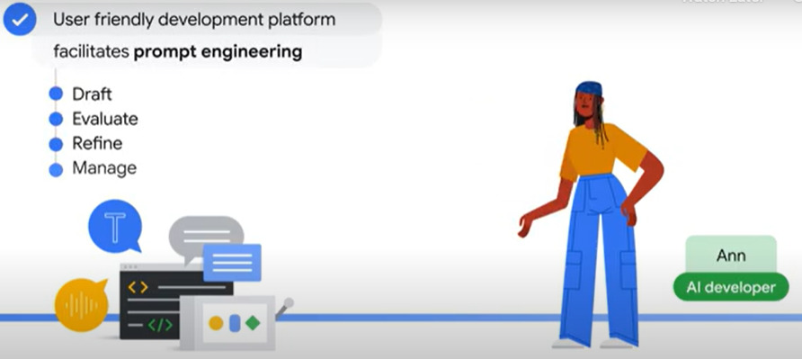
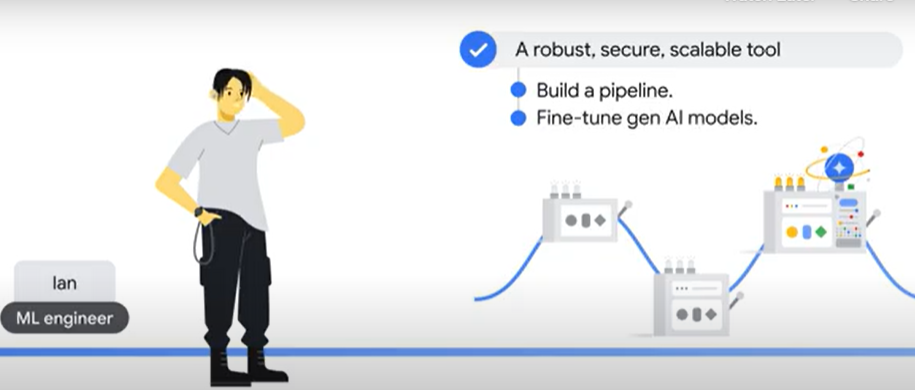
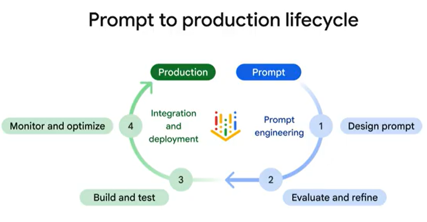

What if there are tools to help interact with AI models and turn your gen AI ideas into production?

<h5>Business Analist</h5>

As an <b>AI developer</b>, Ann seeks a user-friendly development platform that facilitates prompt engineering from drafting, evaluating, and refining to manage prompts.

As an <b>ML engineer</b>, Ian requires a robust, secure, and scalable tool that builds a pipeline to deploy prompt to production and fine tune gen AI models for optimal results.

<h2>What is Vertex AI Studio?</h2>

Vertex AI Studio is your gateway to generative AI. It's a development environment for developers and nondevelopers to interact with gen AI models, prototype their ideas, and launch them into production.

Envision Vertex AI Studio as an innovative workshop where gen AI models are your raw materials. Vertex AI Studio toolkit is your arsenal for shaping and refining these models into powerful AI solutions.

