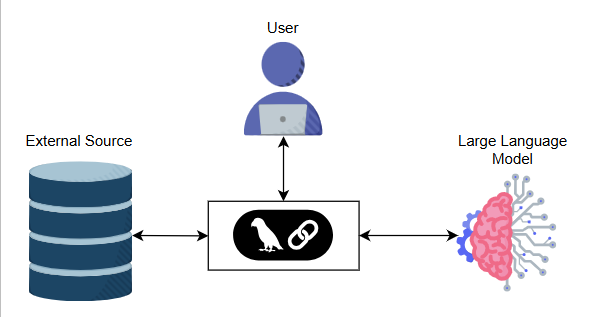
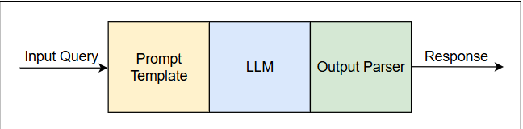
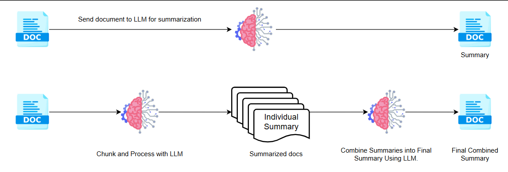
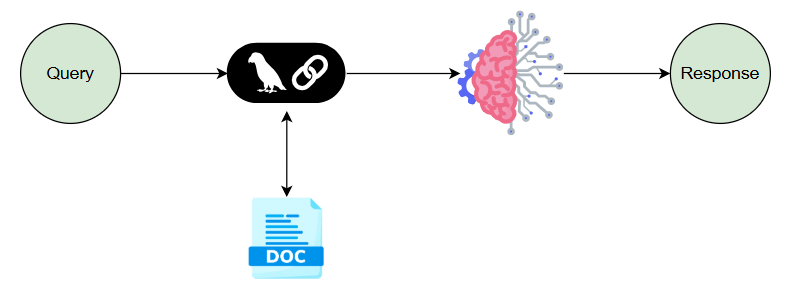
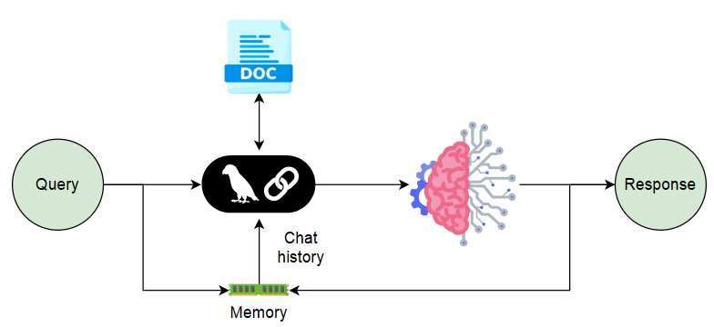
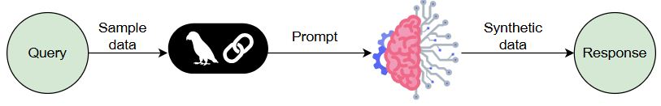
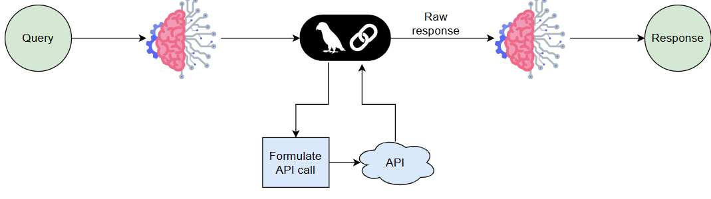

<h1>What Is a Language Model?</h1>

<b>Language model</b>is a statistical model that learns the probability of a sequence of words appearing in a text. 
It's trained on a large amount of text data and learns patterns and relationships within that data. The core task of a 
language model is to predict what comes next, based on the preceding text. It might predict the next word, the next character, or even the next sentence.

<h5>LMs power many features you might interact with regularly:</h5>
<ul>
<li><b>Spell checkers: </b>They identify and suggest corrections for spelling errors.</li>
<li><b>Grammar checkers: </b>They identify and flag grammar mistakes in your text.</li>
<li><b>Text generation: </b>some LMs can generate short phrases and sentences.</li>
<li><b>Chatbots: </b> Simple chatbots might use a language model for generating sentences.</li>
</ul>
<h3> Large language models (LLMs)</h3>

<b>LLM</b> are like the supersized version of the basic language models we just talked about. They are trained on much larger datasets, which allows them to do things way beyond a single next-word guess.

<ul>
<li><b>Data: </b> LLMs are trained on an enormous amount of text.</li>
<li><b>Parameters: </b>Inside the model are millions (or billions) of adjustable “knobs.” The more knobs, the finer the model can tune its understanding and output.</li>
</ul>

LLMs can do all of the following and more:

- Summarize a 10-page article into a concise paragraph
- Translate text between multiple languages
- Generate new content like blog posts, stories, or even code snippets
- Analyze text and highlight sentiment or important points

<h1>What is LangChain?</h1>

<b>LangChain </b> is like a toolkit for building applications with LLMs.Think of it as a set of instructions that helps you guide and connect with an LLM to build something bigger and more useful.

<h4>LangChain helps in a few key ways</h4>
<ol>
<li>It allows us to chain or connect multiple LLM actions together, enabling us to perform complex tasks. </li>
<li>It lets LLMs access and use information outside of their built-in knowledge. This is essential when working with things like current news or specific data.</li>
</ol>

With LangChain, you can create a wide range of applications. Chatbots with human-like conversations, AI tools that can help you write or research, or data analysis tools that can provide powerful insights. The possibilities are truly extensive.

<h3>Free LLMs with the Groq API</h3>

Groq provides very generous access to most models in the free tier!

<h3>How does LangChain work?</h3>

Imagine you want to cook a complex recipe. You wouldn’t just dump all the ingredients together and hope for the best, right? You’d likely follow a recipe with specific steps, where each step builds on the previous one. LangChain does something similar with LLMs.

Instead of directly asking an LLM to do everything at once, LangChain allows you to:

- <b>Define a chain of actions:</b>You can create a sequence of actions that the LLM will execute. Each action might be a different task, like summarizing text, translating content, or answering questions based on a specific source of information.
- <b>Connect different tools:</b>
<ul>
<li> LLMs: To generate text, analyze, translate, etc.</li>
<li>Data sources: To load information from text files, databases, or APIs.</li>
<li>Other utilities: Like web search or even math tools</li>
</ul>

- <b>Manage the flow of information:</b>LangChain acts as the orchestrator, ensuring that the output from one action becomes the input for the next action in the chain. This flow allows for complex operations that are beyond what a single LLM call could achieve.

A simple LangChain process is shown in the image above, where an Input Query (the user’s question or data) is first processed by a “prompt template.” The prompt template is a structured way of crafting the prompt so that the user’s input is clearly contextualized and formatted for the LLM (the core AI). After the LLM generates a response, that output goes through an “Output Parser,” which formats and cleans the response, ensuring any important information is extracted and presented in a user-friendly way.

Finally, the refined answer is returned to the user as the final “Response.” This chain highlights how LangChain handles input, manages interactions with the LLM, and formats the output, allowing for more structured and useful interactions than directly prompting an LLM.

<h3>Summarizing long documents</h3>

Picture a 100-page contract or a dense research paper. Nobody wants to wade through all those pages just to find the key points. If it’s a relatively short document (or you can handle it in one shot), simply pass the entire text in a single prompt to the LLM via LangChain. 

 However, when the document is large (or you have multiple documents), you often need to split them into manageable chunks, summarize each chunk, and then combine those summaries into one cohesive summary. In LangChain, you might:

- Chunk a big document into smaller pieces.
- Send each chunk to an LLM for individual summaries
- Combine those smaller summaries into a final, polished overview—again through the LLM or a custom combining step.

<h3>Question answering</h3>

Ever wished you could just ask a huge dataset a question like, “Which products had the highest returns last quarter?” and get an instant answer? LangChain can help with that! You can store your documents (product data or marketing reports) in a vector database. When a user asks a question, LangChain fetches the most relevant chunks from your data, passes them to the LLM, and returns a direct answer, like a little AI librarian pulling just the right books from the shelf.

<h3>Question answering</h3>

Have you ever talked to a chatbot that forgets what you just said? Frustrating, right? LangChain solves that with a robust memory feature. Imagine a customer service bot for a shipping company. First, it greets you and asks for your order number. That order number needs to stay in memory throughout the entire conversation. LangChain also offers multiple memory strategies, which we will look at later in this course.

<h3>Generating synthetic data</h3>

Sometimes you need extra data to train another AI model or create a sample dataset for testing. But real data can be scarce, expensive, or locked behind privacy regulations. LangChain can help generate synthetic user profiles, product descriptions, or conversation snippets. This is particularly handy for building or testing AI/ML applications without exposing sensitive real-world data. Also, because you’re not collecting real user data, you avoid certain privacy concerns and can generate large quantities cheaply.

<h3>Integrating with APIs</h3>

You need real-time weather data, stock prices, or up-to-the-minute sports scores.

A standard LLM might be limited by its training cutoff date, but LangChain and LangGraph can orchestrate calls to external APIs. You can build agentic workflows that parse a user’s request, decide it needs fresh data (e.g., the current temperature in Tokyo), call an external weather API, and then feed that data back into the LLM.

LangChain can then handle the JSON or structured response from the API, integrate it into a cohesive response, and show the user the final result.

