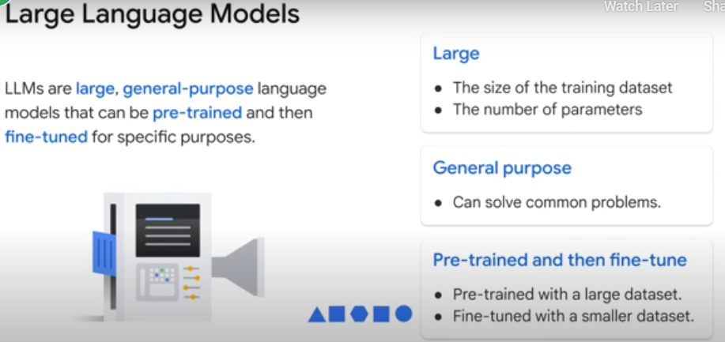
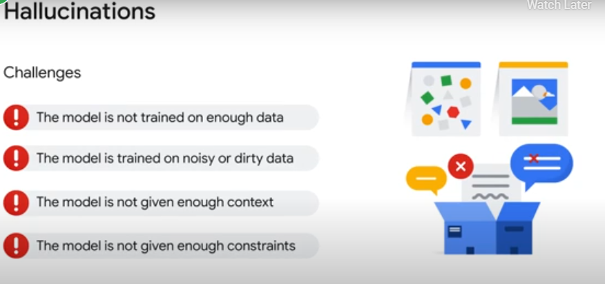
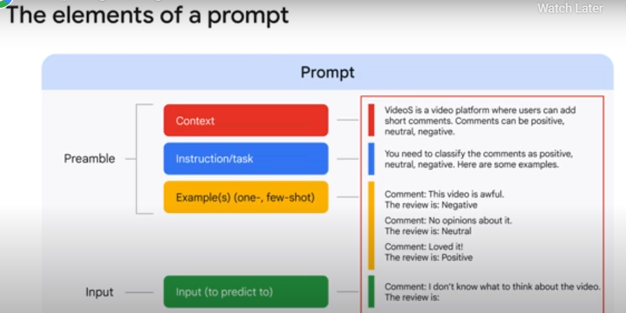

<h2>What is generative AI?</h2>

Generative artificial intelligence, which is commonly referred to as gen AI, is a subset of artificial intelligence 
that is capable of creating text, images, or other data using generative models, often in response to prompts.

By the way, a prompt is a specific instruction, question, or cue given to a computer program or user to initiate a specific action or response, but we examine this more later.

<h5>Gen AI models learn the patterns and structure from input training data and then create new data with similar characteristics.</h5>

<h2>What is  large language models?</h2>

Large language models refer to large, general-purpose language models that can be pre-trained and then fine-tuned for specific purposes.

Parameters are the memories and knowledge that the machine has learned during model training.

<h2>But how are LLMs trained?</h2>

When you submit a prompt to an LLM, it calculates the probability of the correct answer from its pre-trained model.

Pre-training an LLM involves feeding a massive dataset of text, images, and code to the model so that it can learn the underlying structure and patterns of the language.

In this way, the LLM works like a fancy autocomplete, suggesting the most common correct response to the prompt.

But sometimes the LLM gives a completely wrong answer. This is called a <b>hallucination</b>.

Hallucinations are words or phrases that are generated by the model that are often nonsensical or grammatically incorrect. This happens because LLMs can only understand the information they were trained on.

Ultimately, an LLM does not know anything outside of what it was trained on, and it cannot truly know if that information is accurate.

<h2>What is Prompt Engineering?</h2>

A prompt is the text that you feed to the model, and prompt engineering is a way of articulating your prompts to get the best response from the model.
The better structured a prompt is, the better the output from the model will be.

Prompts can be in the form of a question, and are categorized into four categories:<b> zero-shot, one-shot, few-shot, and role prompts.</b>

- Zero-shot prompts do not contain any context or examples to assist the model.
- One-shot prompts, however, provide one example to the model for context.
- Few-shot prompts provide at least two examples to the model for context.
- Role prompts which require a frame of reference for the model to work from as it answers the questions.

student-04-4ad8ac1146fd@qwiklabs.net -username
rCzaX1lAPFXT-password
qwiklabs-gcp-02-b9cdf83f363b-projectID