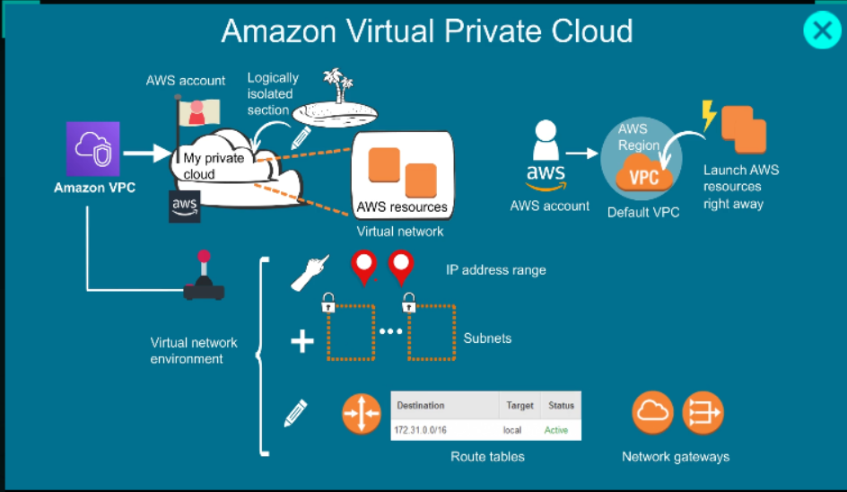
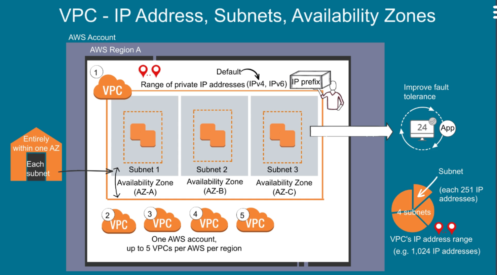
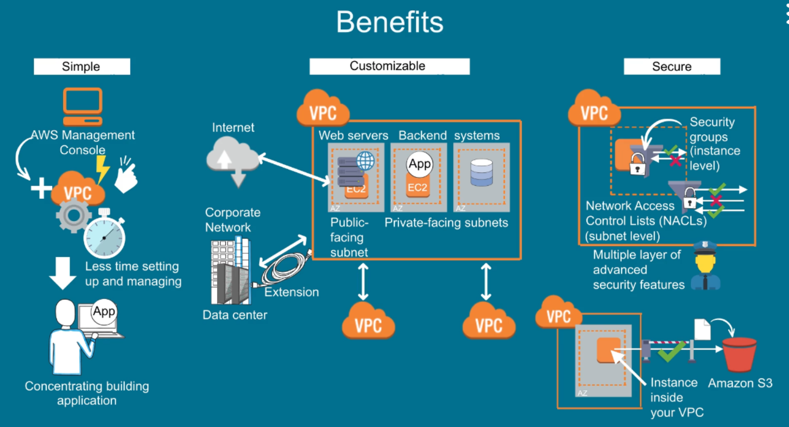
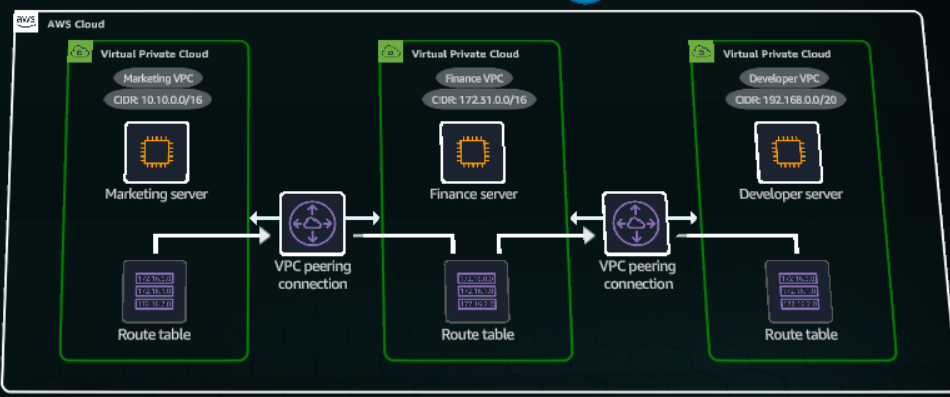
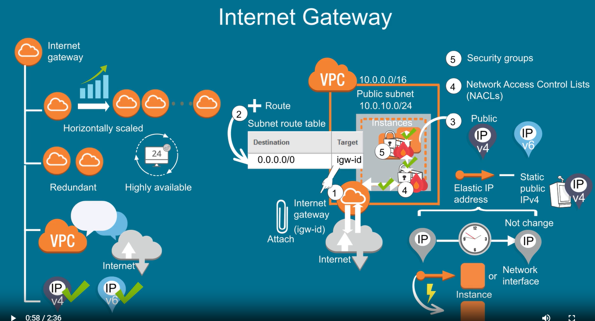
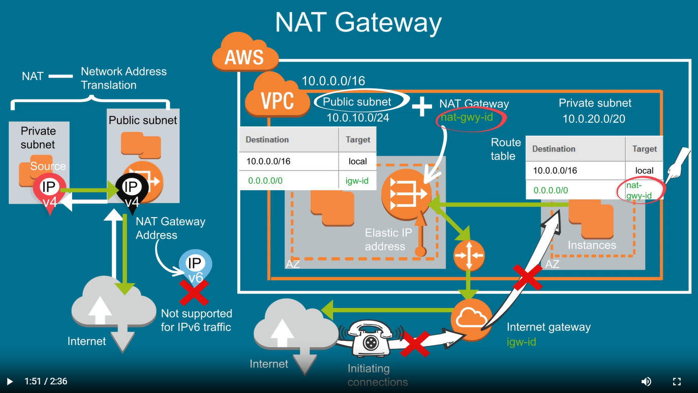

# Amazon VPC
Amazon APC it like your own private cloud within the AWS Cloud. 

`VPC` are isolated by default. Access between VPCs requres a VPC peering connection, wich operates through the private
AWS network without gateway, VPN connections, or phyzical hardware.

A VPC peering connection is established between Marketing and Finance VPC, enabling private IPv4 or IPv6 traffic routing between them.

Route tables in both VPCs require new rules pointing to the VPC peering connection. The Marketing VPC rout table directs traffic to Finance VPC thought the
peering connection, and the Finance VPC rout table does the same in the opposite direction.

A separate VPC peering connection is created between Finance and Developer VPC, with corresponding route table updates in both VPCs.

No peering connection exists between Marketing and Developer VPC becouse they don't require direct communication. VPC peering doesn't support transitive relationships, preventing traffic flow between Marceting and Developer VPCs through the Finance VPC.

# Internet Gateway
An internet gaeway is horizontally scaled, redundant, and highly available by default. It allows communication between instances in your VPC and the internet. An internet gateway support both IPv4 and IPv6 traffic. It imposes no bandwidth constraints on network traffic. 

To enable inernet access for instances in a VPC subnet, you must attach an internet gateway to your VPC, add a rout to your subnet rout table,
and point your rout table to the internet gateway.
Make sure your instances have public IPv4 address,IPv6 address or elastic IP address.
An elastic IP address is a static, public IPv4 address. you can rapidly move an elastic IP address
from one instance or network interface to another. 

Other side, you need a NAT gateway in the public internet to enable instances in a private subnet to enable instances in a private subnet
to connect to the internet  with  instances.

`NAT` stands for Network Address Translation. When traffic goes to the internet, the source IPv4 address in the private subnet is translated to the NAT gateway's address at the public subnet.

Similarly for the response traffic, the NAT gateway translates the address back to the private IPv4 address of the instance in the private subnet.

To create NAT gateway you must specify the public subnet in thich the NAT gateway should reside. Tou must also specify an elastic IP address
to associate with NAT gateway when you create it.
After you create NAT gateway you must update your rout table for your private subnet to point to the NAT gateway as the target for internet-bound traffic.

For IPv6 traffic, you would use an egress-only internet gateway instead. It allows outbound communication over IPv6 from instances in your VPC to the internet.

https://calculator.aws/#/estimate?id=2af4d67610a5400cb15d298f95ed34f32e24be35

172.31.0.193
192.168.0.0/20

https://891377363155.signin.aws.amazon.com/console
