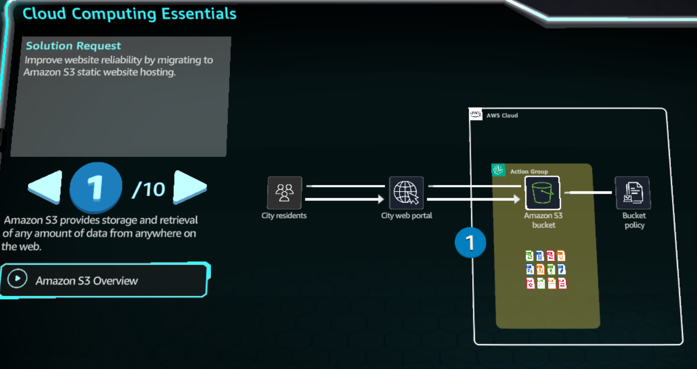
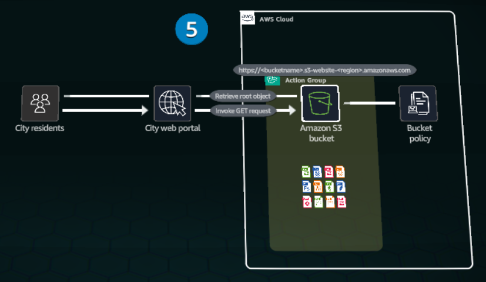
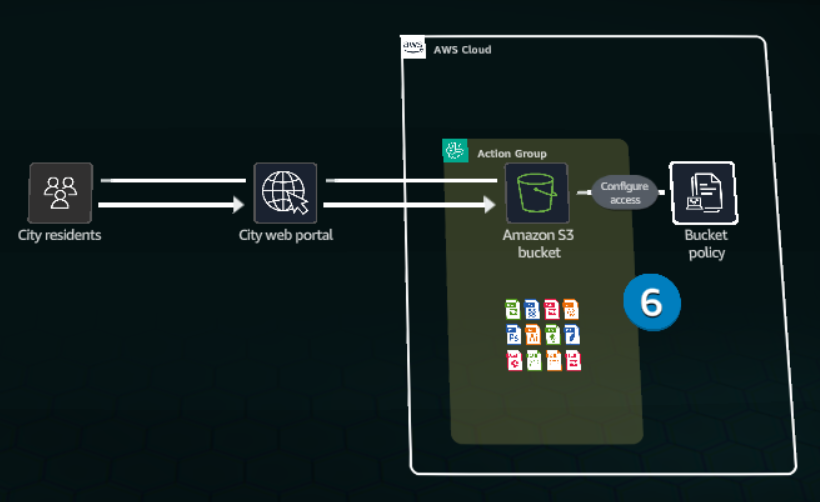
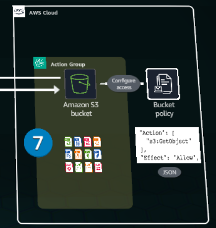
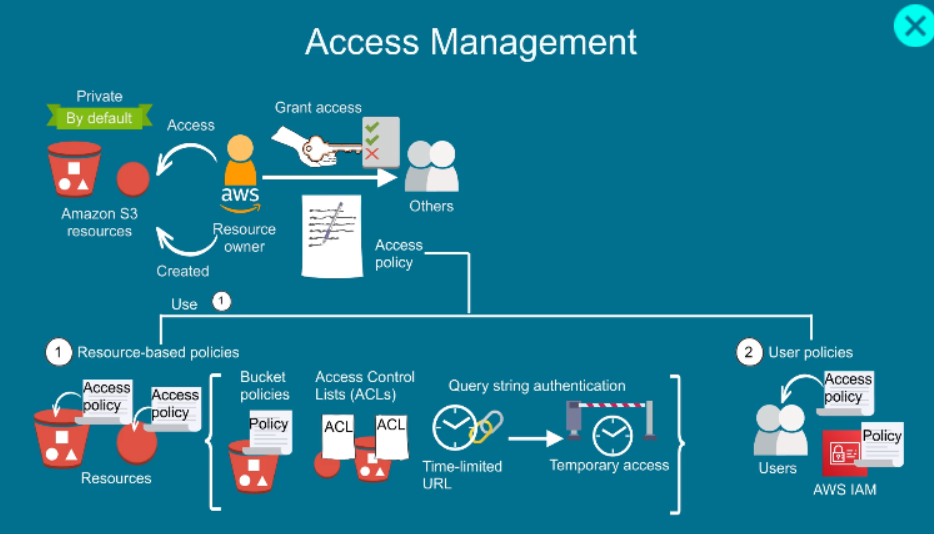
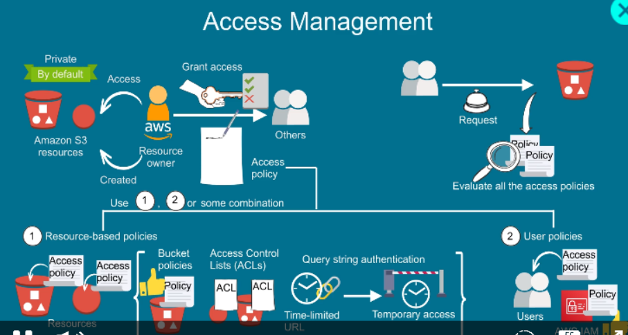
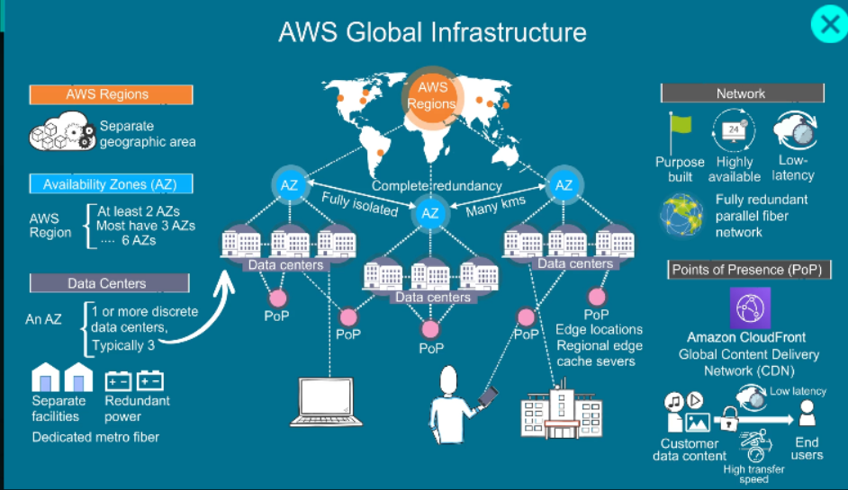
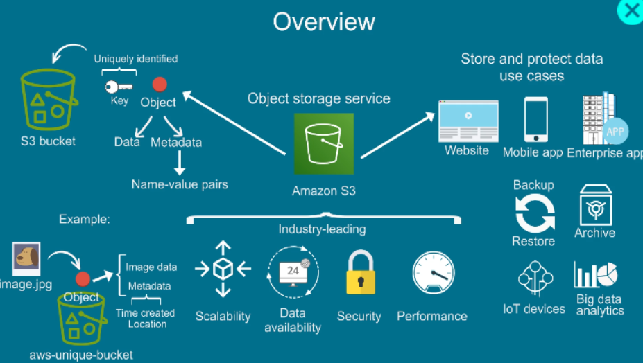
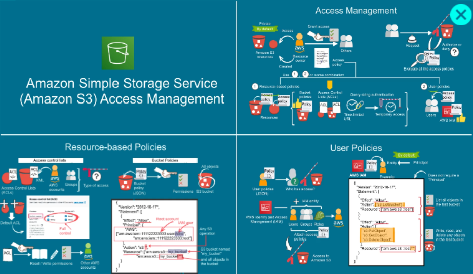

# Cloud Computing Essentials

In  Amazon S3, data is stored as objects within containers called buckets.

S3 bucket stores both the HTML file and supporting assets required for website functionality. Any S3 bucket can be enabled for static wecsite hosting.

When configured for website hosting, the S3 bucket recives a dedicated URL. Requests to this URL prompt Amazon S3 to serve the bucketsdesignated root objject

Access to the S3 bucket and its contents is controlled through permissions, which are defined in a bucket policy.

A bucket policy, written in JSON format, specifies who can access the bucket and waht operations they can perform.

bucket name -->  website-bucket-b25b6660-0bfa
http://website-bucket-b25b6660-0bfa.s3-website-us-east-1.amazonaws.com

TravelAgencyServers-ALB-1320309843.us-east-1.elb.amazonaws.com

EC2
DNS
VPC
RDS
EFS
Auto-Scaling
Elastic Load Balansing (ELB)
S3
ec2-54-234-8-121.compute-1.amazonaws.com

# AWS Services
Amazon EC2 Auto Scaling
Amazon CloudWatch
Amazon DynamoDB
Amazon Elastic Compute Cloud
Amazon Elastic File System
Elastic Load Balancing
AWS Identity and Access Management
Amazon Relational Database Service
Amazon Simple Storage Service
Amazon VPC
