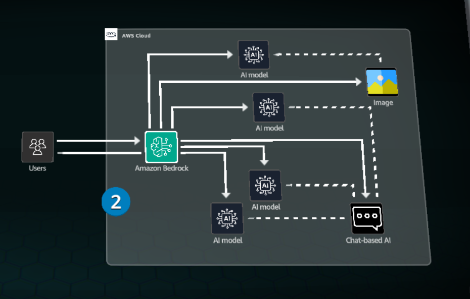
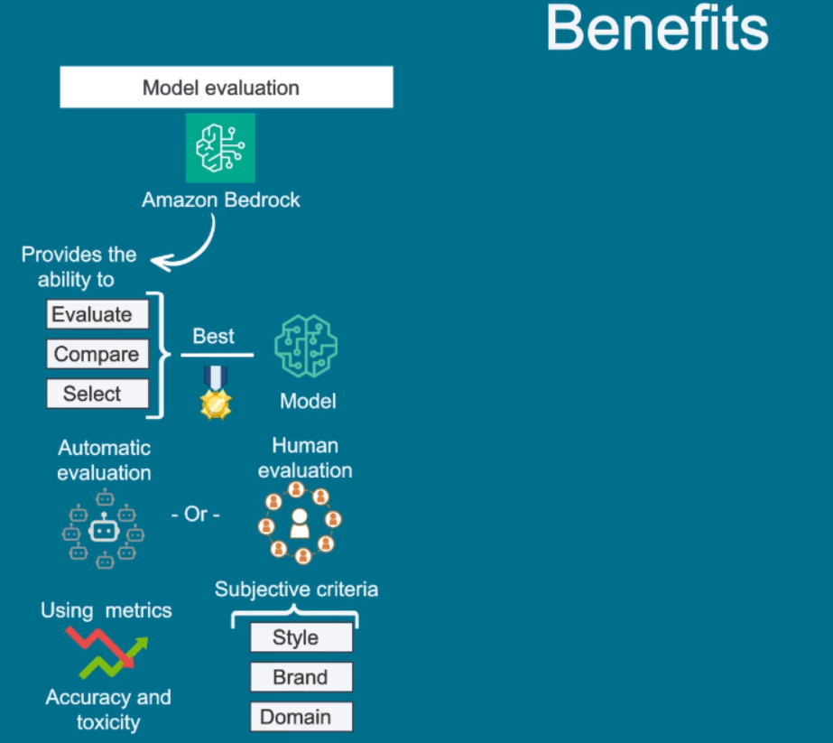
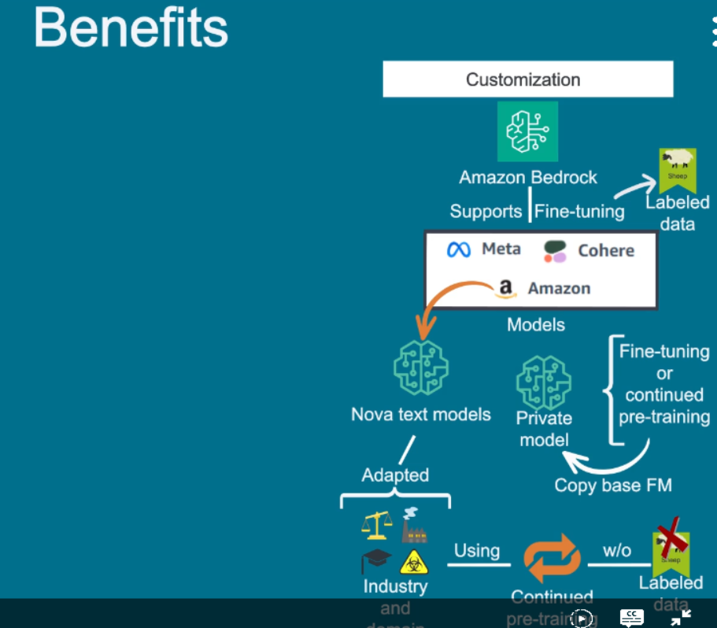
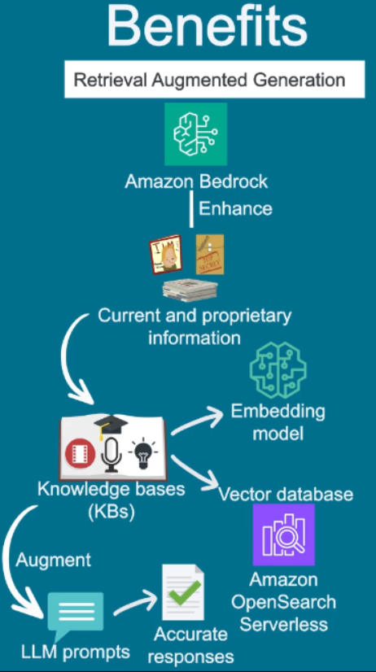
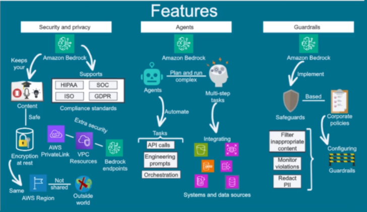
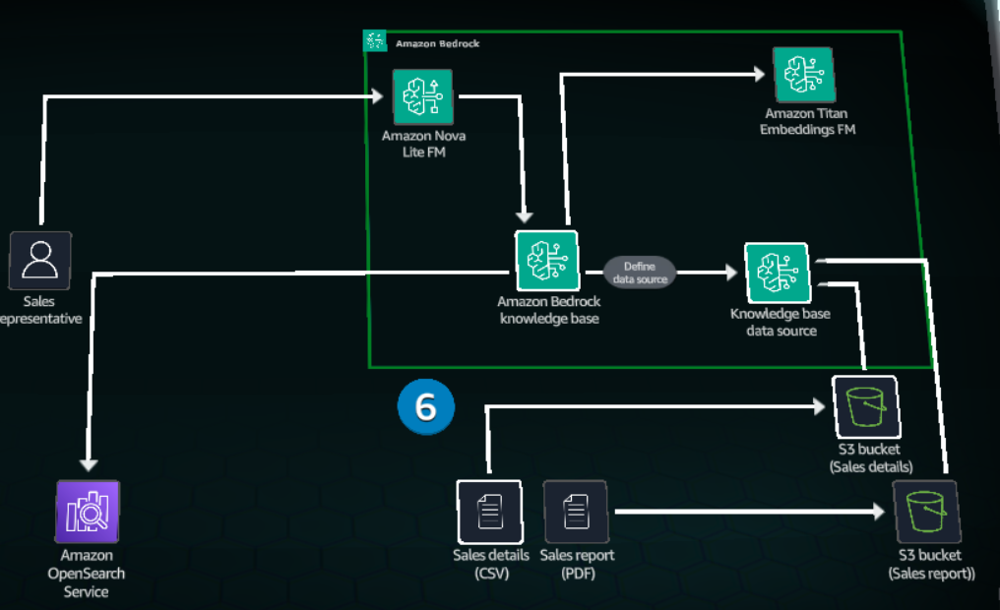
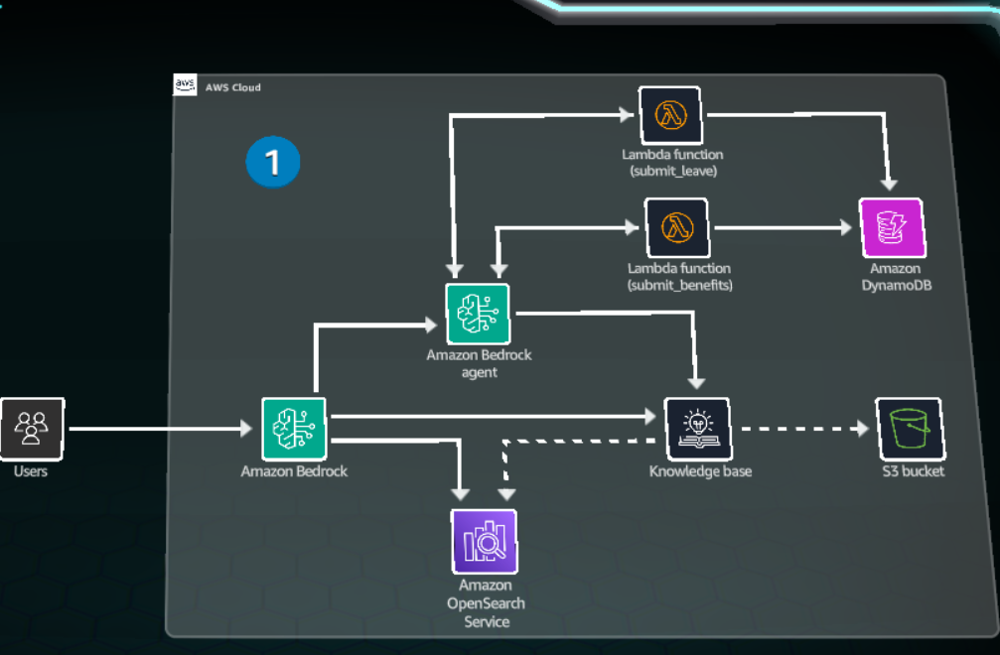

# Amazon Bedrock
`Amazon Bedrock` fully managed service that makes high-performing foundation models (FMs)
from leading AI companies and Amazon available for use through a unified API.

Users can access different AI models through the **Amazon Bedrock console**.

With **Amazon Bedrock** users can test and experiment with different models and values before integrating onto application.
**Chat/Text playground** is used to assess how well different models respond in chat-based AI experience.

## Benefits
- **Model evaluation**: Amazon Bedrock provides the ability to evaluate, compare and select the best 
model with automatic evaluation, using metrics such as accuracy and toxicity, or use human evaluation.

- **Model customization**: Amazon Bedrock supports fine-tuning with labeled data for certain models from Meta, Cohere and Amazon.

- **Retrieval Augmented Generation (RAG)** : Bedrock allow you to enhance with current and propertary information using KBs. 
KB couple a text embedding model with a vector database such as Amazon Open Search serverless to augment LLM prompts for more accurate responses.

# Amazon Bedrock knowledge base (vector database)
Uses `Amazon OpenSearch` Serverless to store the vector embeddings.

When creating knowledge base , a data source need to be defined. In this solution data source is a bucket (S3). Data source sync is initiated to populate the **OpenSearch Serverless vector store**.

The data sync process each source by invoking the embeddings FM to convert the text into its vector representation.

You are a professional HR Assistant responsible for helping employees with HR-related policy questions. Follow these guidelines:

1. Primary Responsibilities:
- Answer questions about HR policies using all knowledge bases available
- Maintain professional and friendly tone
- Protect confidential information

2. When handling HR policy questions:
- Include relevant policy references only from available knowledge bases
- If the information is not in the knowledge bases, recommend consulting HR department

3. Limitations:
- Defer sensitive matters to HR department

4. Response Format:
- Be concise and clear
- Confirm understanding before proceeding
- Provide next steps when applicable

Always maintain professionalism and confidentiality in all interactions.

arn:aws:aoss:us-east-1:655116568835:collection/6mafdson6p2j2074rvke

arn:aws:aoss:us-east-1:655116568835:collection/6mafdson6p2j2074rvke

CLM-20260304140134