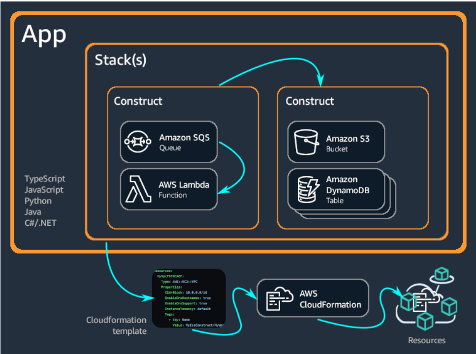

<h2>AWS Cloud Development Kit (AWS CDK)</h2>
AWS CDK, a framework for defining cloud infrastructure in code and provisioning it through AWS CloudFormation.
The AWS CDK lets you build reliable, scalable, cost-effective applications in the cloud with the considerable expressive power of a programming language. This approach yields many benefits, including:
-Build with high-level constructs that automatically provide sensible, secure defaults for your AWS resources, defining more 			infrastructure with less code.
-Use programming idioms like parameters, conditionals, loops, composition, and inheritance to model your system design from 			building blocks provided by AWS and others.
-Put your infrastructure, application code, and configuration all in one place, ensuring that at every milestone you have a 			complete, cloud-deployable system.
-Employ software engineering practices such as code reviews, unit tests, and source control to make your infrastructure more 			robust.
-Connect your AWS resources together (even across stacks) and grant permissions using simple, intent-oriented APIs.
-Import existing AWS CloudFormation templates to give your resources a CDK API.
-Use the power of AWS CloudFormation to perform infrastructure deployments predictably and repeatedly, with rollback on error.
-Easily share infrastructure design patterns among teams within your organization or even with the public.

<h2>How it works</h2>
The AWS CDK supports TypeScript, JavaScript, Python, Java, C#/.Net, and Go. Developers can use one of these supported programming languages to define reusable cloud components known as Constructs. You compose these together into Stacks and Apps.

Example of using CDK with Typescript of creating the infrastructure for a static site, which uses an S3 bucket for storing the content.

The AWS CDK consists of two primary parts:
    -AWS CDK Construct Library – A collection of pre-written modular and reusable pieces of code, called constructs, that you can use, modify, and integrate to develop your infrastructure quickly. The goal of the AWS CDK Construct Library is to reduce the complexity required to define and integrate AWS services together when building applications on AWS.
    -AWS CDK Toolkit - Tools that you can use to manage and interact with your CDK apps, such as performing synthesis or deployment. The CDK Toolkit consists of a command line tool (CDK CLI) and a programmatic library (CDK Toolkit Library).

<h2>Benefits of the AWS CDK</h2>
    -<b>Develop and manage your infrastructure as code (IaC)</b>
        Practice infrastructure as code to create, deploy, and maintain infrastructure in a programmatic, descriptive, and declarative way. 
    -<b>Define your cloud infrastructure using general-purpose programming languages</b>
        With the AWS CDK, you can use any of the following programming languages : TypeScript, JavaScript, Python, Java, C#/.Net, and Go.
    -<b>Deploy infrastructure through AWS CloudFormation</b>
        AWS CDK integrates with AWS CloudFormation to deploy and provision your infrastructure on AWS. AWS CloudFormation is a managed AWS service that offers extensive support of resource and property configurations for provisioning services on AWS.
    -<b>Get started developing your application quickly with constructs</b>
        Develop faster by using and sharing reusable components called constructs. Use low-level constructs to define individual AWS CloudFormation resources and their properties. Use high-level constructs to quickly define larger components of your application, with sensible, secure defaults for your AWS resources, defining more infrastructure with less code.

<h2>Example of the AWS CDK</h2>
export class MyEcsConstructStack extends Stack {
constructor(scope: App, id: string, props?: StackProps) {
super(scope, id, props);

    const vpc = new ec2.Vpc(this, "MyVpc", {
      maxAzs: 3 // Default is all AZs in region
    });

    const cluster = new ecs.Cluster(this, "MyCluster", {
      vpc: vpc
    });

    // Create a load-balanced Fargate service and make it public
    new ecs_patterns.ApplicationLoadBalancedFargateService(this, "MyFargateService", {
      cluster: cluster, // Required
      cpu: 512, // Default is 256
      desiredCount: 6, // Default is 1
      taskImageOptions: { image: ecs.ContainerImage.fromRegistry("amazon/amazon-ecs-sample") },
      memoryLimitMiB: 2048, // Default is 512
      publicLoadBalancer: true // Default is false
    });
}
}

<h1>Understanding the CDK Toolkit Library</h1>
The CDK Toolkit Library enables you to perform CDK actions programmatically through code instead of using CLI commands. You can use this library to create custom tools, build specialized CLI applications, and integrate CDK capabilities into your development workflows.

<h3>Manage your infrastructure lifecycle with programmatic control</h3>
The CDK Toolkit Library provides following CDK actions:
<ul>
<li>Synthesis: Generate AWS CloudFormation templates and deployment artifacts.</li>
<li>Deployment</li>
<li>Refactor : Preserve deployed resources when refactoring CDK code, such as renaming constructs or moving them between stacks.</li>
<li>List: View information about stacks and their dependencies.</li>
<li>Watch: Monitor CDK apps for local changes.</li>
<li>Rollback: Return stacks to their last stable state.</li>
<li>Destroy - Remove CDK stacks and associated resources.</li>
</ul>

<h3>Enhance and customize your infrastructure management</h3>
<ul>
<li>Control through code</li>
<li>Manage cloud assemblies</li>
<li>Customize deployments</li>
<li>Preserve resources during refactoring</li>
<li>Handle errors precisely </li>
<li>Tailor communications</li>
<li>Connect with AWS</li>
</ul>

<h2>Choosing when to use the CDK Toolkit Library</h2>
 <ul>
<li>Automate infrastructure deployments as part of CI/CD pipelines.</li>
<li>Build custom deployment tools tailored to your organization’s needs.</li>
<li>Integrate CDK actions into existing applications or platforms.</li>
<li>Create specialized deployment workflows with custom validation or approval steps.</li>
<li>Implement advanced infrastructure management patterns across multiple environments.</li>
<li>Automate refactoring operations to preserve resources when you refactor CDK code.</li>
</ul>
