# DynamoDB
`DynamoDB` is a **serverless**, fully managed, distributed NoSQL database service.

DynamoDB offers **zero infrastructure management**, **zero downtime maintenance**, instant **scaling** to any application demand, and **pay-per-request** billing.

DynamoDB is fully managed  tasks such as **backups, security, compliance, monitoring**, and more.

DynamoDB global tables is a **multi-Region, multi-active** database with up to 99.999% availability and offers the highest database resilience.

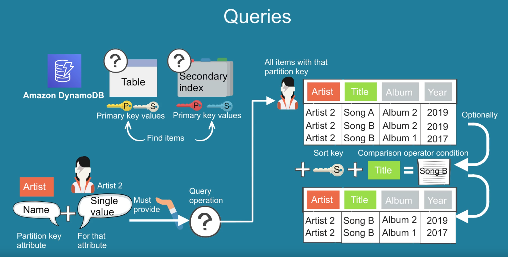
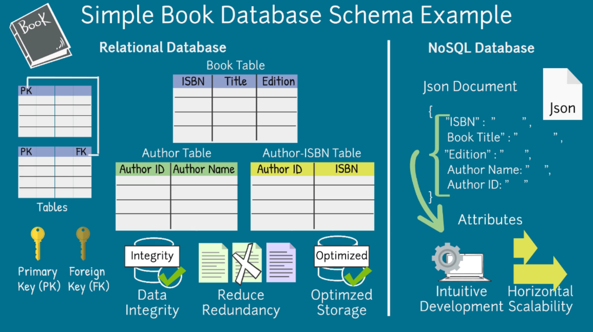
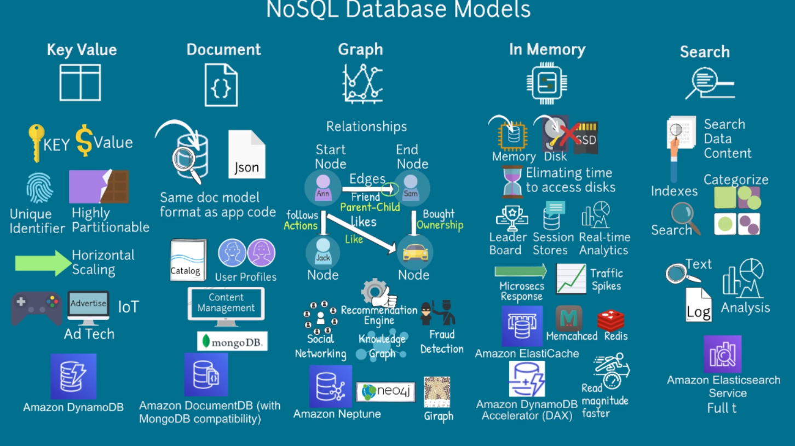

#### The two `table classes` available:
- `DynamoDB Standard `: have lower costs for reads and writes but higher storage costs.
- `DynamoDB Standard-Infrequent Access`: have lower storage costs but higher costs for reads and writes.

Amazon DynamoDB stores data in `partitions`. A partition is an **allocation of storage** for a table, backed by solid state 
drives (SSDs) and automatically replicated across multiple Availability Zones within an AWS Region.

## Security
DynamoDB supports `IAM` permissions. `IAM` permissions can be defined in **identity-based policies, resource-based policies**, or other AWS policies to control access to DynamoDB resources. 
You can attach IAM policies to **IAM users, groups, roles, and DynamoDB tables and streams**, and control them as desired.

You can use `Amazon DynamoDB using VPC endpoints`.
#### DynamoDB supports two types of VPC endpoints:
- **Gateway endpoints**: You can access DynamoDB from your VPC, without requiring an internet gateway.Do not allow access from on-premises networks, from peered VPCs in other AWS Regions, or through a transit gateway.
- **AWS PrivateLink.**: AWS PrivateLink which is available for an additional cost.With AWS PrivateLink, you can simplify private network connectivity between virtual private clouds (VPCs), DynamoDB, and your on-premises data centers using interface VPC endpoints and private IP addresses.

#### Fine-grained access control  (FGAC)
`Fine-grained access control (FGAC)` gives a DynamoDB table owner granular control over data in the table through 
AWS Identity and Access Management (IAM) policies and conditions. FGAC lets the owner provide permissions for access to items or attributes of the table, and associated actions.

# DynamoDB Tables Terms
A table is a collection of data wich we call items. Iche item has some characteristics, wich we call attributes.

Each item in the table hase unique identifier, or **primary key**. DynamoDB supports two different kind of primary keys, `partition key` and `sort key`.

- **Partition key**: is mandatory. DynamoDB uses the partition key's value as input to an internal hash function, which determines the partition (physical storage) in which the item will be stored. This allows for fast retrieval of items based on the partition key.
- **Sort key**: is optional. If a sort key is defined, DynamoDB uses the combination of the partition key and sort key to uniquely identify an item. This allows for more complex querying and sorting of items within a partition.
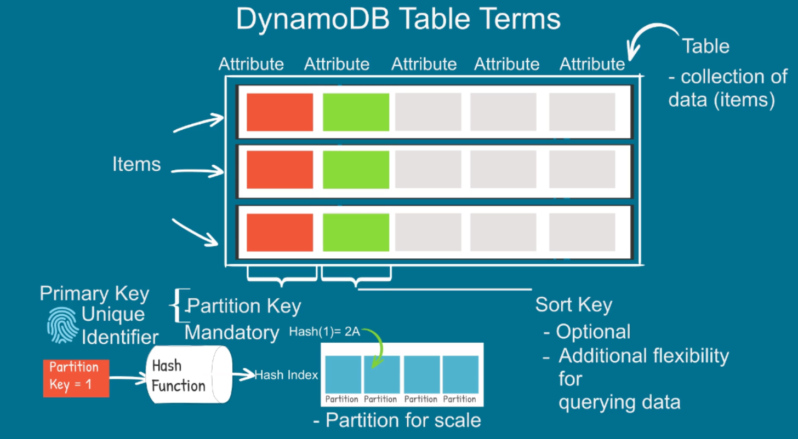

# Amazon DynamoDB Scans-Overview
A scan operation examines every item in the table and returns all data attributes by default. You can use the `ProjectionExpression` parameter to return only specific attributes. A scan operation can be used to retrieve all items in a table or to find items that match a specific filter criteria.
Best practice to avoid using a scan operation on a large table, as it can be inefficient and may consume a lot of read capacity units. 
**Single Scan operation** can retrieve a maximum of one megabyte of data.
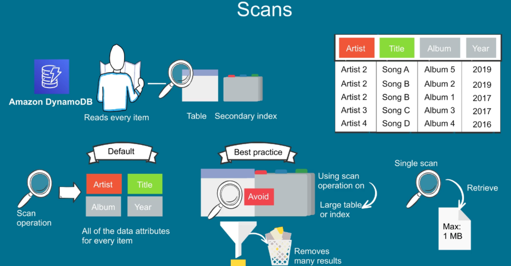
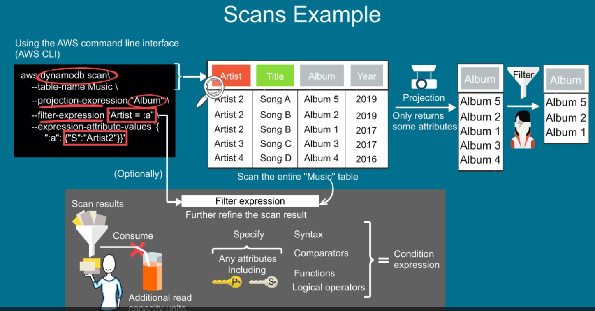
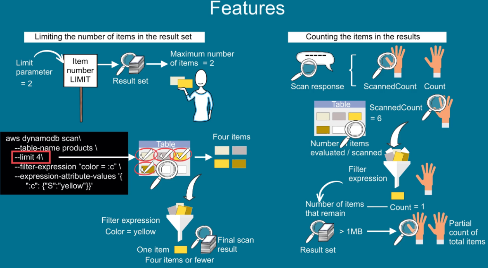
----------------------

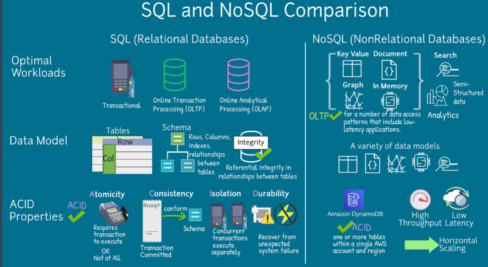
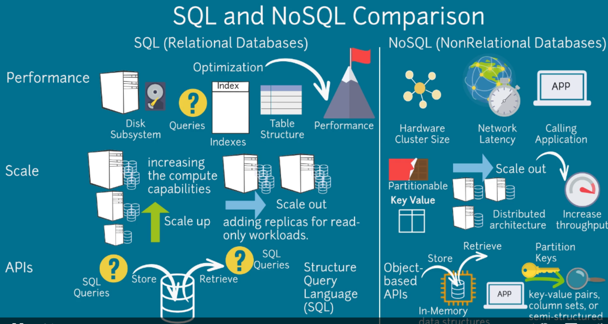

# Query
For query operation you must provide a name of patrition key attribute and a single value for that attribute.
Query returns all items with that partition key value. 

### Example 
The DynamoDB query CLI command is used to query the "Music" table.
If you want to specify a search critery, you can use a key condition expretion.
The expretion contains a string that determines the item to be read from table or index.
You must specify partition key name (the `Artist`). You can provide second condition for the sort key if present.

A single query operation can retrieve a maximum of one megabyte of data.

Qury results always sorted by sort key value. By default sort order is ascending. To reverse the order, set the `ScanIndexForward` parameter to false.
If you need a further refine the query result, after applyingthe key condition expretion, you can provide filter expretion option.
Filter expretion can not contain partition key or sort key attribut.
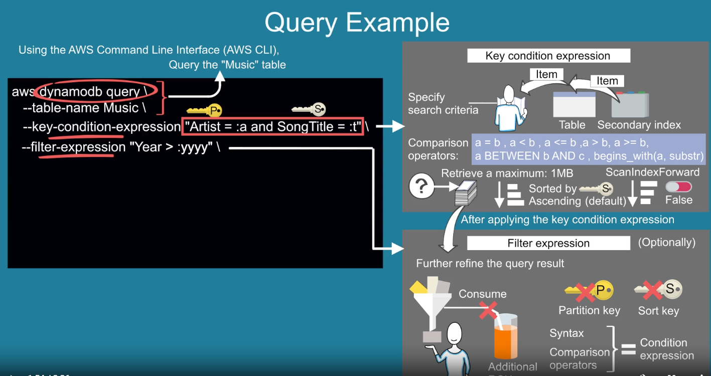

If you need to compare attribute with value, define expretion value as a placeholder.
They are used substitutesfor the actual values that you want to compare.
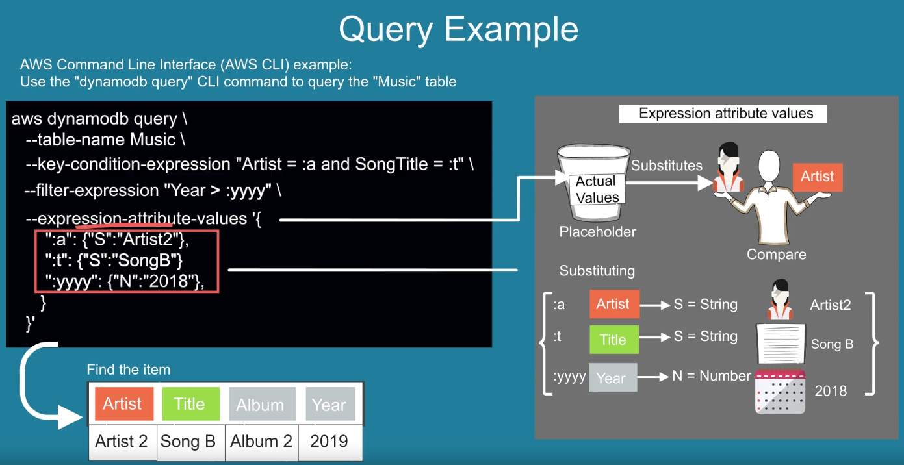

# DynamoDB table Terms
A table is collection of datawich we call items. Each item has some characteristics, which we call attributes.
Each item in a table has a unique identifier, or primary key. DynamoDB supports two different kinds of primary keys: `partition key` and `sort key`.

The **partition key** is mandatory. DynamoDB uses the partition key's value as input to an internal hash function.
The output of that hash function determines the partition (physical storage) in which the item will be stored. This allows for fast retrieval of items based on the partition key.
The partition key enablespartition for scalability purpose.

The **sort key** is optional and provide additional flexibility for query data.
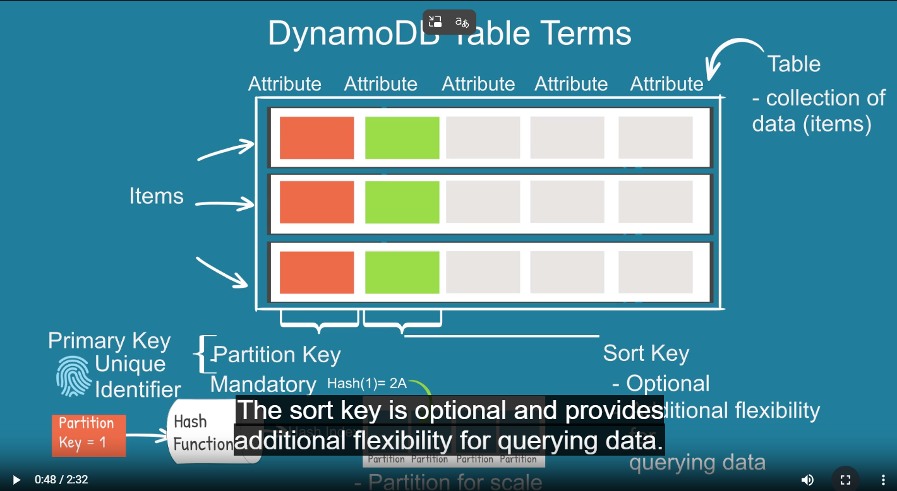
### Delete item
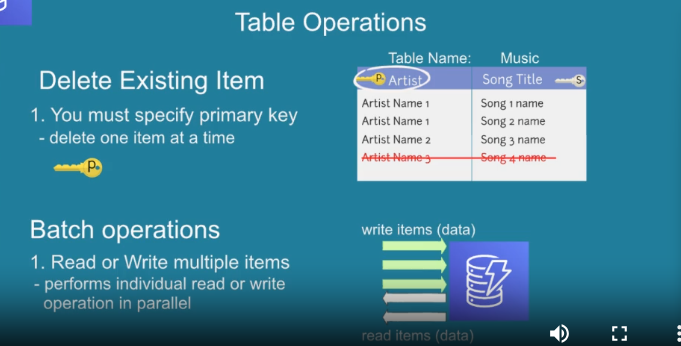

