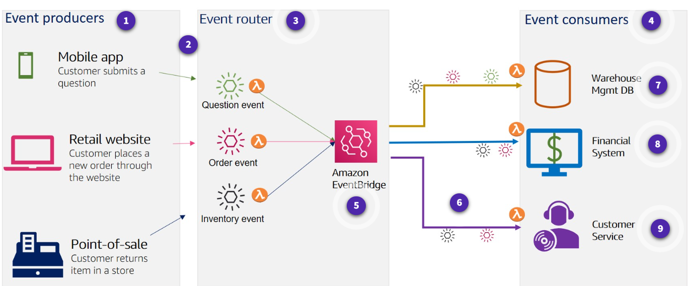
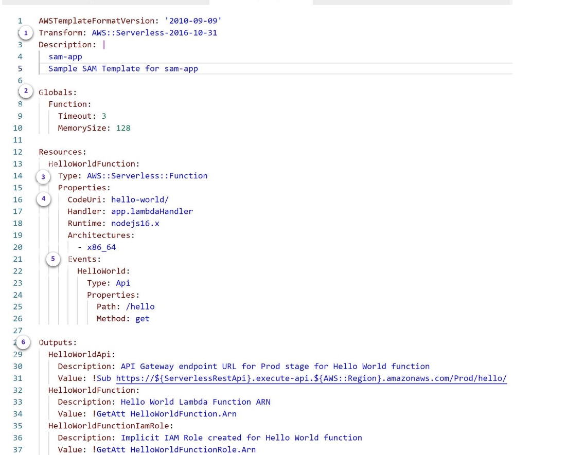
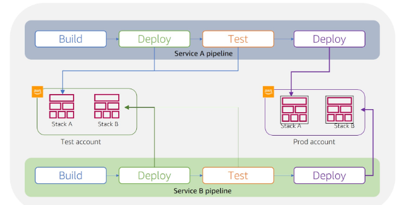

# AWS Lambda
AWS Lambda is a compute service. You can use it to run code without provisioning or managing servers. 

### Event-driven architectures
An event-driven architecture uses events to initiate actions and communication between decoupled services.
When an event occurs, the information is published for other services to consume it. 

### Producers, routers, consumers
AWS services generate events and act as an event source for Lambda. Lambda runs custom code (functions) in response to events. 

#### 1.Events and event producers
Events contain all of the information required for a consumer to take action on the event.Producers create events.They do not know who the consumer is. 
#### 2.Events
An event is a change in state of whatever you are monitoring, for example an updated shopping cart.
#### 3.Event router
The router filters, and pushes events to the  appropriate consumers. It uses a set of rules or another service such as Amazon EventBridge to send the messages.
#### 4.Event consumers
Consumers either subscribe to receive notification about events or they monitor an event stream and only act on events that pertain to them. 

## What is a Lambda function?
The code you run on AWS Lambda is called a Lambda function. Think of a function as a small, self-contained application. After you create your Lambda function, it is ready to run as soon as it is initiated.
Lambda functions are stateless.

After you upload your code to AWS Lambda, you can configure an event source, such as an Amazon Simple Storage Service (Amazon S3) event, Amazon DynamoDB stream, Amazon Simple Notification Service (Amazon SNS) notification.

## Invocation models for running Lambda functions
Event sources can invoke a Lambda function in three general patterns. These patterns are called `invocation models`.Each `invocation model `is unique and addresses a different application and developer needs. 
 
### 1. Synchronous invocation
When you invoke a function synchronously, Lambda runs the function and waits for a response.
##### **Synchronous AWS services**
The following AWS services invoke Lambda synchronously:
- Amazon API Gateway
- Amazon Cognito
- AWS CloudFormation
- Amazon Alexa

### 2. Asynchronous invocation
When you invoke a function asynchronously, events are queued and the requestor doesn't wait for the function to complete.  
With the asynchronous model, you can make use of destinations. Use destinations to send records of asynchronous invocations to other services. 
##### **Asynchronous AWS services**
The following AWS services invoke Lambda asynchronously: 
- Amazon SNS 
- Amazon S3
- Amazon EventBridge 
##### **Destination**
A destination can send records of asynchronous invocations to other services. You can configure separate destinations for events that fail processing and for events that process successfully.

### 3. Polling invocation
This invocation model is designed to integrate with AWS streaming and queuing based services with no code or server management. Lambda will poll (or watch) these services.
##### ** AWS services**
- Amazon DynamoDB Streams
- Amazon Kinesis
- Amazon SQS
##### **Event Source Mapping**
The configuration of services as event triggers is known as event source mapping. This process occurs when you configure event sources to launch your Lambda functions and then grant theses sources IAM permissions to access the Lambda function. 

## Lambda execution environment
Lambda invokes your function in an execution environment, which is a secure and isolated environment. 
### Execution environment lifecycle
When you create your Lambda function, you specify configuration information, such as the amount of available memory and the maximum invocation time allowed for your function. 
 Permissions, resources, credentials, and environment variables are shared between the function and the extensions.
#### 1. Init phase
In this phase, Lambda creates or unfreezes an execution environment with the configured resources, downloads the code for the function and all layers, initializes any extensions, initializes the runtime, and then runs the function’s 

#### 2. Invoke phase
Lambda invokes the function handler. After the function runs to completion, Lambda prepares to handle another function invocation. 
#### 3. Shutdown phase
If the Lambda function does not receive any invocations for a period of time,  Lambda shuts down the runtime, alerts the extensions to let them stop cleanly, and then removes the environment. 
 Lambda sends a shutdown event to each extension, which tells the extension that the environment is about to be shut down.

### Performance optimization
Serverless applications can be extremely performant, thanks to the ease of parallelization and concurrency.
#### Cold and warm starts
A `cold start`  occurs when a new execution environment is required to run a Lambda function. When the Lambda service receives a request to run a function, the service first prepares an execution environment. During this step, the service downloads the code for the function, then creates the execution environment with the specified memory, runtime, and configuration. 

In a `warm start`, the Lambda service retains the environment instead of destroying it immediately. This allows the function to run again within the same execution environment. This saves time by not needing to initialize the environment. 

### Best practice: Minimize cold start times

## AWS Lambda Function Permissions
***Two types of IAM policies used with Lambda functions***-
permission to invoke the function (`IAM resource-based policy`), and permission of the Lambda function itself to act upon other services.

Resource policies grant permissions to invoke the function, whereas the `execution role` strictly controls what the function can to do within the other AWS service.

#### Execution role
The` execution role` gives your function permissions to interact with other services. You provide this role when you create a function. 
The policy for this role defines the actions the role is allowed to take — for example, writing to a **DynamoDB** table. 
**Always start with the most restrictive set of permissions and only grant further permissions as required for the function to run.**

# Authoring AWS Lambda Functions
### **handler method**
The Lambda function handler is the method in your function code that processes events. The handler method takes **two objects** – the `event object` and the` context object`. 
#### Event Object
- The event object is required.
- The contents of the event parameter include all of the data and metadata your Lambda function needs to drive its logic.
#### Context Object
- The context object allows your function code to interact with the Lambda execution environment
- The contents and structure of the context object vary, based on the language runtime your Lambda function is using. At minimum it contains the elements:
   - **AWS RequestID** – Used to track specific invocations.
   - **Runtime** – The amount of time in milliseconds remaining before a function timeout.
   - **Logging** – Information about which Amazon CloudWatch Logs stream your log statements will be sent.

# Building Lambda functions
There are **three** ways to build and deploy your Lambda functions – the `Lambda console editor`, `deployment packages`, and `automation tools`. 

### Lambda console editor
You can author functions within the Lambda console, with an IDE toolkit, using command line tools, or using the AWS SDKs.  
From the Lambda console **Create function** window, you have the following three options for how to create your function:
- `Author from scratch`: Start with a simple Hello World example.
- `Use a blueprint`: Build a Lambda application from sample code and configuration presents for common use cases.
- `Use a container image`: Select a container image to deploy for your function.

### Deployment packages
Your Lambda function's code consists of scripts or compiled programs and their dependencies. As developers increase their skills and advance beyond using the AWS Lambda console, they start using deployment packages to deploy the function code. 

### Automate using tools
Serverless applications built using Lambda are a combination of Lambda functions, event sources, and other resources defined using the AWS Serverless Application Model (AWS SAM). You can automate the deployment process of your applications by using AWS SAM and other AWS services, such as AWS CodeBuild, AWS CodeDeploy, and AWS CodePipeline.

## What is AWS SAM?
AWS SAM is an open-source framework for building serverless applications. It provides shorthand syntax to express functions, APIs, databases, and event source mappings. 
During deployment AWS SAM transforms and expands the AWS SAM syntax into AWS CloudFormation syntax.

1. Transform:
This line tells CloudFormation that this is a SAM template that it needs to transform.
2. Globals: This section defines properties common to all your Serverless functions and APIs. In this case, it includes the following lines:
 Function:
   Timeout: 3
  MemorySize: 128 
3. Type: resource named HelloWorldFunction as a Lambda function.
4. Properties section

### AWS SAM CLI
You can install the AWS SAM CLI locally to help test your serverless applications, validate your AWS SAM templates, and streamline your deployments.
#### **AWS SAM CLI commands**
- `init`- Initializes a serverless application.
- `local` -  Runs your application locally.
- `validate` -  Validates an AWS SAM template.
- `deploy` - Deploys an AWS SAM application.
- `build` - 

## Serverless CI/CD pipeline

You can incorporate additional tools to create an automated CI/CD pipeline for your serverless applications that integrate with AWS SAM. 
- **CodeBuild** – Automate the process of packaging code and running tests before the code is deployed.
- **CodeDeploy** – Use version management options to ensure safe deployments to production. 

--------------------

AWS Lambda is a cloud-based service that enables the creation and execution of serverless functions, allowing you to handle tasks like data processing, route requests, and database operations without managing your own servers. Here's a structured overview of AWS Lambda:

1. **Introduction to Lambda**:
   - Lambda is part of the AWS Lambda Function API, which is a web service for creating and managing serverless functions.

2. **Key Components**:
   - **Lambda Function API**: The main tool for creating, managing, and running serverless functions. It supports Python and JavaScript, handling tasks like data processing and routing.
   - **Lambda Function Container**: A service that runs Lambda functions on a serverless platform, providing a platform for Lambda functions to execute.
   - **Lambda Function Services**: Pre-configured instances offering common Lambda functions, such as processing, routing, and caching, making them easier to use.

3. **Functionality**:
   - Lambda functions can process data using tasks like mapping, reducing, filtering, and handling asynchronous data.
   - They support database operations, making them versatile for various applications.

4. **Deployment and Use**:
   - Lambda functions can be deployed on local machines, serverless platforms, or managed instances like AWS Lambda.
   - They are efficient, scalable, and easier to deploy compared to traditional solutions.

5. **Integration with AWS Services**:
   - Lambda functions can run on AWS S3, EKS, or managed instances, allowing flexibility in deployment environments.

6. **Benefits**:
   - Serverless efficiency, scalability, and ease of deployment make Lambda a powerful tool for modern applications.

In summary, AWS Lambda is a versatile and efficient service for creating serverless functions, offering a range of functionalities and deployment options to suit various needs.