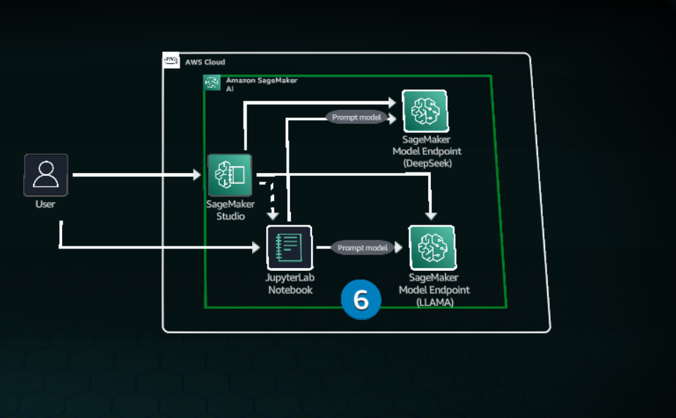

# Amazon SageMaker AI
`Amazon SageMaker` Studio, a unified ML integrated development IDE, is used to streamline a model's development, training, testing, and deployment, all from one central location.

Users can connect to SageMaker AI through their browser,accessing a fully configured JupyterLab enviroment without having to manage any infrastructure.

With `SageMaker` users can create,deploy, and monitor models.

lab-data-bucket-199176307678-e55275a0 

        # Prepare the request payload       
        try:
            request_payload = {
                "messages": [
                    {
                        "role": "user",
                        "content": [{"text": user_message}]
                    }
                ],
                "inferenceConfig": {
                    "temperature": 0.7,
                    "topP": 0.9,
                    "maxTokens": 512
                }
            }
        except NameError as e:
            error_response = {
                "statusCode": 500,
                "body": f"NameError: {str(e)}."
            }
            return error_response

        try:
            # Invoke the model
            response = bedrock_runtime.invoke_model(
                modelId=MODEL_ID,
                body=json.dumps(request_payload)
            )

            f95b70fdc3.txt

            4df5ffa12f.txt