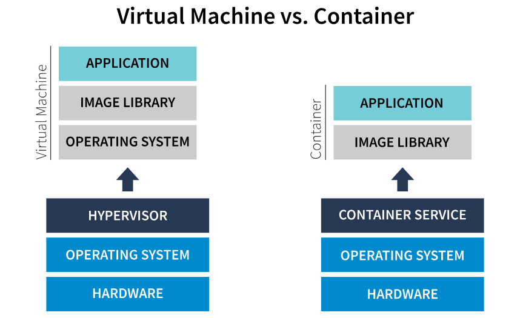

<h1>CONTAINERS</h1>

<b>A container</b> is a standard unit of software that packages up code and all its dependencies so that an application runs quickly and reliably from one computing environment to another. 

<b>A container image</b> is a lightweight, stand-alone, executable package of software that includes everything needed to run an application: code, runtime, system tools, system libraries and settings. Containers are designed to make the DevOps process simple and efficient.

Like virtual machines (VM), containers provide the infrastructure for your custom code and applications. However, containers make operating a cloud practical, fast, and cost-effective by creating bundles that virtualize at the operating system (OS) level rather than at the hardware level. A single physical or virtual host (a server with an OS) can house multiple containers at the same time. Containers remain lightweight by sharing the OS they run on while isolating processes within user space.

Everything needed to run a software application successfully can be stored in a container to make development and deployment more efficient. For this reason, containers are perfect for running microservices.

<h1>Docker</h1>

It is a platform for developing, deploying, and running applications.

<h3>Docker Engines</h3>

The Docker Engine combines open-source container technology with a workflow for building, running, and managing containerized applications. The Docker Engine consists of three major components: Docker Daemon, Rest API, and Docker CLI.

<h4>Docker Daemon</h4>

A service running on the host computer that executes commands. It manages Docker images, containers, networks, and storage volumes.

<h4>Rest API</h4>

An API used by applications to execute Docker commands via the Docker daemon.

<h4>Docker CLI</h4>

A command-line interface developers use to execute Docker commands via the Docker daemon.

<h2>SERVERLESS</h2>

Imagine deploying an application without having to think about server management. Serverless technology makes this possible. Serverless computing provides a way to quickly evolve architecture while placing minimal emphasis—if any at all—on physical infrastructure.
Serverless architecture is powered by cloud service companies and is used to build scalable, cost-efficient applications that allow you to increase agility and decrease the need to support legacy hardware and operating systems.
However, "serverless" doesn't mean there are no physical parts to this architecture. Technically, there is a server somewhere; you just do not have to think about it. The term "serverless" implies that developers and application teams do not need to concern themselves
with the building, deployment, configuration, and operational management of underlying infrastructure. They can build their programs for nearly any type of application, and everything required to run and scale the application with high availability is handled for them by the cloud management vendor.
