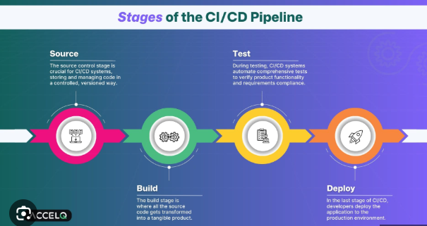

# CI CD pipeline
A CI/CD pipeline is an automated process that integrates and deploys software changes, streamlining the development lifecycle by frequently merging code, running automated tests, and releasing updates to production.

### Key components
- **Continuous Integration (CI):** Developers frequently merge code changes into a central repository, and automated builds and tests are run to catch and fix bugs early.
- **Continuous Delivery (CD):** An extension of CI, this phase automatically prepares code changes for release to a production environment. A manual approval step is often required before deployment.
- **Continuous Deployment (CD):** A fully automated process where every validated change is automatically deployed to production, ensuring a continuous flow of new features and updates to users.

### How it works?
1. **Commit:** A developer commits code changes to a shared repository.
2. **Build:** The pipeline automatically compiles the code and creates an executable artifact.
3. **Test:** Automated tests (like unit tests, integration tests, and security checks) are run to validate the code's functionality and performance.
4. **Deploy:** If the tests pass, the code is automatically deployed to a staging or production environment.
5. **Monitor:** The pipeline can monitor the application in production, with feedback sent back to the development team.
### Benefits
- **Faster delivery:** Speeds up the release of new features and updates
- **Improved quality:** Reduces the risk of bugs and errors through early and automated testing.
- **Increased efficiency:** Automates repetitive tasks, freeing up developers to focus on writing code.
- **Better collaboration:** Encourages collaboration between development and operations teams.
- **More reliable releases:** Ensures that every release is tested and validated, leading to more stable software.

--------

# Jenkins
Jenkins is an **open-source automation server that facilitates continuous integration and continuous delivery (CI/CD)** in
software development. It automates the building, testing, and deployment of applications, allowing developers to focus on writing code while ensuring that changes are integrated smoothly and reliably.
### What it does
- **Automates workflows**: It automates repetitive tasks in the software development lifecycle (SDLC).
- **Builds & Tests**: Triggers automated builds and runs tests (unit, integration) when code changes are committed to repositories like GitHub or GitLab.
- **Deploys**: Moves successful builds to staging or production environments. 
- **Integrates**: Uses plugins to connect with numerous development tools (e.g., Docker, Kubernetes, Maven).
### Key features
- CI/CD Pipeline: Defines complex delivery workflows as code (Jenkinsfile) for consistency. 
- Plugins: Offers a vast library (over 1900) for customization and integration. 
- Platform: Runs on Java and supports Windows, Linux, macOS, and other Unix-like systems. 
- Open Source: Freely available and community-driven. 
### How it works (Simplified)
- **Code Commit**: Developer pushes code to a repository (e.g., GitHub).
- **Trigger**: Jenkins detects the change and starts a job.
- **Build**: Compiles the code.
- **Test**: Runs automated tests.
- **Deploy**: If tests pass, deploys the application.
### Benefits
- Faster delivery of features and bug fixes.
- Improved code quality through automated testing.
- Speed & Reliability
- Scalability

## Jenkins Core Concepts
### Jenkins Controller (Formerly Master)
One Jenkins node functions as the `organizer`, called a `Jenkins Controller`. This node manages other nodes running the
Jenkins Agent. It can also execute builds, although it isn’t as scalable as Jenkins agents.

**The controller holds the central Jenkins configuration**

### Jenkins Agent (Formerly Slave)
The `Jenkins Agent` connects to the Jenkins Controller to run build jobs. 

You can use **multiple Jenkins Agents** to balance build load, improve performance, and create a secure environment independent of the Controller.

### Jenkins Node
A `Jenkins Node` is a machine that is part of the Jenkins environment and can execute build jobs.

### Jenkins Project (Formerly Job)
A `Jenkins Project` is a collection of tasks that Jenkins performs, such as building code, running tests, and deploying applications. 
Projects can be configured to run automatically based on triggers like code commits or scheduled times.

### Jenkins Plugins
`Plugins` are modules you can install on a Jenkins server. This adds features that Jenkins doesn’t have by default.

### Jenkins Pipeline
A Jenkins Pipeline is a user-created pipeline model. This includes:
- Automated builds.
- Multi-step testing.
- Deployment processes.
- Security scanning

