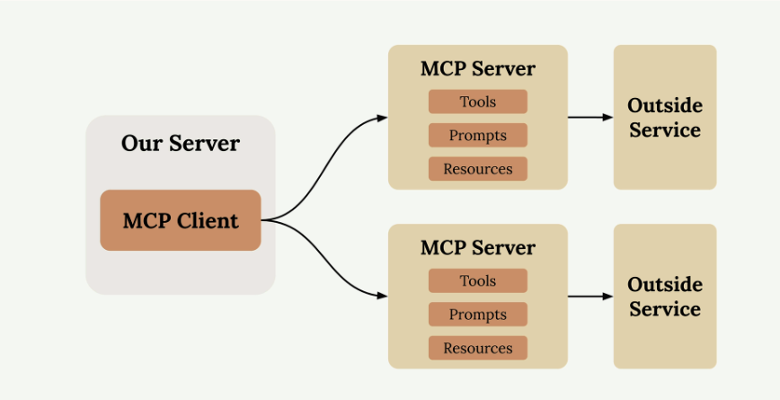
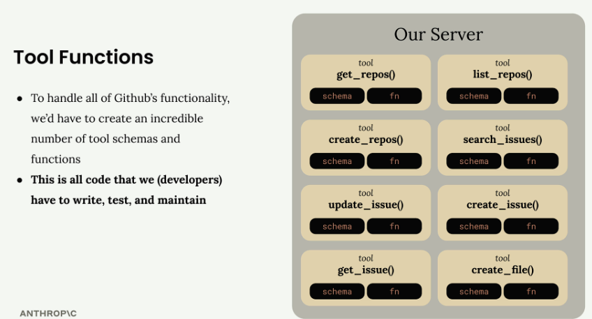
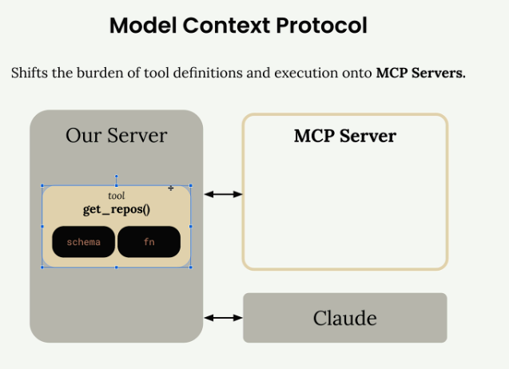

# MCP
Model Context Protocol (MCP) is a communication layer.

MCP Client (your server) connecting to MCP Servers that contain tools, prompts, and resources. Each MCP Server acts as an interface to some outside service.

GitHub has massive functionality - repositories, pull requests, issues, projects, and tons more. Without MCP, you'd need to create an incredible number of tool schemas and functions to handle all of GitHub's features.

### How MCP Works
MCP shifts this tool definitions and execution from your server to dedicated MCP servers. Instead of you authoring all those GitHub tools, an MCP Server for GitHub handles it. 
Your application connects to this MCP server instead of implementing everything from scratch.

### MCP Servers Explained
MCP Servers provide access to data or functionality implemented by outside services. 
MCP Server for GitHub contains tools like `get_repos()` and connects directly to GitHub's API. Your server communicates with the MCP server, which handles all the GitHub-specific implementation details.