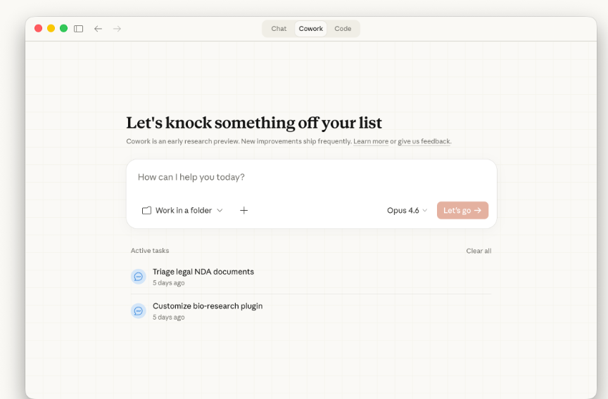
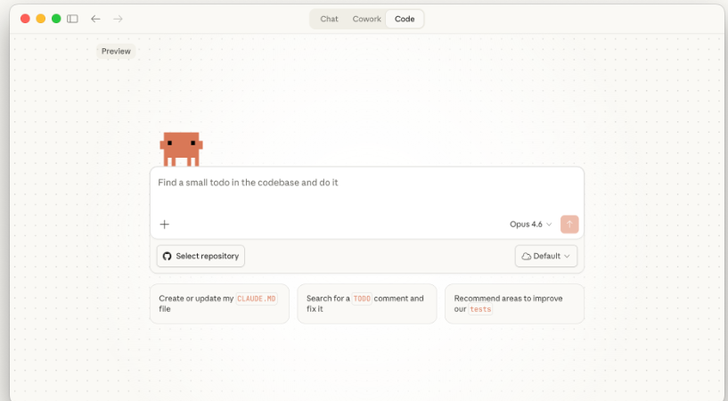
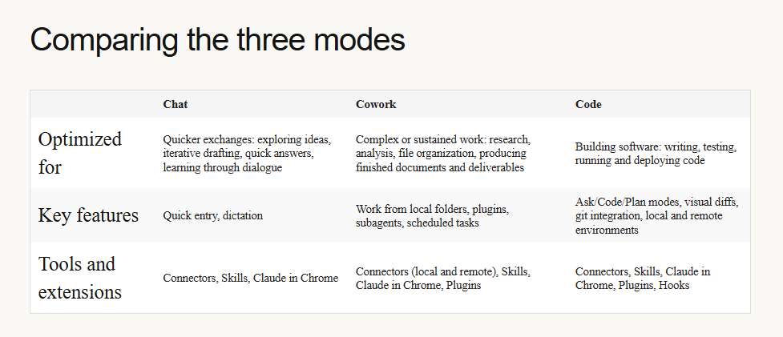

## Navigating the Claude desktop app: Chat, Cowork, Code
The Claude desktop app gives you three ways to work with Claude: `Chat`, `Cowork`, and `Code`.

`Chat` is the same Claude you know from **claude.ai**, plus quick entry, screenshots, dictation, and connectors that come from running natively on your computer. `Cowork` gives Claude the reach and the room to do more. This broader scope allows it to conduct more thorough research and analysis, and produce more complex documents and deliverables. `Code` is for building software, from writing and testing code to deploying it.

**Cowork and Code** run on the same engine. Both are Claude Code underneath — local to your machine, capable of independent work, able to spin up sub-agents and sustain long tasks. This allows Claude to work through larger tasks on its own, like research and writing or building software.

### Chat
If you've used claude.ai, this works the same way, with a few things that come from running natively on your computer:
- Quick entry. 
- Screenshots and window sharing. 
- Dictation. 
- Desktop connectors. Connect local tools and services through connectors so Claude can work with other tools on your machine.

### Cowork

**Claude Cowork** is built for work that takes real effort: pulling information from many sources, making sense of it, and producing something finished.

 You can run multiple tasks at once, each in its own conversation, and switch between them from the sidebar.
 - **Folder access**. Give Claude a folder on your computer and it reads what's there, figures out what's relevant, and saves finished work back to the same place. You can also upload files, paste content into the conversation, or connect tools that pull in what Claude needs.
 - **Scheduled tasks**. Claude can handle recurring work on a schedule: a daily briefing that pulls from your Slack and calendar, a weekly roundup of what shipped, a morning inbox triage that sorts what needs your attention.
 - **Browser use**. Connect Claude in Chrome and Claude can navigate websites, interact with pages, and pull what it finds directly into the task it's working on.
 - **Plugins**. Plugins give Claude capabilities it doesn't have on its own
 - **Protected environment**. Cowork runs in a contained space on your computer. Claude can read, create, and edit files within the folders you share, but can't access anything outside them.

 ## Code
 
 `Code` puts a full development environment inside the desktop app, powered by Claude Code.
 `Code` runs directly in your project with full access to your file system, terminal, and development tools.

 **You choose where work happens:**
1. Local: You select a folder on your computer and Claude works directly with those files. Because it runs on your machine, Claude can read your project, access local tools, and run a development server you can preview in your browser.
2. Remote: You connect a GitHub repository and Claude works in a cloud environment. Sessions continue even if you close the app, so you can start a big refactor and check back later. Good for larger codebases or when you want to keep development off your local machin

Three interaction modes let you control how much Claude does on its own:
- Ask: Claude proposes every change and waits for your approval. You review a visual diff and accept or reject before anything is modified.
- Code: Claude applies file changes automatically but checks before running terminal commands.
- Plan: Claude outlines its full approach before touching anything. A dedicated plan viewer lets you review and revisit the strategy as work progresses.

# Introduction to projects
### What are Projects?
Projects are ideal for storing knowledge Claude should reference, organizing related chats around a specific topic or work area, and collaborating with team members who need access to the same shared context.

### When to use Projects
Projects are particularly valuable when you're working on something ongoing—not just a one-off question.
- Reference materials you'll use repeatedly
- Consistent requirements for how Claude should respond
- Team collaboration needs where multiple people should work from the same foundation

### Creating your first project

#### Step 1: Set up your project
1. Hover over the left sidebar and click "Projects," or navigate directly to claude.ai/projects
2. Click "+ New Project"
3. Give your project a descriptive name
4. Add a brief description of what you're working on. 
5. Choose your visibility settings

#### Step 2: Add project instructions
Project instructions tell Claude how to behave across all conversations in this project.Click on `"Instructions"`. Instructions typically include:
- Context about what you're working on
- Process instructions
- Tone and style preferences
- Specific requirements

#### Step 3: Build your knowledge base
Your project's knowledge base is where you upload documents that Claude should reference. 
Click the "+" button to add content. You can upload various file types including PDF, DOCX, CSV, TXT, HTML, and more. You can also connect to Google Drive to link documents directly.

### Permission levels
1. Can view
2. Can edit
3. Owner

# Creating with artifacts
### What are artifacts?
Artifacts are standalone, interactive outputs that Claude creates in a dedicated window alongside your conversation. Instead of getting a long block of code or text buried in the chat, you see your content rendered and ready to use

### Common artifact types
Claude can create **different types of artifacts**, each suited to different needs:
- **Documents** (like markdown, plain text): Great for anything text-heavy that you'll want to export or continue editing—like meeting notes, reports, project plans, blog posts, and other written content.
- **Code snippets**: Working code in any programming language—Python, JavaScript, C++, and more. 
- **HTML pages**: Complete web pages with HTML, CSS, and JavaScript in a single file. Perfect for landing pages, forms, interactive demos, or quick prototypes.
- **SVG images**: Scalable vector graphics for logos, icons, illustrations, and other visual elements.
- **Mermaid diagrams**
- **React components**: Interactive UI elements with real functionality—calculators, dashboards, games, data visualizations. 

### Creating artifact
Creating an `artifact` is as simple as having a conversation. Just describe what you want, and Claude will determine whether to present it as an artifact.

