# Introducing hooks
`Hooks` allow you to run commands before or after Claude attempts to run a tool.

### How Hooks Work
When you ask Claude something, your query gets sent to the Claude model along with tool definitions. Claude might decide to use a tool by providing a formatted response, and then Claude Code executes that tool and returns the result.

Hooks insert themselves into this process, allowing you to execute code just before or just after the tool execution happens.
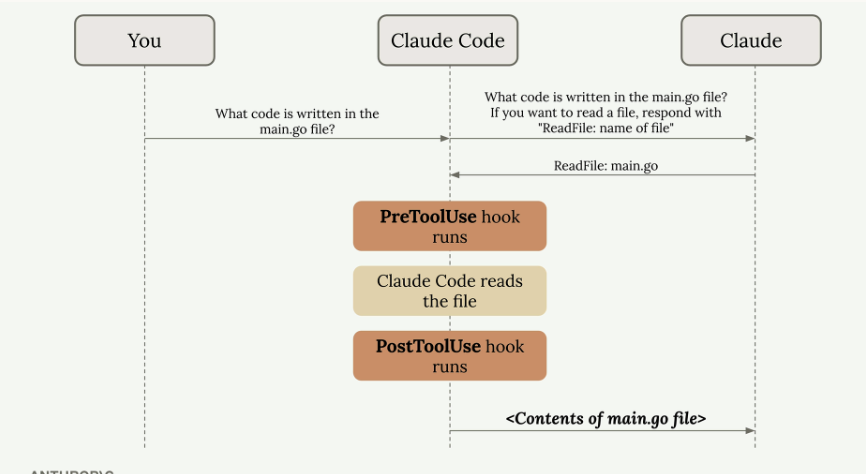

#### There are two types of hooks:
- **PreToolUse hooks** - Run before a tool is called
- **PostToolUse hooks** - Run after a tool is called

### Hook Configuration
Hooks are defined in Claude settings files. You can add them to:
- `Global` - **~/.claude/settings.json** (affects all projects)
- `Project` - **.claude/settings.json** (shared with team)
- `Project` (not committed) - **.claude/settings.local.json** (personal settings)

You can write hooks by hand in these files or use the` /hooks` command inside Claude Code.
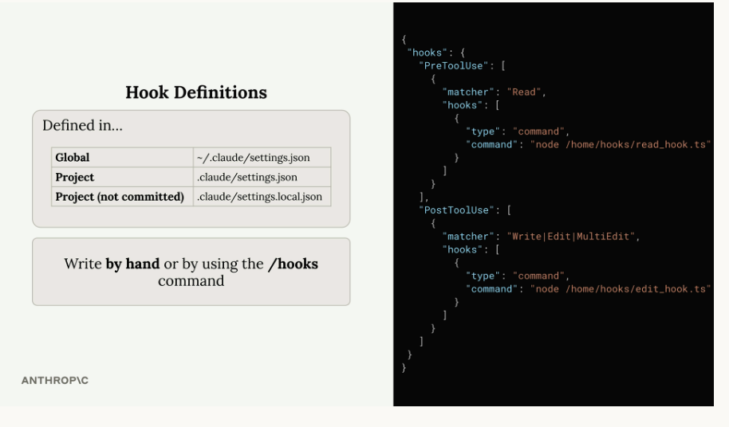

The configuration structure includes two main sections:
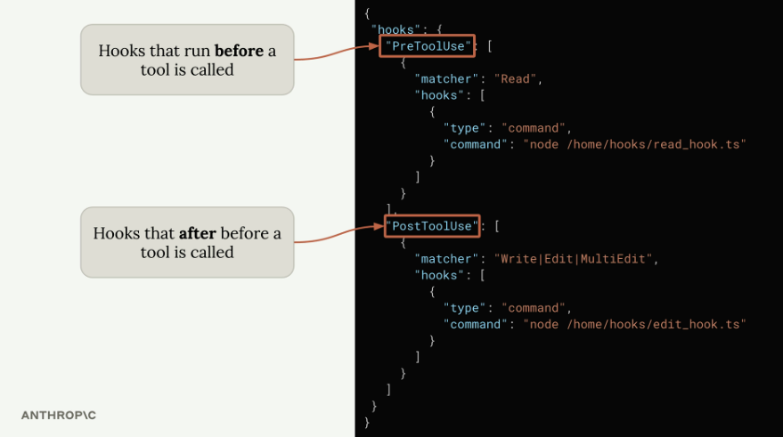

### PreToolUse Hooks
`PreToolUse` hooks run before a tool is executed. They include a matcher that specifies which tool types to target:
```js
"PreToolUse": [
  {
    "matcher": "Read",
    "hooks": [
      {
        "type": "command",
        "command": "node /home/hooks/read_hook.ts"
      }
    ]
  }
]
```

Before the 'Read' tool is executed, this configuration runs the specified command. Your command receives details about the tool call Claude wants to make, and you can:
- Allow the operation to proceed normally
- Block the tool call and send an error message back to Claude

### PostToolUse Hooks
PostToolUse hooks run after a tool has been executed.  Here's an example that triggers after **write, edit, or multi-edit** operations:
```js
"PostToolUse": [
  {
    "matcher": "Write|Edit|MultiEdit",
    "hooks": [
      {
        "type": "command", 
        "command": "node /home/hooks/edit_hook.ts"
      }
    ]
  }
]
```
Since the tool call has already occurred, PostToolUse hooks can't block the operation. However, they can:
- Run follow-up operations (like formatting a file that was just edited)
- Provide additional feedback to Claude about the tool use

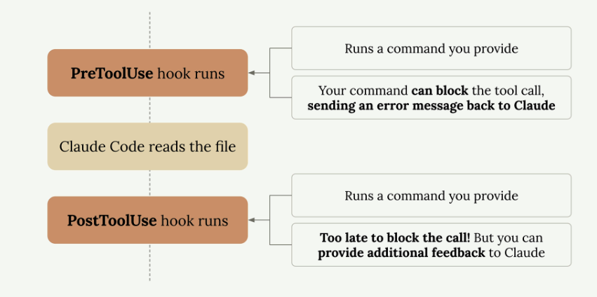

### Practical Applications
Here are some common ways to use hooks:
- **Code formatting** - Automatically format files after Claude edits them
- **Testing** - Run tests automatically when files are changed
- **Access control** - Block Claude from reading or editing specific files
- **Code quality** - Run linters or type checkers 
- **Logging** - Track what files Claude accesses or modifies
- **Validation** - Check naming conventions or coding standards

## Defining hooks
### Building a Hook
Creating a hook involves four main steps:
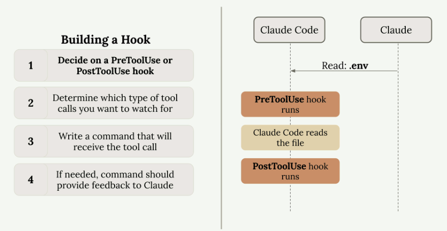
1. **Decide on a PreToolUse or PostToolUse hook**
2. **Determine which type of tool calls you want to watch for**
3. **Write a command that will receive the tool call**
4. **If needed, command should provide feedback to Claude**

### Available Tools
Claude Code provides several built-in tools that you can monitor with hooks:
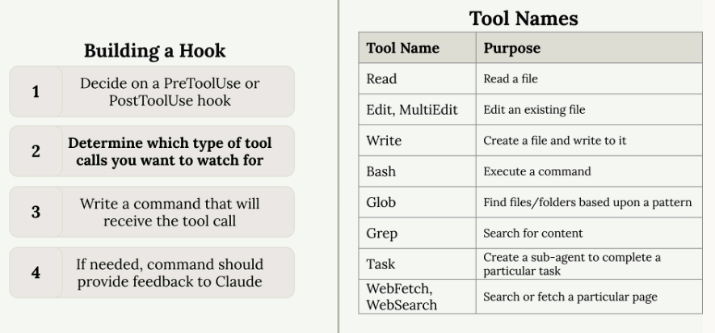

### Tool Call Data Structure
When your hook command executes, Claude sends JSON data through standard input containing details about the proposed tool call:
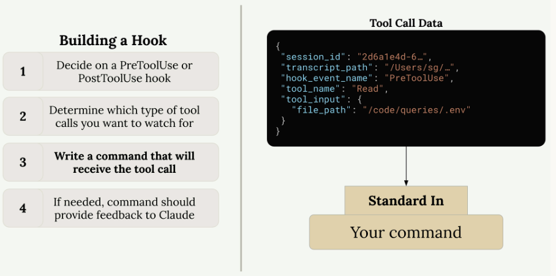

### Exit Codes and Control Flow
Your hook command communicates back to Claude through exit codes:
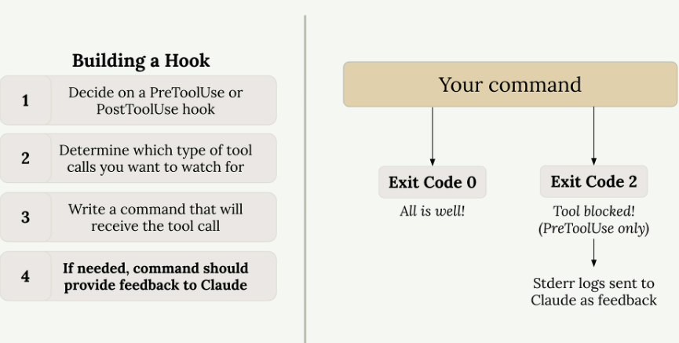
- **Exit Code 0** - Everything is fine, allow the tool call to proceed
- **Exit Code 2** - Block the tool call (PreToolUse hooks only)
When you exit with code 2 in a PreToolUse hook, any error messages you write to standard error will be sent to Claude as feedback, explaining why the operation was blocked.


## Implementing a hook
Let's build a custom hook to prevent Claude from reading sensitive files like .env.

### Setting Up the Hook Configuration
 Open `.claude/settings.local.json` file. We'll create a **PreToolUse** hook since we want to intercept tool calls before they execute.

 The **configuration** requires two key pieces:
 - **Matcher** - specifies which tools to watch for
 - **Command** - the script that runs when those tools are called
```js
"matcher": "Read|Grep"
"command": "node ./hooks/read_hook.js"
```

### Understanding Tool Call Data
When Claude attempts to use a tool, your hook receives detailed information about that call through standard input as JSON. This data includes:
- Session ID and transcript path
- Hook event name (PreToolUse in our case)
- Tool name (Read, Grep, etc.)
- Tool input parameters, including the file path

### Implementing the Hook Script
The hook script needs to read the tool call data from standard input and check if Claude is trying to access the `.env` file. 
```js
async function main() {
  const chunks = [];
  for await (const chunk of process.stdin) {
    chunks.push(chunk);
  }
  
  const toolArgs = JSON.parse(Buffer.concat(chunks).toString());
  
  // Extract the file path Claude is trying to read
  const readPath = 
    toolArgs.tool_input?.file_path || toolArgs.tool_input?.path || "";
  
  // Check if Claude is trying to read the .env file
  if (readPath.includes('.env')) {
    console.error("You cannot read the .env file");
    process.exit(2);
  }
}
```
The script checks for .env in the file path and blocks the operation if found.Claude receives an error message and understands the operation was blocked by a hook.


### Key Benefits
- **Proactive protection** - blocks access before sensitive data is read
- **Transparent operation** - Claude understands why the operation failed
- **Flexible matching** - works with multiple tools (read, grep, etc.)
- **Clear feedback** - provides meaningful error messages


## Useful hooks!
### Query Duplication Prevention Hook
Consider a project structure with multiple query files, each containing many SQL functions. When you ask Claude to "create a Slack integration that alerts about orders pending longer than 3 days," it might write a new query instead of using the existing` getPendingOrders() `function.
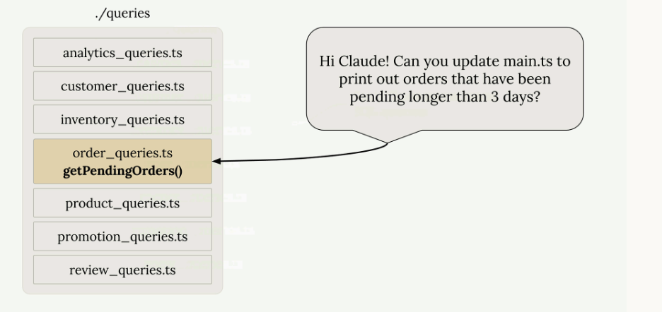
The query duplication hook addresses this by implementing a review process:
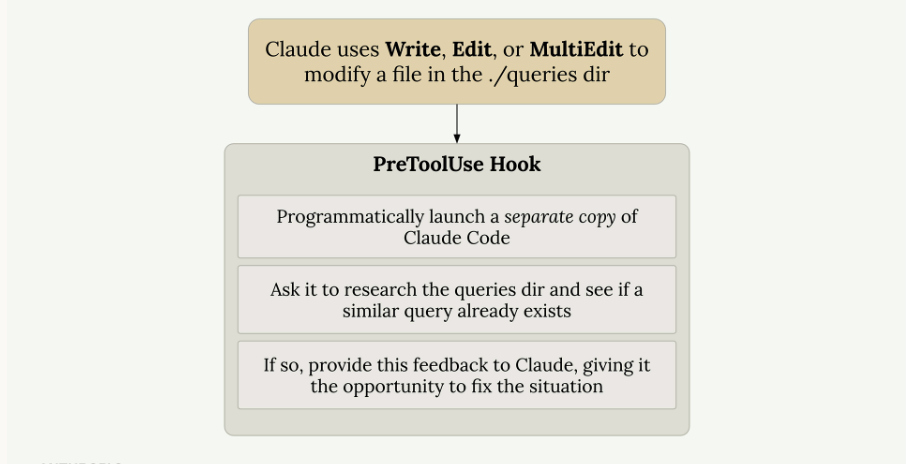
**Here's how it works:**
- Triggers when Claude modifies files in the `./queries` directory
- Launches a **separate instance** of Claude Code programmatically
- Asks the second instance to **review the changes and check for similar existing queries**
- If **duplicates** are found, provides feedback to the original Claude instance
- Prompts Claude to **remove the duplicate** and use the existing functionality


## Another useful hook
- `Notification` - Runs when Claude Code sends a notification, which occurs when Claude needs permission to use a tool, or after Claude Code has been idle for 60 seconds
- `Stop` - Runs when Claude Code has finished responding
- `SubagentStop` - Runs when a subagent (these are displayed as a "Task" in the UI) has finished
- `PreCompact` - Runs before a compact operation occurs, either manual or automatic
- `UserPromptSubmit` - Runs when the user submits a prompt, before Claude processes it
- `SessionStart` - Runs when starting or resuming a session
- `SessionEnd` - Runs when a session ends

Here's the confusing part:
1. The stdin input to your commands will change based upon the type of hook being executed (`PreToolUse, PostToolUse, Notification`, etc)
2. The` tool_input` contained in that will differ based upon the tool that was called (in the case of PreToolUse and PostToolUse hooks).

For example, here's a sample of some stdin input to a hook, where the hook is a `PostToolUse` that was watching for uses of the `TodoWrite` tool. For reference, that is the tool that Claude uses to keep track of to-do items.
```js
{
  "session_id": "9ecf22fa-edf8-4332-ae85-b6d5456eda64",
  "transcript_path": "<path_to_transcript>",
  "hook_event_name": "PostToolUse",
  "tool_name": "TodoWrite",
  "tool_input": {
    "todos": [{ "content": "write a readme", "status": "pending", "priority": "medium", "id": "1" }]
  },
  "tool_response": {
    "oldTodos": [],
    "newTodos": [{ "content": "write a readme", "status": "pending", "priority": "medium", "id": "1" }]
  }
}
```
And for comparison, here's an example of the input to a `Stop` hook:
```js
{
  "session_id": "af9f50b6-f042-4773-b3e2-c3a4814765ce",
  "transcript_path": "<path_to_transcript>",
  "hook_event_name": "Stop",
  "stop_hook_active": false
}
```
As you can see, the stdin input to your command will differ significantly based upon the hook (`PreToolUse`, `PostToolUse`, `Stop`, etc) and the matcher used (in the case of `PreToolUse` and `PostToolUse`). This can make writing hooks challenging - you might not know the exact structure of the input to your command!
```js
"PostToolUse": [ // Or "PreToolUse" or "Stop", etc
  {
    "matcher": "*",
    "hooks": [
      {
        "type": "command",
        "command": "jq . > post-log.json"
      }
    ]
  },
]
```

## The Claude Code SDK
The Claude Code SDK lets you run Claude Code programmatically from within your own applications and scripts.
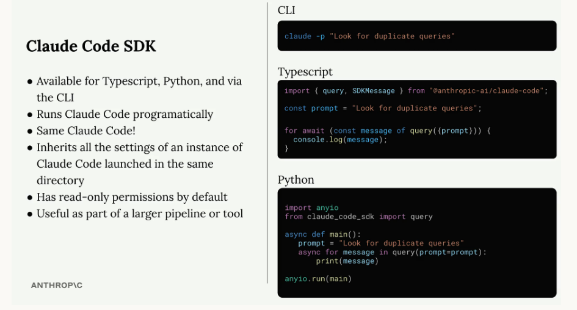

### Key Features
- Runs Claude Code programmatically
- Same Claude Code functionality as the terminal version
- Inherits all settings from Claude Code instances in the same directory
- Read-only permissions by default
- Most useful as part of larger pipelines or tools

### Basic Usage
Example that asks Claude to analyze code for duplicate queries:
```js
import { query } from "@anthropic-ai/claude-code";

const prompt = "Look for duplicate queries in the ./src/queries dir";

for await (const message of query({
  prompt,
})) {
  console.log(JSON.stringify(message, null, 2));
}
```

### Permissions and Tools
By default, the `SDK` only has `read-only` permissions. 

To enable write permissions, you can add the `allowedTools` option to your query:
```js
for await (const message of query({
  prompt,
  options: {
    allowedTools: ["Edit"]
  }
})) {
  console.log(JSON.stringify(message, null, 2));
}
```
