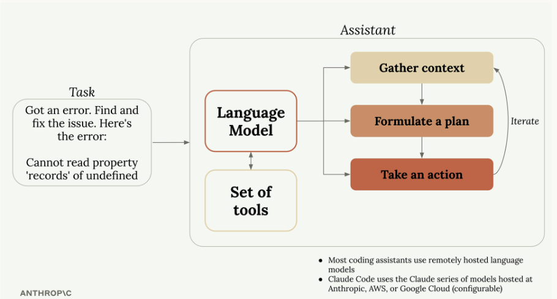
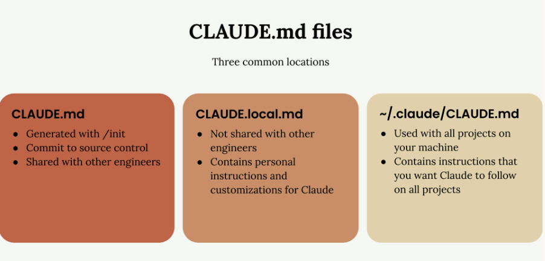

# Cloud coding assistant 
Coding assistant is a sophisticated system that uses language models to tackle complex programming tasks.
### How Coding Assistants Work
When you give a coding assistant a task, it follows a process similar to how a human developer would approach the problem:

1. **Gather context** - Understanding what the error refers to, which part of the codebase is affected, and what files are relevant
2. **Formulate a plan** - Formulate a plan
3. **Take action** - implementing the solution 

**Language models by themselves can only process text and return text - they can't actually read files or run commands.**
So how do coding assistants solve this problem? They use a clever system called `tool use.`

### Tool Use
When you send a request to a coding assistant, it automatically adds tool instructions .

Not all language models are equally good at using tools. The Claude series of models **(Opus, Sonnet, and Haiku)** 
are particularly strong at understanding what tools do and using them effectively to complete complex tasks.

### Benefits of Strong Tool Use
- **Tackles harder tasks**
- **Extensible platform**  You can easily add new tools to Claude Code
- **Better security** 

## CLAUDE.md File Locations
`Claude` recognizes three different CLAUDE.md files in three common locations:

- **CLAUDE.md**- Generated with /init, committed to source control, shared with other engineers
- **CLAUDE.local.md** - Not shared with other engineers, contains personal instructions and customizations for Claude
- **~/.claude/CLAUDE.md** - Used with all projects on your machine, contains instructions that you want Claude to follow on all projects

### Adding Custom Instructions
Use the `#` command to enter "memory mode" - this lets you edit your `CLAUDE.md` files.
```js
# Use comments sparingly. Only comment complex code.
```

### File Mentions with '@'
When you need Claude to look at specific files, use the `@` symbol followed by the file path.

### Referencing Files in CLAUDE.md
You can also mention files directly in your CLAUDE.md file using the same `@` syntax.

## Making changes
#### 1. Using Screenshots for Precise Communication
#### 2. Planning Mode
For more complex tasks that require extensive research across your codebase, you can enable `Planning Mode`.

Enable Planning Mode by pressing `Shift + Tab` twice (or once if you're already auto-accepting edits). In this mode, Claude will:
- Read more files in your project
- Create a detailed implementation plan
- Show you exactly what it intends to do
- Wait for your approval before proceeding

#### 3. Thinking Modes
Claude offers different levels of reasoning through "thinking" modes. 
The available thinking modes include:
- `Think`- Basic reasoning
- `Think more` - Extended reasoning
- `Think a lot` - Comprehensive reasoning
- `Think longer` - Extended time reasoning
- `Ultrathink` - Maximum reasoning capability

### When to Use Planning vs Thinking
**Planning Mode** is best for:
- Tasks requiring broad understanding of your codebase
- Multi-step implementations
- Changes that affect multiple files or components

**Thinking Mode** is best for:
- Complex logic problems
- Debugging difficult issues
- Algorithmic challenges

You can combine both modes for tasks that require both breadth and depth.

## Controlling context
### Interrupting Claude with Escape
Sometimes Claude starts heading in the wrong direction or tries to tackle too much at once. You can press the `Escape key` to stop Claude mid-response, allowing you to redirect the conversation.

### Combining Escape with Memories
When Claude makes the same mistake repeatedly across different conversations, you can:
- Press `Escape` to stop the current response
- Use the `#` shortcut to add a memory about the correct approach
- Continue the conversation with the corrected information

### Rewinding Conversations
You can rewind the conversation by pressing `Escape twice`.This shows you all the messages you've sent, allowing you to jump back to an earlier point and continue from there. 

### Context Management Commands
Claude provides several commands to help manage conversation context effectively:

**/compact**

The `/compact` command summarizes your entire conversation history

**/clear**

The `/clear` command completely removes the conversation history, giving you a fresh start.

### When to Use These Techniques
These conversation control techniques are valuable during:
- Long-running conversations where context can become cluttered
- Task transitions where previous context might be distracting
- Situations where Claude repeatedly makes the same mistakes
- Complex projects where you need to maintain focus on specific components


## Custom commands
### Creating Custom Commands
To create a custom command, you need to set up a specific folder structure in your project:
1. Find the .claude folder in your project directory
2. Create a new directory called `commands` inside it
3. Create a new markdown file with your desired command name (like `audit.md`)

So `audit.md` creates the `/audit` command.

### Commands with Arguments
Custom commands can accept arguments using the `$ARGUMENTS` placeholder.
For example, a `write_tests.md` command might contain:
```js
Write comprehensive tests for: $ARGUMENTS

Testing conventions:
* Use Vitests with React Testing Library
* Place test files in a __tests__ directory in the same folder as the source file
* Name test files as [filename].test.ts(x)
* Use @/ prefix for imports

Coverage:
* Test happy paths
* Test edge cases
* Test error states
```
You can then run this command with a file path:

```js
/write_tests the use-auth.ts file in the hooks directory 
```

### Key Benefits
- **Automation** - Turn repetitive workflows into single commands
- **Consistency** - Ensure the same steps are followed every time
- **Context** - Provide Claude with specific instructions and conventions for your project
- **Flexibility** - Use arguments to make commands work with different inputs

## MCP servers with Claude Code
You can extend Claude Code's capabilities by adding `MCP` **(Model Context Protocol)** servers. These servers run either remotely or locally on your machine and provide Claude with new tools and abilities it wouldn't normally have.

One of the most popular `MCP` servers is `Playwright`, which gives Claude the ability to control a web browser.

### Installing the Playwright MCP Server
```js
claude mcp add playwright npx @playwright/mcp@latest
```
This command does two things:
- Names the MCP server `"playwright"`
- Provides the command that starts the server locally on your machine

### Managing Permissions
When you first use MCP server tools, Claude will ask for permission each time.

Open the `.claude/settings.local.json` file and add the server to the allow array:
```js
{
  "permissions": {
    "allow": ["mcp__playwright"],
    "deny": []
  }
}
```

### Exploring Other MCP Servers
`Playwright` is just one example of what's possible with MCP servers. The ecosystem includes servers for:
- Database interactions
- API testing and monitoring
- File system operations
- Cloud service integrations
- Development tool automation


