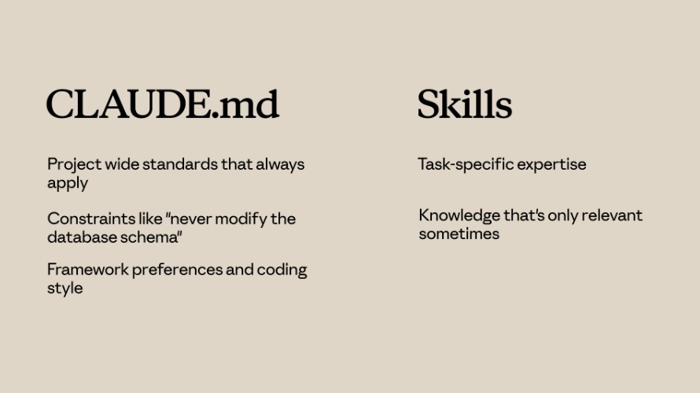

## Skills vs. other Claude Code features
Claude Code offers several customization options: **Skills, CLAUDE.md, subagents, hooks, and MCP servers**. They solve different problems

- `CLAUDE.md` loads into every conversation and is best for always-on project standards. `Skills` load on demand and are best for task-specific expertise
- `Subagents` run in isolated execution contexts — use them for delegated work. `Skills` add knowledge to your current conversation
- `Hooks` are event-driven (fire on file saves, tool calls). `Skills` are request-driven (activate based on what you're asking)
- `MCP servers` provide external tools and integrations — a different category entirely from skills

### CLAUDE.md vs Skills
`CLAUDE.md` loads into every conversation, always. If you want Claude to use TypeScript strict mode in your project, put it in your `CLAUDE.md` file.

`Skills` load on demand. When Claude matches a request to a skill, that skill's instructions join the conversation.


### Skills vs Subagents
`Skills` add knowledge to your current conversation. When a skill activates, its instructions join the existing context.

`Subagents` run in a separate context. They receive a task, work on it independently, and return results.
#### Use Subagents when:
- You want to delegate a task to a separate execution context
- You need different tool access than the main conversation
- You want isolation between delegated work and your main context

### Skills vs Hooks
`Hooks` fire on events. A hook might run a linter every time Claude saves a file, or validate input before certain tool calls. They're event-driven.

`Skills` are request-driven. They activate based on what you're asking.
#### Use Hooks for:
- Operations that should run on every file save
- Validation before specific tool calls
- Automated side effects of Claude's actions

----------
### Putting It All Together
1. **CLAUDE.md** — always-on project standards
2. **Skills** — task-specific expertise that loads on demand
3. **Hooks** — automated operations triggered by events
4. **Subagents** — isolated execution contexts for delegated work
5. **MCP servers** — external tools and integrations

------------

### Committing Skills to Your Repository
Place them in `.claude/skills,` and anyone who clones the repo gets those skills automatically — no extra installation needed.

This approach works well for:
- Team coding standards
- Project-specific workflows
- Skills that reference your codebase structure

### Distributing Skills Through Plugins
Plugins are a way to extend Claude Code with custom functionality designed to be shared across teams and projects. In your plugin project, create a `skills` directory that follows a similar file structure to the `.claude` directory — each skill gets its own folder with a `SKILL.md` file inside.

### Enterprise Deployment Through Managed Settings
 Enterprise skills take the highest priority — they override personal, project, and plugin skills with the same name.

 The managed settings file supports features like `strictKnownMarketplaces` to control where plugins can be installed from:
 ```js
 "strictKnownMarketplaces": [
  {
    "source": "github",
    "repo": "acme-corp/approved-plugins"
  },
  {
    "source": "npm",
    "package": "@acme-corp/compliance-plugins"
  }
]
```

### Skills and Subagents
Subagents don't automatically see your skills.
- **Built-in agents** (like Explorer, Plan, and Verify) can't access skills at all
- **Custom subagents** you define can use skills, but only when you explicitly list them
- Skills are loaded when the subagent starts

To create a custom subagent with skills, add an agent markdown file in `.claude/agents`. You can use the `/agents` command in Claude Code to create one interactively:


The generated agent file includes a `skills` field that lists which skills to load.