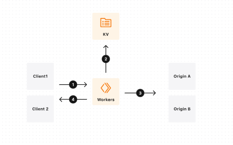

# A/B testing with same-URL direct access
Set up an A/B test by controlling what response is served based on cookies.
```ts
const NAME = "myExampleWorkersABTest";

export default {
	async fetch(req): Promise<Response> {
		const url = new URL(req.url);

		// Enable Passthrough to allow direct access to control and test routes.
		if (url.pathname.startsWith("/control") || url.pathname.startsWith("/test"))
			return fetch(req);

		// Determine which group this requester is in.
		const cookie = req.headers.get("cookie");

		if (cookie && cookie.includes(`${NAME}=control`)) {
			url.pathname = "/control" + url.pathname;
		} else if (cookie && cookie.includes(`${NAME}=test`)) {
			url.pathname = "/test" + url.pathname;
		} else {
			// If there is no cookie, this is a new client. Choose a group and set the cookie.
			const group = Math.random() < 0.5 ? "test" : "control"; // 50/50 split
			if (group === "control") {
				url.pathname = "/control" + url.pathname;
			} else {
				url.pathname = "/test" + url.pathname;
			}
			// Reconstruct response to avoid immutability
			let res = await fetch(url);
			res = new Response(res.body, res);
			// Set cookie to enable persistent A/B sessions.
			res.headers.append("Set-Cookie", `${NAME}=${group}; path=/`);
			return res;
		}
		return fetch(url);
	},
}
```

# A/B-testing using Workers
### Introduction
`A/B testing`, also known as **split testing**. `A/B testing` involves comparing two versions of a web page or app feature to determine which one performs better.

The process typically begins with the creation of *two variants:* the **control (A)** and the **variant (B)**.
These variants are identical except for the specific element being tested, whether it's a headline, button color, layout, or any other component.
For example, a team might test two different **call-to-action** button colors to see which one generates more clicks.

As users interact with the **different variants**, their actions and behaviors are *tracked* and *analyzed*.

 `Key metrics` such as **click-through rates, conversion rates, bounce rates, and engagement metrics** are monitored to determine which variant is more effective.

`A/B testing` is a powerful tool for continuously optimizing and improving digital experiences, enabling teams to make data-driven decisions based on real user feedback.

Cloudflare's low-latency, fully serverless compute platform, `Workers` offers powerful capabilities to enable A/B testing using a server-side implementation. With the help of `Workers KV`, this solution can be make highly configurable with ease.

### A/B testing using Workers


This architecture shows a same-URL A/B testing endpoint. The A/B testing logic and configuration is deployed on the server side, so that clients do not have to implement any changes to make use of A/B testing.
1. **Client:** Sends requests to server.
2. **Configuration:** Process incoming request using Workers. Read current configuration by reading from `KV` using the `get()` method.
3. **Origin requests:** Check for already existing `cookies` in the request headers. If no `cookie` for group assignment is set, randomly assign a group. If a `cookie` is set, extract assigned group from the `cookie` header. Send request to either the control endpoint (A) or variant endpoints (B) depending on the configuration and the assigned group.
4. **Response:** Return the response from the origin. Additionally, if no cookie was previously set, set a cookie with the respective assigned group for session affinity.

- A Worker intercepts incoming requests
- Checks for an existing cookie (e.g. myExampleWorkersABTest=control or =test)
- If no cookie exists, it randomly assigns the visitor to a group (commonly a 50/50 split via Math.random() < 0.5)
- It rewrites the URL path (e.g. to /control or /test) and fetches that version
- It sets a Set-Cookie header so the same visitor keeps seeing the same variant on future requests