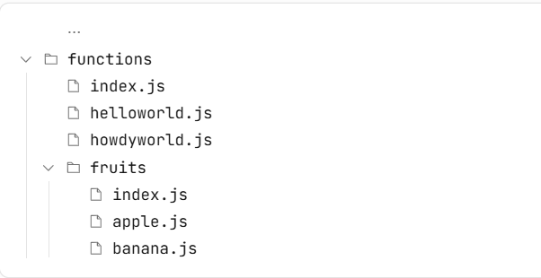
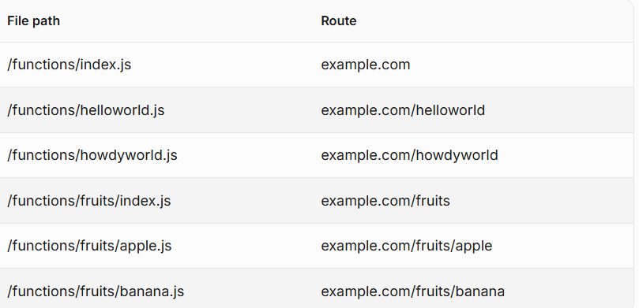
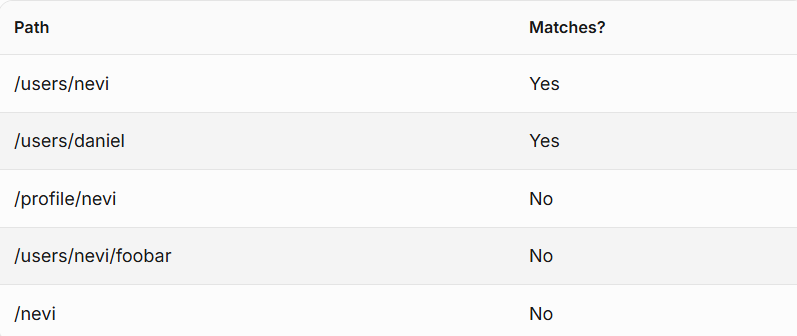
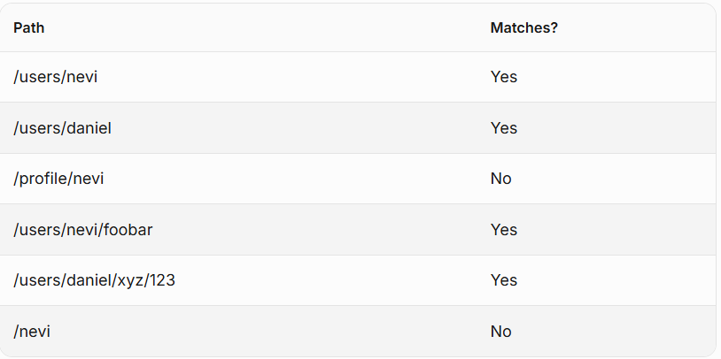

# Functions
`Pages Functions` allows you to build full-stack applications by executing code on the Cloudflare network.
With Functions, you can introduce application aspects such as **authenticating, handling form submissions, or working with middleware.**

### Create a Function
Create a `/functions` directory at the root.
Writing your Functions files in the `/functions` directory will automatically generate routes.

```js
//helloworld.js
export function onRequest(context) {
	return new Response("Hello, world!");
}
```
This Function will run on the `/helloworld` route and returns `"Hello, world!"`.

You can create a `/functions` directory with as many levels as needed for your project's use case.



### Dynamic routes
#### Single path segments
To create a dynamic route, place **one set of brackets** around your filename – for example, `/users/[user].js.` You are creating a placeholder for a single path segment:


#### Multipath segments
By placing **two sets of brackets** around your filename – for example, `/users/[[user]].js` – you are matching **any depth of route** after `/users/:`.


# Middleware
Middleware is reusable logic that can be run before your `onRequest` function.

Middleware is similar to standard Pages Functions but **middleware** is always defined in a `_middleware.js `file in your project's `/functions` directory.

If you want to run a middleware on your **entire application**, including in front of static files, create a `functions/_middleware.js `file.
In `_middleware.js` files, you may export an onRequest handler .This example uses the `next()` method available in the request handler's context object:

```js
export async function onRequest(context) {
	try {
		return await context.next();
	} catch (err) {
		return new Response(`${err.message}\n${err.stack}`, { status: 500 });
	}
}
```
#### Chain middleware
You can export an array of Pages Functions as your middleware handler. This allows you to chain together multiple middlewares that you want to run. 
```js
async function errorHandling(context) {
	try {
		return await context.next();
	} catch (err) {
		return new Response(`${err.message}\n${err.stack}`, { status: 500 });
	}
}

function authentication(context) {
	if (context.request.headers.get("x-email") != "admin@example.com") {
		return new Response("Unauthorized", { status: 403 });
	}

	return context.next();
}

export const onRequest = [errorHandling, authentication];
```
