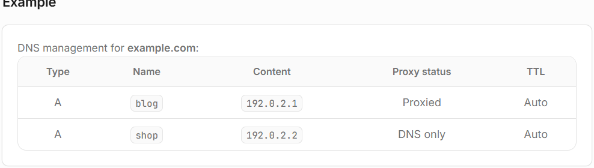

# Proxy status
While your DNS records contain information about your domain, the proxy status controls whether HTTP/HTTPS traffic for that record routes through Cloudflare's network or goes directly to your origin server.

When a record is **Proxied,** Cloudflare sits between your visitors and your server — optimizing, caching, and protecting traffic along the way.
When a record is **DNS-only**, Cloudflare responds with your server's actual IP address and does not route HTTP/HTTPS traffic through its network.

Only- `A, AAAA, and CNAME` records — can be **proxied**. Other record types (such as MX or TXT) are always **DNS-only.**

### Benefits
When you set a DNS record to Proxied — shown as an orange cloud icon in the dashboard, also known as "orange-clouded" — Cloudflare can:
- Protect your origin server (the server hosting your website or application) from DDoS attacks .
- Optimize, cache, and protect all requests to your application.
- Apply your Cloudflare product configurations (such as WAF rules, caching, and redirect rules) to incoming traffic.

# Proxy behavior

