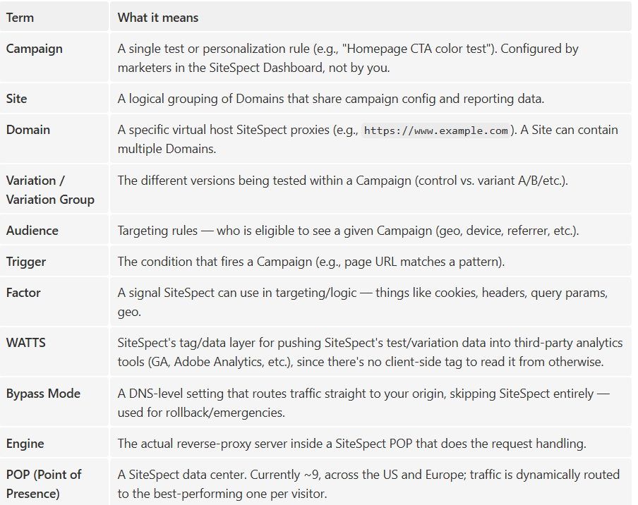
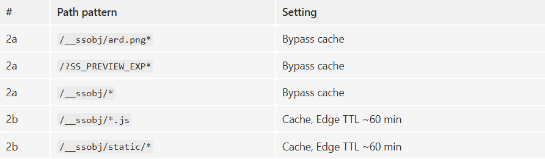

# SiteSpect 
**What it is:** SiteSpect is an A/B testing, personalization, and recommendations platform. Its defining feature is that it's **tagless and server-side** — it doesn't rely on a JavaScript snippet loading in the browser. Instead, it sits as a **reverse proxy in your traffic path**, intercepts the HTML response from your real web server, and rewrites it on the fly (find-and-replace, DOM changes, redirects, etc.) before it ever reaches the visitor. That's why there's no flicker/flash-of-original-content — the visitor never sees the untested page.

### Core vocabulary you'll want to recognize:


## 1. The actual architecture you'll be configuring
This is different from a typical in-house Worker-based A/B test. SiteSpect is a **reverse-proxy-based, server-side testing platform** — no tags/snippets. The flow:
```
End user -> Cloudflare (your CDN) -> SiteSpect Cloud (acts as your "origin") -> your real web server/origin
                                         ^
                            SiteSpect measures + rewrites HTML here,
                            then the modified HTML flows back through
                            Cloudflare to the end user.
```

**Key facts:**
- Cloudflare's **origin setting is changed to point at a SiteSpect-provided DNS hostname** — SiteSpect becomes an extra hop between Cloudflare and your real backend, at least for HTML.
- SiteSpect's cloud runs on `POPs` (currently 9, US + Europe) with internal reverse-proxy "engines"; visitor sessions are tracked with `cookies`, and visitors can move between SiteSpect engines/POPs without affecting their assigned test experience.
- Static assets (images, CSS, most JS) should keep going straight to your normal origin — **only HTML (and SiteSpect's own JS/config objects) needs to route through SiteSpect.**
- SiteSpect also supports **Bypass Mode:** a DNS-level fallback that points traffic directly at your origin, skipping SiteSpect entirely — this is your emergency rollback lever, and you should be ready to explain how/when you'd use it.

## 2. The exact Cloudflare configuration SiteSpect's own docs specify
This is close to a "know this cold" checklist — it's very plausible the interview will probe exactly this.

**1. Origin change:** point the CDN's origin to the DNS name SiteSpect provides (for the domain(s)/paths under test).

**2. Caching rules, applied in this order (order matters):**

**Why order matters:** classic Page Rules apply **all matching rules, but for conflicting settings on the same URL, the first matching rule in priority order wins.** `/__ssobj/*.js and /__ssobj/static/*` are technically sub-paths of `/__ssobj/*`, so if the broad bypass rule were evaluated with equal-or-higher priority than the narrower cache rules, it would win and you'd never get the intended 60-minute caching on the JS/static objects. You need the specific bypass rules (ard.png, the preview query string) and the specific cache rules to sit correctly relative to the catch-all `/__ssobj/*` bypass.

**3. Health/performance objects:** you'll need to deploy two small static HTML files on your real origin (on a static, non-tested part of the site) so SiteSpect can continuously probe latency/availability from each POP and route visitors to the best-performing entry point. SiteSpect hits these multiple times per second — know why they exist so you don't accidentally cache, block, or rate-limit them.

**4. SSL/TLS:** SiteSpect terminates TLS on its own cluster for the domains it proxies, so a cert + key (yours, a new one, a CSR, or a SiteSpect self-signed cert for non-prod) has to be provisioned onto their cluster. This is a coordination point with the vendor and with whoever owns your certs — flag it as a dependency, not something Cloudflare config alone solves.

**5. Sites vs. Domains model:** SiteSpect groups config into Sites (a logical grouping — shares test data/campaigns) and Domains (the actual virtual hosts, e.g. https://www.example.com). One Site can have multiple Domains if you want a consistent test experience across http/https and across subdomains; separate Sites if you want to keep test data isolated per subdomain (e.g., www vs shop). Worth understanding because it affects how you'll scope the Cloudflare-side routing per property when "P.'s web properties" (plural) are in play.

**6. Modern-Cloudflare translation:** SiteSpect's docs say "under Page Rules" — but Page Rules are Cloudflare-deprecated (2024) in favor of the **Ruleset Engine.** In a real, current Cloudflare account you'd implement the same bypass/TTL behavior with **Cache Rules** (Rulesets API/dashboard) instead of legacy Page Rules, respecting the same effective precedence. Saying this out loud unprompted is a strong signal — it shows you're not just parroting vendor docs verbatim.

## 3. Troubleshooting: the failure modes you'll actually be asked about

**1. Cache bypass rule ordering wrong -> SiteSpect's variant JS/config gets cached when it shouldn't, or vice versa.** First thing to check: `cf-cache-status` on `/__ssobj/*` requests.

**2. Cache doesn't vary by cookie/session -> wrong variant frozen into the edge cache.** Cloudflare's edge cache does not use Vary to split cache entries by cookie (or even by Origin, which causes similar-looking CORS bugs) — if HTML is cached at all, you must use a Cache Rule with an explicit custom cache key (or bypass cache for HTML entirely, which is what SiteSpect's own guidance effectively does by routing HTML fully through their proxy per-request).

**3. DNS not proxied (grey-clouded) on the domain pointed at SiteSpect ->** depending on setup this can break the intended routing entirely, since the traffic never takes the path you configured.

**4.SSL cert expiring on SiteSpect's cluster ->** SiteSpect auto-notifies ~45 days out, but if nobody owns that email loop internally, it becomes an outage. Good one to mention when asked about handover/documentation — this is exactly the kind of operational detail that needs to survive a handoff.


### 5. Sample code / config you could write or talk through
##### A. Translating SiteSpect's Page Rules guidance into a modern Cache Rule (Rulesets API shape)
```json
{
  "rules": [
    {
      "expression": "http.request.uri.path eq \"/__ssobj/ard.png\" or http.request.uri.query contains \"SS_PREVIEW_EXP\"",
      "description": "SiteSpect: never cache health-check pixel or preview-mode requests",
      "action": "set_cache_settings",
      "action_parameters": { "cache": false }
    },
    {
      "expression": "http.request.uri.path eq \"/__ssobj/ard.png\" or starts_with(http.request.uri.path, \"/__ssobj/static/\") or (ends_with(http.request.uri.path, \".js\") and starts_with(http.request.uri.path, \"/__ssobj/\"))",
      "description": "SiteSpect: cache JS/static SiteSpect objects for 60 minutes",
      "action": "set_cache_settings",
      "action_parameters": {
        "cache": true,
        "edge_ttl": { "mode": "override_origin", "default": 3600 }
      }
    },
    {
      "expression": "starts_with(http.request.uri.path, \"/__ssobj/\")",
      "description": "SiteSpect: bypass cache for all other __ssobj objects (must be lower priority than the two rules above)",
      "action": "set_cache_settings",
      "action_parameters": { "cache": false }
    }
  ]
}
```


##### B. A quick curl-based validation script you could narrate or actually run
```
#!/usr/bin/env bash
DOMAIN="https://www.example.com"

echo "== HTML page (should route through SiteSpect, not be edge-cached) =="
curl -sI "$DOMAIN/" | grep -Ei "cf-cache-status|cf-ray|set-cookie"

echo "== SiteSpect health pixel (should always bypass cache) =="
curl -sI "$DOMAIN/__ssobj/ard.png" | grep -Ei "cf-cache-status|cf-ray"

echo "== SiteSpect JS object (should be a HIT after warmup, ~60min TTL) =="
curl -sI "$DOMAIN/__ssobj/some-config.js" | grep -Ei "cf-cache-status|age|cache-control"

echo "== Preview mode query string (should always bypass) =="
curl -sI "$DOMAIN/?SS_PREVIEW_EXP=1" | grep -Ei "cf-cache-status"
```

##### C. If asked to whiteboard a fallback/DIY approach without SiteSpect
```js
export default {
  async fetch(request) {
    const cookie = request.headers.get("Cookie") || "";
    const hasBucket = /ab-bucket=(A|B)/.test(cookie);
    const bucket = hasBucket ? cookie.match(/ab-bucket=(A|B)/)[1]
                              : (Math.random() < 0.5 ? "A" : "B");

    const originReq = new Request(request);
    originReq.headers.set("x-ab-bucket", bucket); // must be part of the cache key if HTML is cached

    const resp = await fetch(originReq);
    const out = new Response(resp.body, resp);
    if (!hasBucket) {
      out.headers.append("Set-Cookie", `ab-bucket=${bucket}; Path=/; Max-Age=2592000; Secure; SameSite=Lax`);
    }
    return out;
  }
};
```
