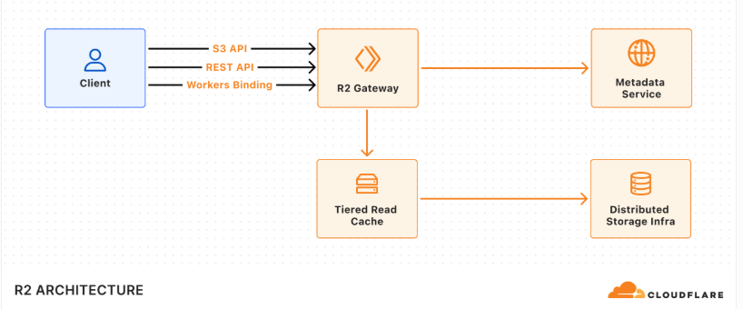
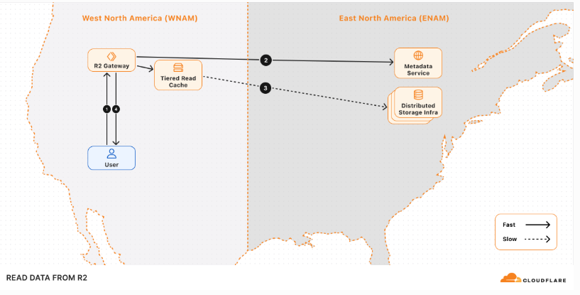

# KV Storage

Workers `KV` is a data storage that allows you to store and retrieve data globally.

Access your Workers KV namespace from Cloudflare Workers using **Workers Bindings** or from your external application using the **REST API**:


```ts
// Bindings
export default {
	async fetch(request, env, ctx): Promise<Response> {
		// write a key-value pair
		await env.KV.put('KEY', 'VALUE');

		// read a key-value pair
		const value = await env.KV.get('KEY');

		// list all key-value pairs
		const allKeys = await env.KV.list();

		// delete a key-value pair
		await env.KV.delete('KEY');

		// return a Workers response
		return new Response(
			JSON.stringify({
				value: value,
				allKeys: allKeys,
			}),
		);
	},

} satisfies ExportedHandler<{ KV: KVNamespace }>;

//REST API

const client = new Cloudflare({
	apiEmail: process.env['CLOUDFLARE_EMAIL'], // This is the default and can be omitted
	apiKey: process.env['CLOUDFLARE_API_KEY'], // This is the default and can be omitted
});

const value = await client.kv.namespaces.values.update('<KV_NAMESPACE_ID>', 'KEY', {
	account_id: '<ACCOUNT_ID>',
	value: 'VALUE',
});

const value = await client.kv.namespaces.values.get('<KV_NAMESPACE_ID>', 'KEY', {
	account_id: '<ACCOUNT_ID>',
});

const value = await client.kv.namespaces.values.delete('<KV_NAMESPACE_ID>', 'KEY', {
	account_id: '<ACCOUNT_ID>',
});

// Automatically fetches more pages as needed.
for await (const namespace of client.kv.namespaces.list({ account_id: '<ACCOUNT_ID>' })) {
	console.log(namespace.id);
}
```


# Cloudflare R2
Cloudflare R2 Storage allows developers to store large amounts of unstructured data without the costly egress bandwidth fees associated with typical cloud storage services.

You can use R2 for multiple scenarios, including but not limited to:
- Storage for cloud-native applications
- Cloud storage for web content
- Storage for podcast episodes
- Data lakes (analytics and big data)
- Cloud storage output for large batch processes, such as machine learning model artifacts or datasets

### Architecture
R2's architecture is composed of multiple components:
- **R2 Gateway:** The entry point for all API requests that handles authentication and routing logic. This service is deployed across Cloudflare's global network via Cloudflare Workers.
- **Metadata Service:** A distributed layer built on Durable Objects used to store and manage object metadata .
It includes a built-in cache layer to speed up access to metadata.
- **Tiered Read Cache:** A caching layer that sits in front of the Distributed Storage Infrastructure that speeds up object reads by using Cloudflare Tiered Cache to serve data closer to the client.
- **Distributed Storage Infrastructure:** The underlying infrastructure that persistently stores encrypted object data.

All requests are routed through the R2 Gateway, which coordinates with the Metadata Service and Distributed Storage Infrastructure to retrieve the object data

### Write data to R2
1. **Request handling:** The request is received by the R2 Gateway at the edge, close to the user, where it is authenticated.
2. **Encryption and routing:** The Gateway reaches out to the Metadata Service to retrieve the encryption key and determines which storage cluster to write the encrypted data to within the location set for the bucket.
3. **Writing to storage:** The encrypted data is written and stored in the distributed storage infrastructure, and replicated within the region (e.g. ENAM) for durability.
4. **Metadata commit:** Finally, the Metadata Service commits the object's metadata, making it visible in subsequent reads. Only after this commit is an HTTP 200 success response sent to the client.

### Read data from R2
1. **Request handling:** The request is received by the R2 Gateway at the edge, close to the user, where it is authenticated.
2. **Metadata lookup:** The Gateway asks the Metadata Service for the object metadata.
3. **Reading the object:** The Gateway attempts to retrieve the encrypted object 
4. **Serving to client:** The object is decrypted and served to the user.


# D1 Storage
D1 is Cloudflare's managed, serverless database with SQLite's SQL semantics.

