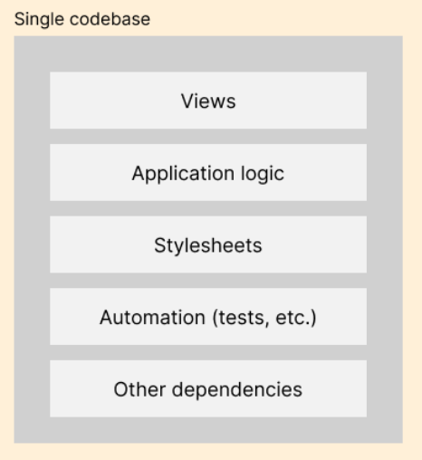
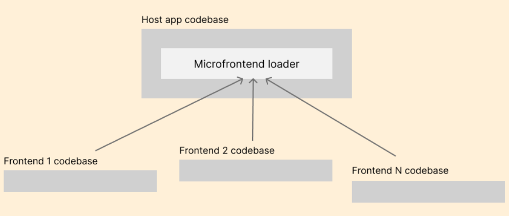
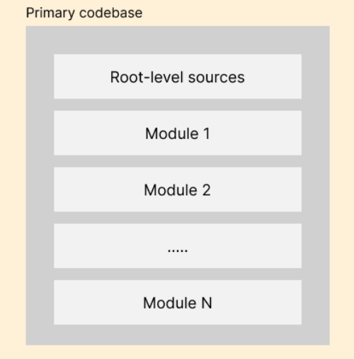

# Frontend Architecture
### Popular frontend architecture patterns
- Monolithic architecture
- Microfrontend architecture
- Modular architecture
- Component-based architecture
- Hybrid/mixed architecture
- Flux architecture

## Monolithic architecture
Monolithic architecture hosts the `entire app` frontend’s interfaces, resources, and dependency module sources in just one project codebase.

### Strengths of monolithic architecture
- Offers the simplest complete codebase structure for small projects
- Beginner-friendly development environment since every codebase component is stored in one code repository
- Simplifies debugging and testing 
- Simplifies the deployment process and pre-deployment workflows
-  fast initial project handover and reduced development costs from initial development cycles
### Weaknesses of monolithic architecture
- Codebase grows with the project size and affects maintainability and developer-productivity
- Comes with scalability limitations
- Can create collaboration limitations and problematic code integration
- Deployment completions typically take more time and restart the entire app

## Microfrontend architecture
The microfrontend architecture divide the app frontend into isolated, maintainable frontend projects.
Developers can create `microfrontends` with UI segments, components, modules, or even entire app frontends based on the 
complexity of the product and development preferences.

A software system that follows the **microfrontend pattern** has two types of separate projects:
- **The host app**: Responsible for loading and managing microfrontend execution life cycles
- **Microfrontends**: Provide functionality to the host app on demand
### Strengths of microfrontend architecture
- Improved scalability and maintainability 
- deployments without even restarting the host app
- Independent development and deployment cycles for microfrontends
### Weaknesses of microfrontend architecture
- Increased complexity in managing multiple projects
- Potential performance overhead due to multiple microfrontends
- Understanding the microfrontend architecture can be challenging 

## Modular architecture
Modular architecture decomposes the codebase into separate, maintainable, and installable modules. 
Developers split the primary app code into sub-modules based on functionality, so they can develop, test, and deploy them
as isolated entities without creating collaborative development conflicts.

The modular pattern turns a single monolithic code repository

### Strengths of modular architecture
- Reduces the main codebase complexity and improves maintainability
- Improves collaboration through parallel development 
- Offers better unit test 
### Weaknesses of modular architecture
- Primary codebase complexity grows when the submodule count increases
- Beginners should become familiar with modules, module integration, and SCM (source code management) submodules (i.e., Git submodules) before starting with development
- Difficult to see a whole project codebase snapshot from one code repository
- Deployments are typically slow and restart the entire app