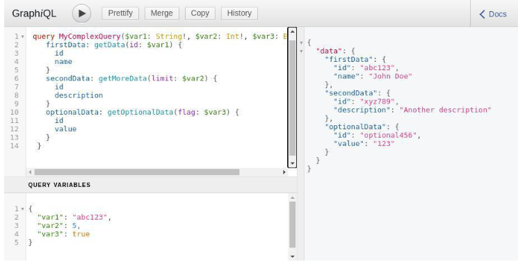
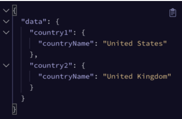

# GraphQL
GraphQL is an **open-source data query language for APIs** and It is a **server-side runtime** for executing the query.

It is an **alternative to REST**, where clients make multiple requests to different endpoints to get the data they require but in GraphQL clients can **request exactly the data they need** in a single query.

### Key Features of GraphQL
- **Flexible Queries**: Clients can request exactly the data they need, avoiding over-fetching and under-fetching.
- **Strongly Typed**: GraphQL schemas provide clear data structures and types, reducing runtime errors
- **Real-time Updates**: GraphQL supports subscriptions for real-time data interactions.
- **Single Endpoint**: GraphQL uses a single endpoint for all data requests.
- **Introspection**: Clients can explore the schema's capabilities through introspection queries.
- **Batching**: Multiple queries can be sent in a single request to minimize network overhead.
- **Efficient for Mobile**: GraphQL can be more efficient for mobile devices by reducing data transfer.

## GraphQL Queries
GraphQ`L queries are requests made to a **GraphQL server** to fetch or modify data. They are written using the GraphQL query 
language syntax, which allows clients to specify exactly what data they need.

### Different Ways to Writing GraphQL Queries
1. **Basic Queries:**
```
query {
  users {
    id
    name
    email
  }
}
```
2. **Query with Arguments:**
```
query {
  user(id: 1) {
    name
    email
  }
}
```
3. **Nested Objects:**
```
query {
  user(id: 1) {
    name
    posts {
      title
      body
    }
  }
}
```
4. **Aliases:**
```
query {
  user1: user(id: 1) {
    name
  }
  user2: user(id: 2) {
    name
  }
}
```
5. **Fragment:**
   Let's fetches the names and emails of two users, using a fragment called userFields to reuse the common set of fields for both users
```
query {
  user1: user(id: 1) {
    ...userFields
  }
  user2: user(id: 2) {
    ...userFields
  }
}

fragment userFields on User {
  name
  email
}
```
6. **Query with Variables:**
   Let's retrieve the name and email of a user identified by a specific userId using GraphQL `variables`.
```
query($userId: ID!) {
  user(id: $userId) {
    name
    email
  }
}
```
-----------

# Mutations in GraphQL
GraphQL **queries** are used to retrieve information, **mutations** are used to to write data to the server, 
similar to `HTTP` Commands like `POST`, `PUT`, `PATCH`, and `DELETE` in REST APIs.
### Add new data
```
enum Episode {
  NEWHOPE
  EMPIRE
  JEDI
}
 
input ReviewInput {
  stars: Int!
  commentary: String
}
 
type Mutation {
  createReview(episode: Episode, review: ReviewInput!): Review
}
```
### Update existing data
```
   type Mutation {
  updateHumanName(id: ID!, name: String!): Human
}
```
### Delete data
```
   type Mutation {
  deleteUser(id: ID!): Boolean
}
```
-----------------

# Variables in GraphQL
- `Variables` are declared within the parentheses of a query or mutation.
- In GrahphQL, each varaible starts with a dollar sign `($)` followed by the variablle name and its type.
```
query GetPerson($id: ID!) {
  person(id: $id) {
    name
    age
    address
  }
}
```
### Multiple Variables
```
query MyComplexQuery($var1: String!, $var2: Int!, $var3: Boolean) {
    firstData: getData(id: $var1) {
      id
      name
    }
    secondData: getMoreData(limit: $var2) {
      id
      description
    }
    optionalData: getOptionalData(flag: $var3) {
      id
      value
    }
  }
```
##### Providing Variables Values
We can pass the values in the graphql query using the Graphql Query Variable Field.

**Variable Values**
```
{
  "var1": "abc123",
  "var2": 5,
  "var3": true
}
```

### Default Variable
```
query($id:ID=5){
  person(id:$id){
    name
    address
 }
}
```

------------

# Fragments in GraphQL
In GraphQL, as you develop your queries, you might find that **certain fields are needed across various queries**.
It's beneficial to restructure your queries by combining these shared fields into reusable units called **fragments.**
```
fragment UserInfo on User {
  id
  name
  email
}

type User {
  id: ID!
  name: String!
  email: String!
}

query GetUser {
  user(id: "123") {
    ...UserInfo
  }
}

// RESPONSE

{
  "data": {
    "user": {
      "id": "123",
      "name": "John Doe",
      "email": "john.doe@example.com"
    }
  }
}
```
### Benefits of the Fragments
- **Reusability**: Fragments allow grouping fields for reuse across queries
- **Caching Support**: Enhances caching effectiveness in GraphQL clients.
- **Reduced Redundancy**: Minimizes duplication of field selections, improving query efficiency.
- **Flexible Updates**: Updates to a fragment automatically reflect in all queries using it


------------------
# GraphQL Aliases
Powerful tool that help in assigning **alternative names to the fields** present in the query.
```
query {
  country1: country(code: "US") {
    countryName: name
  }
  country2: country(code: "GB") {
    countryName: name
  }
}
```


-----------
# Directives in GraphQL
GraphQL `Directives` used to control the execution of **queries and mutations**. They provide a way
to dynamically modify the structure and shape of **GraphQL operations**, enabling more flexibility and control over the data fetching process.

### What GraphQL Directives do?
- GraphQL directives enable developers to perform transformations during query execution.
- Directives also enable developers to specify conditions for including or excluding fields or fragments.
- Using directives, developers can manage GraphQL operations more effectively.
- Directives increase flexibility and control over data fetching procedures in GraphQL

## Types of Directives
- **Built-in Directives**: These are predefined directives provided by GraphQL itself, such as `@include` and `@skip`.
- **Custom Directives**: Developers can define their own custom directives to tailor the behavior of their GraphQL APIs according to specific requirements.

### Example of an Operation Directive
1. The `@deprecated directive`, which means a field or a type as deprecated and indicates that it should no longer be used.
```
graphql

type Product {
  id: ID!
  name: String!
  price: Float! @deprecated(reason: "Use 'unitPrice' instead")
  unitPrice: Float!
}
```
2. The `@skip directive`, which is used to conditionally skip a field depending on a Boolean condition
```
graphql

query GetUserDetails($skipAdminDetails: Boolean!) {
  user(id: "123") {
    id
    name
    email
    isAdmin @skip(if: $skipAdminDetails)
    adminDetails {
      role
      permissions
    }
  }
}
```
3. A field in the response can be conditionally included using the `@include directive` in accordance with a Boolean condition.
```
graphql

query GetUser($includeAddress: Boolean!) {
  user {
    id
    name
    email
    address @include(if: $includeAddress) {
      street
      city
      country
    }
  }
}
```
4. To define a URL that describes how a GraphQL type or interface behaves, use the `@specifiedBy directive`.
```
graphql

scalar DateTime @specifiedBy(url: "https://graphql.org/learn/schema/#scalar-types")
```


