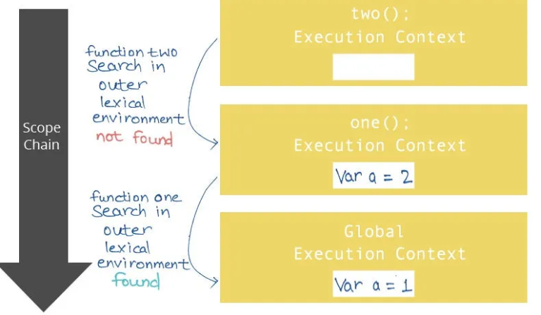

# Lexical Environment
A `lexical environment` in JavaScript is a data structure that stores variables and functions defined in the current scope, along with references to all outer scopes. It is also known as the lexical scope.



A lexical environment in JavaScript is a data structure that stores variables and functions defined in the current scope, along with references to all outer scopes. It is also known as the lexical scope.
Additionally, a new lexical environment is created each time the function is invoked, which holds the function’s local variables and parameters.

When the JavaScript interpreter encounters a variable name, it `first` searches for the variable in the lexical environment of the `current scope`.
If the variable is `not found` in the current scope, the interpreter searches the lexical environment of the `outer scope`, and so on.
The interpreter continues searching the lexical environment until it finds the variable, or it reaches the `global scope`. If the variable is not found anywhere in the lexical environment, 
the interpreter throws a `ReferenceError` exception.

# Temporal Dead Zone (TDZ)
The **Temporal Dead Zone (TDZ)** refers to the period between the start of a block and the point where a variable declared with
`let` or `const` is initialized. During this time, the variable exists in scope but **cannot be accessed**, and attempting
to do so results in a `ReferenceError`.
### Key characteristics of the TDZ:
- Applies to `let` and `const`: Unlike `var` variables, which are initialized with `undefined` when hoisted, let and const variables are not initialized until their declaration line is reached during execution.
- Results in `ReferenceError`: Attempting to access a `let` or `const` variable within its TDZ will result in a `ReferenceError`, indicating that the variable cannot be accessed before initialization.
```js
{
  function someMethod() {
    console.log(counter1); // Output: undefined (due to var hoisting)
    console.log(counter2); // Throws ReferenceError (TDZ for let)

    var counter1 = 1;
    let counter2 = 2;
  }
}
```

# Memoization
Memoization is a technique which attempts to increase a function’s performance by caching its previously computed results.
Each time a memoized function is called, its parameters are used to index the cache. If the data is present, then it can be 
returned, without executing the entire function. Otherwise the function is executed and then the result is added to the cache.
```js
const memoizeAddition = () => {
  let cache = {};
  return (value) => {
    if (value in cache) {
      console.log("Fetching from cache");
      return cache[value]; // Here, cache.value cannot be used as property name starts with the number which is not a valid JavaScript  identifier. Hence, can only be accessed using the square bracket notation.
    } else {
      console.log("Calculating result");
      let result = value + 20;
      cache[value] = result;
      return result;
    }
  };
};
// returned function from memoizeAddition
const addition = memoizeAddition();
console.log(addition(20)); //output: 40 calculated
console.log(addition(20)); //output: 40 cached
```

# Hoisting
Hoisting is JavaScript's default behavior where **variable and function declarations** are moved to the top of their scope 
before code execution. This means you can access certain variables and functions even before they are defined in the code.

# Closures
A closure is the combination of a function bundled together with its lexical environment within which that function was declared.
It is an inner function that has access to the outer or enclosing function’s variables, functions and other data even after the outer function has finished its execution. 
