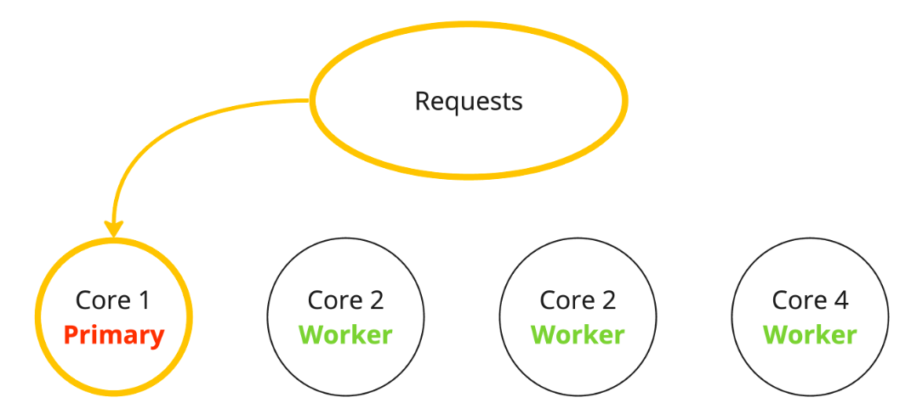

<h1>Object-oriented programming</h1><hr/>
<p>Object-Oriented Programming is a programming style based on classes and objects. These group data (properties) and methods (actions) inside a box.
OOP was developed to make code more flexible and easier to maintain.

JavaScript is prototype-based procedural language, which means it supports both functional and object-oriented programming.</p>
<p>Three main concepts: <b>classes and instances, inheritance, and encapsulation.</b></p>
<h5>There are 4 main principles in OOP, and they are:
<ul>
<li>Abstraction</li>
<li>Encapsulation</li>
<li>Inheritance</li>
<li>Polymorphism</li>
</ul>
</h5>
<h4>What Does Abstraction Mean in OOP?</h4>
<p>Abstraction means hiding certain details that don't matter to the user and only showing essential features or functions.</p>
<h4>What Does Encapsulation Mean in OOP?</h4>
<p>Encapsulation means keeping properties and methods private inside a class, so that they are not accessible from outside that class.</p>
<h4>What Does Inheritance Mean in OOP?</h4>
<p>Inheritance makes all properties and methods available to a child class. This allows us to reuse common logic and to model real-world relationships. </p>
<h4>What Does Polymorphism Mean in OOP?</h4>
<p>Polymorphism means having different and many forms. We can overwrite a method inherited from a parent class.</p>

<h2>Encapsulation</h2>
<p>The object's internal state is kept <b>private</b>meaning that it can only be accessed by the object's own methods, not from other objects. Keeping an object's 
internal state private, and generally making a clear division between its public interface and its private internal state, is called <b>encapsulation</b></p>

<h1>Object</h1>
<p>Object properties, besides a value, have three special attributes </p>
<h4>Property flags</h4>

- <b>writable </b>– if true, the value can be changed, otherwise it’s read-only.
- <b>enumerable</b> – if true, then listed in loops, otherwise not listed.
- <b>configurable</b> – if true, the property can be deleted and these attributes can be modified, otherwise not.

```js
// Object.getOwnPropertyDescriptor allows to query the full information about a property.
let descriptor = Object.getOwnPropertyDescriptor(obj, propertyName);
```

<p>To change the flags, we can use <b>Object.defineProperty</b>.</p>

```js
let user = { };

Object.defineProperty(user, "name", {
  value: "John",
  // for new properties we need to explicitly list what's true
  enumerable: true,
  configurable: true
});

alert(user.name); // John
user.name = "Pete"; // Error
```

<h2>Sealing an object globally</h2>

- <b>Object.seal(obj)</b>  Sets configurable: false for all existing properties.
- <b>Object.freeze(obj)</b>  Sets configurable: false, writable: false for all existing properties.
- <b>Object.isExtensible(obj)</b>  Returns false if adding properties is forbidden, otherwise true.
- <b>Object.isSealed(obj)</b>  Returns true if adding/removing properties is forbidden, and all existing properties have configurable: false.
- <b>Object.isFrozen(obj)</b> Returns true if adding/removing/changing properties is forbidden, and all current properties are configurable: false, writable: false.

<h1>Property getters and setters</h1>
<p>Object have accessor property. They are essentially functions that execute on getting and setting a value, but look like regular properties to an external code.</p>

<h1>Prototypal inheritance</h1>
<h3>[[Prototype]]</h3>
<p>In JavaScript, objects have a special hidden property [[Prototype]], that is either null or references another object. That object is called “a prototype”:</p>


<p>When we read a property from object, and it’s missing, JavaScript automatically takes it from the prototype. In programming, this is called <b>“prototypal inheritance”.</b></p>
<p>The property [[Prototype]] is internal and hidden, but there are many ways to set it.
One of them is to use the special name <b>__proto__</b>, like this:</p>

```js
let animal = {
  eats: true,
    walk() {
        alert("Animal walk");
    }
};
let rabbit = {
  jumps: true,
    // __proto__: animal other way to add prototype
};

//Prototype chain
let longEar = {
    earLength: 10,
    __proto__: rabbit
};

rabbit.__proto__ = animal; // sets rabbit.[[Prototype]] = animal
```
<b>There are only two limitations:</b>
<ol>
<li>The references can’t go in circles. JavaScript will throw an error if we try to assign __proto__ in a circle.</li>
<li>The value of __proto__ can be either an object or null. Other types are ignored.</li>
</ol>

<b>Accessor properties are an exception, as assignment is handled by a setter function. </b>
```js
let user = {
  name: "John",
  surname: "Smith",

  set fullName(value) {
    [this.name, this.surname] = value.split(" ");
  },

  get fullName() {
    return `${this.name} ${this.surname}`;
  }
};

let admin = {
  __proto__: user,
  isAdmin: true
};

alert(admin.fullName); // John Smith (*)

// setter triggers!
admin.fullName = "Alice Cooper"; // (**)

alert(admin.fullName); // Alice Cooper, state of admin modified
alert(user.fullName); // John Smith, state of user protected
```
<h4><b>No matter where the method is found: in an object or its prototype. In a method call, this is always the object before the dot.</b><h4>

<h1>F.prototype</h1>
<p>ew objects can be created with a constructor function, like new F().</p>
<p>F.prototype here means a regular property named "prototype" on F</p>

```js
let animal = {
  eats: true
};

function Rabbit(name) {
  this.name = name;
}

Rabbit.prototype = animal;

let rabbit = new Rabbit("White Rabbit"); //  rabbit.__proto__ == animal

alert( rabbit.eats ); // true
```



<b>Every function has the "prototype" property. he default "prototype" is an object with the only property constructor that points back to the function itself.</b>

<h1>Prototype methods, objects without __proto__</h1>

- Object.getPrototypeOf(obj) – returns the [[Prototype]] of obj.
- Object.setPrototypeOf(obj, proto) – sets the [[Prototype]] of obj to proto.
- Object.create(proto[, descriptors]) – creates an empty object with given proto as [[Prototype]] and optional property descriptors.

```js
let animal = {
  eats: true
};

// create a new object with animal as a prototype
let rabbit = Object.create(animal); // same as {__proto__: animal}

alert(rabbit.eats); // true

alert(Object.getPrototypeOf(rabbit) === animal); // true

Object.setPrototypeOf(rabbit, {}); // change the prototype of rabbit to {}
```

## What is the difference between proto and prototype
The `__proto__` object is the actual object that is used in the lookup chain to resolve methods, etc. Whereas `prototype` is
the object that is used to build `__proto__` when you create an object with the new operator.
```js
new Employee().__proto__ === Employee.prototype;
new Employee().prototype === undefined;
```


# freeze method
The `freeze()` method is used to freeze an object. Freezing an object does not allow adding new properties to an object,
prevents removing, and prevents changing the enumerability, configurability, or writability of existing properties. i.e. 
It returns the passed object and does not create a frozen copy.
```js
const obj = {
  prop: 100,
};

Object.freeze(obj);
obj.prop = 200; // Throws an error in strict mode

console.log(obj.prop); //100
```
#### Remember freezing is only applied to the top-level properties in objects but not for nested objects
```js
const user = {
  name: "John",
  employment: {
    department: "IT",
  },
};

Object.freeze(user);
user.employment.department = "HR";
```

##### `Object.isFrozen()` method is used to determine if an object is frozen or not.

## How do you copy properties from one object to other
You can use the `Object.assign()`
```js
const target = { a: 1, b: 2 };
const source = { b: 3, c: 4 };

const returnedTarget = Object.assign(target, source);

console.log(target); // { a: 1, b: 3, c: 4 }

console.log(returnedTarget); // { a: 1, b: 3, c: 4 }
```

#  seal method
The `Object.seal()` method is used to seal an object, by preventing new properties from being added to it and marking all 
existing properties as non-configurable. But **values of present properties can still be changed as long as they are writable.**
```js
const object = {
  property: "Welcome JS world",
};
Object.seal(object);
object.property = "Welcome to object world";
console.log(Object.isSealed(object)); // true
delete object.property; // You cannot delete when sealed
console.log(object.property); //Welcome to object world
```
#### `The Object.isSealed()` method is used to determine if an object is sealed or not