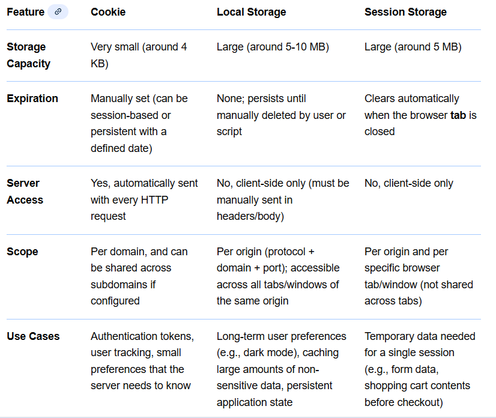

# Web storage
`Web storage` is an API that provides a mechanism by which browsers can store **key/value** pairs locally within the user's browser
The web storage provides two mechanisms for storing data on the client.
1. **Local storage**: It stores data for current origin with no expiration date.
2. **Session storage**: It stores data for one session and the data is lost when the browser tab is closed.

The Window object implements the `WindowLocalStorage` and `WindowSessionStorage` objects which has `localStorage(window.localStorage)` and `sessionStorage(window.sessionStorage)` properties respectively.
```js
localStorage.setItem("logo", document.getElementById("logo").value);
localStorage.getItem("logo");
```
### session storage methods
```js
// Save data to sessionStorage
sessionStorage.setItem("key", "value");

// Get saved data from sessionStorage
let data = sessionStorage.getItem("key");

// Remove saved data from sessionStorage
sessionStorage.removeItem("key");

// Remove all saved data from sessionStorage
sessionStorage.clear();
```

# Cookie
A `cookie` is a piece of data that is stored on your computer to be accessed by your browser. Cookies are saved as **key/value** pairs.

Cookies are used to remember information about the user profile(such as username). It basically involves two steps:
- When a user visits a web page, the user profile can be stored in a cookie
- Next time the user visits the page, the cookie remembers the user profile.

There are few below **options** available for a cookie:
- By default, the cookie is deleted when the browser is closed but you can change this behavior by setting expiry date
- By default, the cookie belongs to a current page. But you can tell the browser what path the cookie belongs to using a path parameter.
```js
document.cookie = "username=John; expires=Sat, 8 Jun 2019 12:00:00 UTC";
document.cookie = "username=John; path=/services";
```

You can **delete** a cookie by setting the expiry date as a passed date. 
```js
document.cookie =
  "username=; expires=Fri, 07 Jun 2019 00:00:00 UTC; path=/;";
```

## What are the differences between cookie, local storage and session storage


-----
Web storage is more secure, and large amounts of data can be stored locally, without affecting website performance. Also, the information is never transferred to the server. Hence this is a more recommended approach than Cookies.