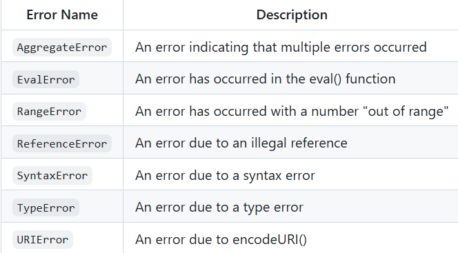

# What is a rest parameter
Rest parameter is an improved way to handle function parameters which allows us to represent an indefinite number of arguments as an array. 
```js
function sum(...args) {
  let total = 0;
  for (const i of args) {
    total += i;
  }
  return total;
}

console.log(sum(1, 2)); //3
console.log(sum(1, 2, 3)); //6
console.log(sum(1, 2, 3, 4)); //10
console.log(sum(1, 2, 3, 4, 5)); //15
```

# What is a spread operator
Spread operator allows iterables( arrays / objects / strings ) to be expanded into single arguments/elements.
```js
function calculateSum(x, y, z) {
  return x + y + z;
}

const numbers = [1, 2, 3];

console.log(calculateSum(...numbers)); // 6
```
## What are the differences between spread operator and rest parameter
`Rest` parameter collects all remaining elements into an array. Whereas `Spread` operator allows iterables( arrays / objects / strings )
to be expanded into single arguments/elements. i.e, Rest parameter is opposite to the spread operator.


# What are the different error names from error object



# Decorator
`decorator` is a  higher-order function that extends or modifies the behavior of another function, method, class, or property without
changing its source code.
```js
// Define a decorator function that adds a static property to a class
let variable = function(object) {
    object.property = 'characteristic';
};

// Apply the decorator to the class
@variable
class GFG {}

// Access the added property
console.log(GFG.property);
```


---------------
```js
console.log(+null); // 0
console.log(+undefined); // NaN
console.log(+false); // 0
console.log(+NaN); // NaN
console.log(+""); // 0

for (var i = 0; i < 4; i++) {
    // global scope
    setTimeout(() => console.log('-',i));
}

for (let i = 0; i < 4; i++) {
    // block scope
    setTimeout(() => console.log(i));
}
```

## Memoization
Memoization is a functional programming technique which attempts to increase a function’s performance by caching its previously computed results. Each time a memoized function is called, its parameters are used to index the cache. If the data is present, then it can be returned, without executing the entire function. Otherwise the function is executed and then the result is added to the cache. 
```js
const memoizeAddition = () => {
  let cache = {};
  return (value) => {
    if (value in cache) {
      console.log("Fetching from cache");
      return cache[value]; // Here, cache.value cannot be used as property name starts with the number which is not a valid JavaScript  identifier. Hence, can only be accessed using the square bracket notation.
    } else {
      console.log("Calculating result");
      let result = value + 20;
      cache[value] = result;
      return result;
    }
  };
};
// returned function from memoizeAddition
const addition = memoizeAddition();
console.log(addition(20)); //output: 40 calculated
console.log(addition(20)); //output: 40 cached
```
