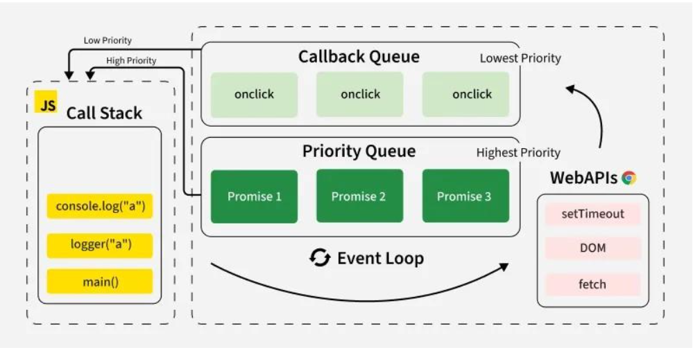
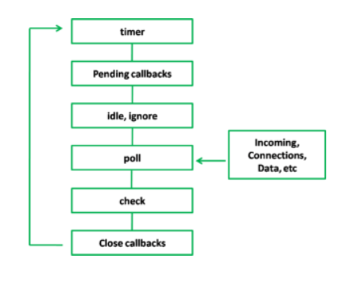

# Event Loop

JavaScript is **single-threaded**, can do one single thing at a time because it has only one call stack.
**JavaScript can do one single thing at a time** because it has only one call stack.

The event loop in Brouser is a core concept in JavaScript that enables non-blocking, asynchronous behavior. 

JavaScript event loop is responsible for managing the execution of code, collecting and processing events, and executing queued tasks. 
 The event loop ensures that tasks are executed in the correct order, enabling asynchronous programming.

### Call stack
The call stack is a mechanism that helps the JavaScript interpreter to **keeps track of the function calls in your code.**
Every time a script or function calls a function, it's **added to the top of the call stack.** Every time the function exits, the interpreter removes it from the call stack.
The order in which the stack processes each function call follows the **LIFO principle (Last In, First Out).** which means it always processes the call that is on top of the stack first.

### What is a callback?
A callback is a function that's passed as an argument to another function. The callback will usually be executed after the code has finished.
Calling setTimeout triggers the execution of **the web API, which adds the callback to the callback queue.**
The event loop then takes the callback from the queue and adds it to the stack as soon as it's empty.
Unlike the call stack, the callback queue follows the **FIFO order (First In, First Out)**, meaning that the calls are processed in the same order they've been added to the queue.

## What is the Event Loop?
**JavaScript event loop is responsible for managing the execution of code, collecting and processing events, and executing queued tasks.**
JavaScript operates in a single-threaded environment, meaning only one piece of code runs at a time. The event loop ensures that tasks are executed in the correct order, enabling asynchronous programming.

The JavaScript event loop takes the first call in the callback queue and adds it to the call stack as soon as it's empty.
If the call stack is currently executing some code, the event loop is blocked and won't add any calls from the queue until the stack is empty again.

### Components of the Event Loop
1. **Call Stack**: The call stack is a data structure that keeps track of the function calls in your code. It follows the Last In, First Out (LIFO) principle, meaning the most recently added function is executed first.
2. **Web APIs:** Provides browser features like setTimeout, DOM events, and HTTP requests. These APIs handle asynchronous operations.
3. **Task Queue (Callback Queue)**: Stores tasks waiting to be executed after the call stack is empty. These tasks are queued by `setTimeout`, `setInterval`, or other APIs.
4. **Microtask Queue**: A `higher-priority` queue for `promises` and `MutationObserver` callbacks. Microtasks are executed before tasks in the task queue.
5. **Event Loop**: Continuously checks if the call stack is empty and pushes tasks from the microtask queue or task queue to the call stack for execution.

## Types of Tasks in JavaScript
1. **Synchronous Tasks**: Executed immediately on the call stack.
2. **Microtasks**: High-priority asynchronous tasks, such as `Promise` callbacks and `queueMicrotask`.
3. **Macrotasks**: Lower-priority asynchronous tasks, like `setTimeout`, `setInterval`, and `DOM events.`

## Order of Execution
1. Synchronous code is executed first on the call stack.
2. Microtasks are executed next, before any macrotasks.
3. Macrotasks are executed last, after the microtask queue is empty.
4. The event loop continuously checks the call stack and queues to manage task execution.

# The memory `heap` and `stack`
## Stack: Static memory allocation
A stack is a data structure that JavaScript uses to store `static data`. Static data is data where the engine knows the size 
at compile time. In JavaScript, this includes` primitive values` (strings, numbers, booleans, undefined, and null) and `references`, which point to objects and functions.

The process of allocating memory right before execution is known as **static memory allocation.**

## Heap: Dynamic memory allocation
The heap is a different space for storing data where JavaScript stores **objects** and **functions**.
The engine doesn't allocate a **fixed amount of memory for these objects ( dynamic memory allocation)**.

----------------
# Node Js Event Loop
Node.js follows these steps to handle operations:
1. Execute the main script (synchronous code)
2. Process any microtasks (Promises, process.nextTick)
3. Execute timers (setTimeout, setInterval)
4. Run I/O callbacks (file system, network operations)
5. Process setImmediate callbacks
6. Handle close events (like socket.on('close'))

## How does Event Loop Work?
##### 1. Initialization
When Node.js starts, it loads the script, executes synchronous code, and registers any asynchronous tasks
#### 2. Event Loop Execution
- The call stack executes synchronous code first.
- Any asynchronous operations (setTimeout, fs.readFile, network requests) are delegated to libuv.
#### 3.Handles Asynchronous Operations with libuv
This library manages a thread pool that offloads heavy tasks (like file I/O, database operations, or network requests) 
that would otherwise block the event loop. The thread pool contains several threads that perform tasks like:
- File system I/O (fs.readFile)
- Network requests (HTTP, TCP, DNS)
- Timers (setTimeout, setInterval)
- Compression and cryptographic tasks
#### 4. Callback Execution
Once the thread pool completes its tasks, it sends callbacks to the event queue. The event loop processes these callbacks, but only when the call stack is empty .
#### 5. Event Loop Phases
The event loop goes through multiple phases
#### 6. Callback Execution from Event Queue
After the call stack is empty, the event loop picks tasks from the event queue and sends them to the call stack for execution.

### Event Loop Phases

**Between each phase, Node.js runs `microtasks` (Promises) and `process.nextTick` callbacks.**
The event loop processes different types of callbacks in this order:
1. **Timers**: setTimeout, setInterval
2. **I/O Callbacks**: Completed I/O operations
3. **Poll**: Retrieve new I/O events
4. **Check**: setImmediate callbacks
5. **Close Callbacks**: e.g., socket.on('close')

# Libuv and the Thread Pool
Node.js uses the `libuv` library, which provides cross-platform asynchronous I/O operations and manages a hidden **thread pool.**
- **Background processing**: Most I/O tasks are executed in the background by workers in this thread pool (which has a default size of 4 threads, configurable).
- **Completion and Callbacks**: Once an I/O operation in the thread pool is complete, libuv places the associated callback function into the task queue. 
