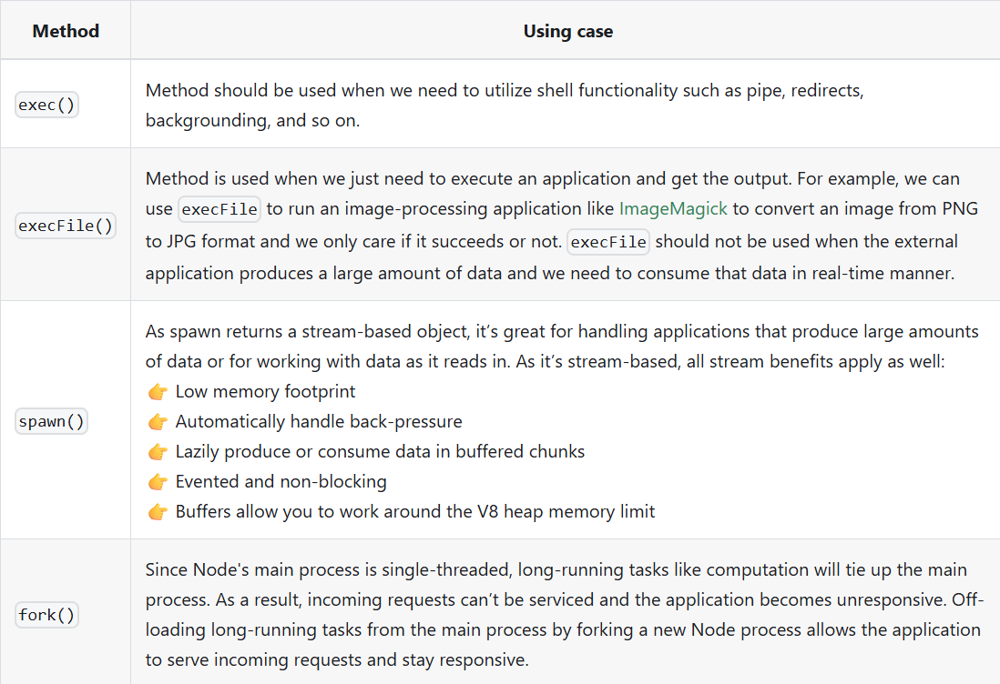

# Child Process
In Node.js, the `child_process` module allows you to create and manage child processes. This is useful for executing external commands, running scripts, or performing tasks in parallel.

There are 4 means of creating a child process:
- exec()
- execFile()
- fork()
- spawn()
## exeq()
This method will spawn a subshell and execute the command in that shell and buffer generated data.
```ts
const childProcess = require('child_process');

const execProcess = (command) => {
  childProcess.exec(command, (error, stdout, stderr) => {
    console.log(`stdout: ${stdout}`);
    console.log(`stderr: ${stderr}`);

    if (error !== null) {
      console.log(`error: ${error}`);
    }
  });
}

execProcess('node -v');
```
The method `exec()` accepts the following arguments:
- ` command`that will be run, with space-separated arguments
- `options `(optional)
- `callback `  (optional), which is called with the output when the process terminates.
  - `error` - error in JavaScript
  - `stdout` - the standard output stream, which is a source of output from the program
  - `stderr` - the standard error stream, which is used for error messages and diagnostics issued by the program
## execFile()
If you need to execute a file without using a shell, the `execFile()` function is what you need. It behaves exactly like the `exec()` function but does not use a shell, which makes it a bit more efficient.
```ts
const childProcess = require('child_process');

const execFile = (command, args) => {
  childProcess.execFile(command, args, (error, stdout, stderr) => {

    console.log(`stdout: ${stdout}`);
    console.log(`stderr: ${stderr}`);

    if (error !== null) {
      console.log(`error: ${error}`);
    }
  });
}

execFile('node', ['-v']);
```
## spawn()
The spawn method creates a new process by executing a command with stream manipulation. 
```ts
const childProcess = require('child_process');

const spawnProcess = (command, args) => {
  const process = childProcess.spawn(command, args);
  let fullData = '';
  let dataChunks = 0;

  process.stderr.on('data', (data) => {
    console.log(`stderr: ${data}`);
  });

  process.stdout.on('data', (data) => {
    fullData += data;
    dataChunks += 1;
    console.log(`stdout: ${data}`);
  });

  // end of data stream, there we can output the data
  process.stdout.on('end', () => {
    console.log(`end: ${fullData}`);
    console.log(`chunks: ${dataChunks}`);
  });

  // event when process is finished
  // there we can get to know with what code it was ended (0 - success, 1 - error)
  process.on('close', (code) => {
    console.log(`child process exited with code ${code}`);
  });
}

spawnProcess('node', ['-v']);
```
## fork()
The `fork()` method is a special case of `spawn() `where the parent and the child process can communicate with each other via `send()` (but child processes cannot communicate with each other).
```ts
//app.js
const { fork } = require('child_process');

const child = fork('./child.js');

child.on('message', (message) => {
  console.log('Parent process received:', message);
});

child.send({ hello: 'from parent process' });

child.on('close', (code) => {
  console.log(`child process exited with code ${code}`);
});

//child.js
process.on('message', (message) => {
  console.log('Child process received:', message);
});

process.send({ hello: 'from child process' });
```
```ts
Child process received: { hello: 'from parent process' }
Parent process received: { hello: 'from child process' }
```
## How to decide which method to use?




