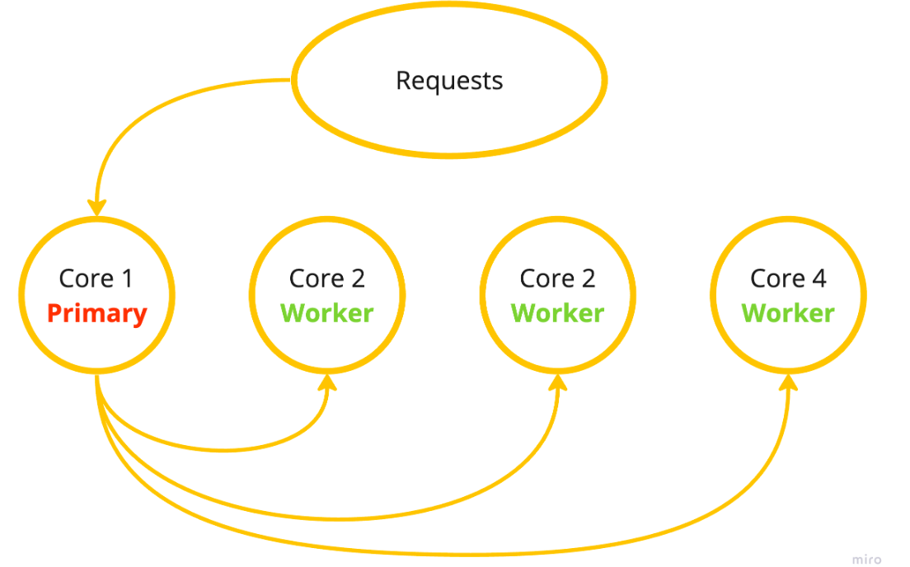

# Cluster
Node.js provides a module named `Cluster` for dividing a single process into several sub-processes, called workers.
Cluster module, complex processes can be divided into smaller, simpler processes, significantly speeding up the applications in Node.
### Why use a Cluster?
By nature, Node.js is a single-threaded language. It means that when you tell Node.js to read a file from the file system, it handles each of those instructions one at time, in a linear fashion.

Without Node.js Cluster all requests are forwarded to a single processor core, as illustrated on the image below:

The cluster module helps us to take advantage of the full processing power of a computer (server) by spreading out the workload of our Node.js application. For example, if we have an 8-core processor, instead of our work being isolated to just one core, we can spread it out to all eight cores.

Using cluster, our first core becomes the primary and all of the additional cores become workers. When a request comes into our application, the primary process performs a round-robin style check asking "which worker can handle this request right now?". The first worker that meets the requirements gets the request. Rinse and repeat.
