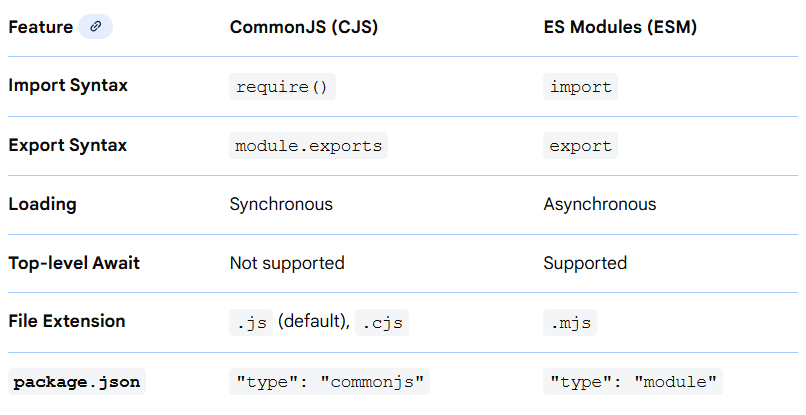

# Modules
`Modules` are reusable pieces of code that can be imported and used in different parts of a Node.js application. 
They help in organizing code, promoting reusability, and managing dependencies.

**Types of Modules:**
1. **Core (Built-in) Modules**: These are modules that come `pre-installed` with Node.js. They provide essential functionalities for building applications.
    - `fs`: For file system operations
    - `http`: For creating HTTP servers and clients.
    - `path`: For handling file paths.
    - `os`: For interacting with the operating system.
    - `events`: For event handling
    - `cluster`: For creating child processes to handle concurrent operations.
2. **Local (Custom) Modules**: These are modules that you write yourself. They are imported using a relative path (e.g., `require('./utils.js'`)).
3. **Third-party (External) Modules**: These are modules created by the community and can be installed via package managers.
    - `express`: A web framework for building web applications.
    - `lodash`: A utility library for working with arrays, objects, and functions.

## Module Systems
1. **ES6 Modules (ECMAScript Modules - ESM)**
      
ES6 modules use `import` and `export` statements to enable static, standardized module loading in JavaScript.
#### Use Cases of ES6 Modules
- Default Export and Import
```js
//greet.js
export default function greet(name) {
    return `Hello, ${name}!`;
}
import greet from './greet.js';
console.log(greet('Node.js'));
```
- Named Exports with Aliases
```js
export function multiply(a, b) {
    return 'Multiplication: ' + (a * b);
}

export function divide(a, b) {
    return 'Division: ' + (a / b);
}
import { multiply as mul, divide as div } from './operations.js';
console.log(mul(6, 3));
console.log(div(10, 2));
```
- Dynamic Imports
```js
export function add(a, b) {
    return a + b;
}

export function multiply(a, b) {
    return a * b;
}
async function loadMathModule() {
   const math = await import('./math.js'); // Dynamically imports the module
   console.log("Dynamic Imports Output:");
   console.log("Addition:", math.add(5, 3));
   console.log("Multiplication:", math.multiply(4, 3));
}

loadMathModule();
```
2. **CommonJS Modules (CJS)**
CommonJS modules use `require()` and `module.exports` for dynamic module loading in Node.js.



