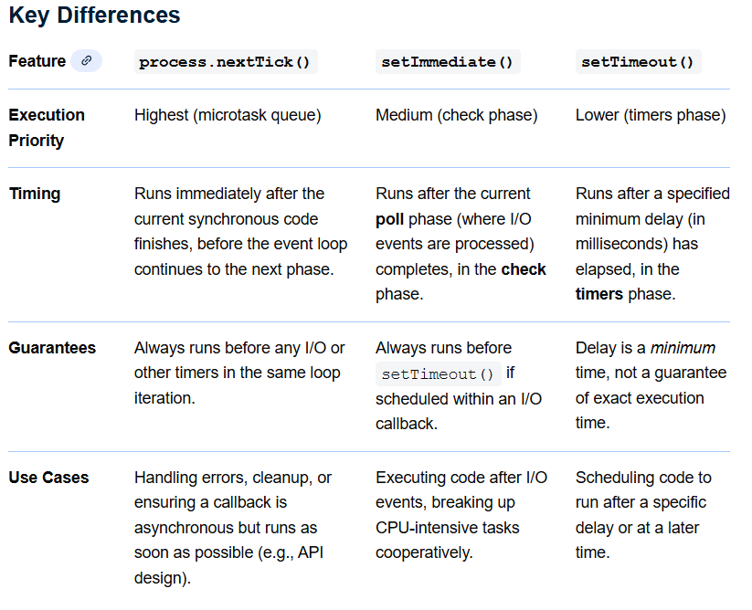

`## `process.nextTick()`
`process.nextTick()` is a Node.js function  that allows developers to schedule a callback to run **immediately after the current operation completes,**
and before the event loop continues to the next phase.
### Key Characteristics
- **High Priority**: They run before any `I/O events`, timers (`setTimeout()`, `setImmediate()`), or `Promise.then()` callbacks.
- **Microtask Queue**:  processed after the current JavaScript code finishes but before the main event loop continues to the next phase.
- **Non-Blocking (of the event loop phase)Non-Blocking (of the event loop phase)**
### When to Use It
1. **Control Execution Order**: You can ensure that your callbacks run **after the current call stack clears**, but **before** the event loop continues to the next phase (like I/O operations).
```js
console.log('Start of the script');

process.nextTick(() => {
    console.log('Executed with process.nextTick');
});

setTimeout(() => {
    console.log('Executed with setTimeout');
}, 0);

console.log('End of the script');

// Output:
// Start of the script
// End of the script
// Executed with process.nextTick
// Executed with setTimeout

```

## `setImmediate()`
`setImmediate()` schedules a callback to run after the current poll phase of the event loop. This means it will execute
after all the I/O events (like reading files or network requests) are completed.



#####  If we run a script `outside of an I/O cycle`, like in the main module, the order in which two timers are executed can be unpredictable because it depends on how fast the process is running.`
```js
// timeout_vs_immediate.js
setTimeout(() => {
  console.log('timeout');
}, 0);

setImmediate(() => {
  console.log('immediate');
});
// Possible Output:
//$ node timeout_vs_immediate.js
timeout
immediate

//$ node timeout_vs_immediate.js
immediate
timeout
```

##### If you put the two timer calls `within an I/O cycle`, the immediate callback will always be executed first.
```js
// timeout_vs_immediate.js
const fs = require('fs');

fs.readFile(__filename, () => {
  setTimeout(() => {
    console.log('timeout');
  }, 0);
  setImmediate(() => {
    console.log('immediate');
  });
});
// Output:
immediate
timeout
```