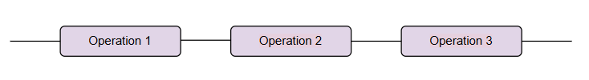
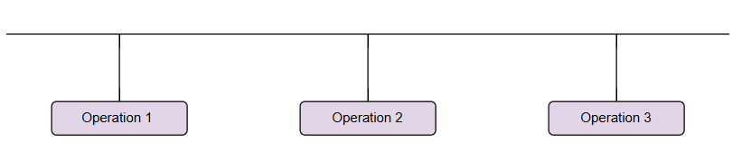
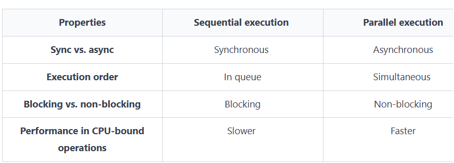

# Sequential execution
In Node.js, **sequential execution** means tasks run one after the other,
with the next task waiting for the current one to complete.
```js
async function fetchSequentially() {
  try {
    const response1 = await fetch("https://randomuser.me/api/?results=10");
    const data1 = await response1.json()
    console.log("response fetch1", data1);

    const response2 = await fetch("https://randomuser.me/api/?results=9");
    const data2 = await response2.json()
    
    console.log("response fetch2", data2);
  } catch (error) {
    console.error("error fetch", error);
  }
}

fetchSequentially();
```


# Parallel execution
**Parallel** execution divides tasks into multiple portions and executes each of them simultaneously on different processors.
```js
async function fetchInParallel() {
  try {
    const fetch1 = fetch("https://randomuser.me/api/?results=10");
    const fetch2 = fetch("https://randomuser.me/api/?results=9");

    const [response1, response2] = await Promise.all([fetch1, fetch2]);
    
    const data1 = await response1.json()
    const data2 = await response2.json()
    
    console.log("response fetch1", data1);
    console.log("response fetch2", data2);
  } catch (error) {
    console.error("error fetch", error);
  }
}

fetchInParallel();
```


## Key differences
