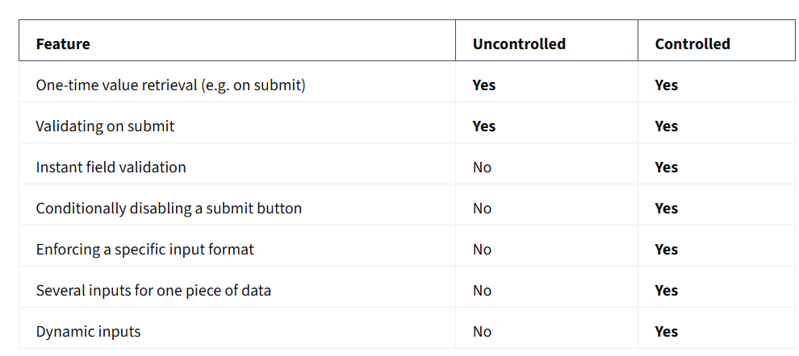

# Component
**Class Component**  is the base class for the React components. Need to extend the built-in **Component class** and define a **render** method:

#### props
The props passed to a class component as `this.props`.

#### state 
The `state` field must be an object.The state of a class component is available as `this.state`.
Do not mutate the state directly. If you wish to change the state, call `setState`.

#### constructor(props)
The `constructor` runs before your class component mounts.Constructor is only used for two purposes in React. It lets you declare state and bind your class methods to the class instance.
**constructor should not return anything.**
- Do not run any side effects or subscriptions in the constructor. Instead, use `componentDidMount` for that.
- Inside a constructor, you need to call `super(props)` before any other statement. If you don’t do that, `this.props` will be `undefined`
- Constructor is the only place where you can assign `this.state` directly. In all other methods, you need to use `this.setState()` instead. Do not call `setState` in the constructor.
- When you use server rendering, the constructor will run on the server too, followed by the render method. However, lifecycle methods like `componentDidMount` or `componentWillUnmount` will not run on the server.

### componentDidCatch(error, info)
If you define `componentDidCatch`, React will call it when some child component (including distant children) throws an error during rendering.

### componentDidMount()
If you define the `componentDidMount` method, React will call it when your component is added (mounted) to the screen. This is a common place to start data fetching, set up subscriptions, or manipulate the DOM nodes

If you implement `componentDidMount`, you usually need to implement other lifecycle methods to avoid bugs. For example, if `componentDidMount` reads some state or props, you also have to implement `componentDidUpdate` to handle their changes, and `componentWillUnmount` to clean up whatever `componentDidMount` was doing.

`componentDidMount` should not return anything.

### componentDidUpdate(prevProps, prevState, snapshot?)
If you define the `componentDidUpdate` method, React will call it immediately after your component has been re-rendered with updated props or state.  T
You can use it to manipulate the DOM after an update.

Typically, you’d use it together with `componentDidMount` and `componentWillUnmount`.
`componentDidUpdate` should not return anything.

### componentWillUnmount()
React will call it before your component is removed (unmounted) from the screen. This is a common place to cancel data fetching or remove subscriptions.

### forceUpdate(callback?) 
f your component’s render method only reads from `this.props`,`this.state`, or` this.context`, it will re-render automatically when you call `setState`

if your component’s render method reads directly from an external data source, then use `forceUpdate `.

### getSnapshotBeforeUpdate(prevProps, prevState)
If you implement `getSnapshotBeforeUpdate`, React will call it immediately before React updates the DOM.


# Function Components
Components is an independent and reusable piece of code that forms as the basis of react application.

Syntax: Function components are defined using the function keyword or arrow function syntax.
FunctionComponent that takes props as input and returns JSX elements.

***State Management:*** Traditionally, function components were stateless and couldn't hold their own state.
Function components can now manage state using Hooks (`useState, useContext`).

***Lifecycle Methods:*** Function components don't have lifecycle methods.
With React Hooks, you can use the `useEffect` Hook to replicate 
lifecycle behavior (like `componentDidMount`, `componentDidUpdate`, `componentWillUnmount`).

## Pure components

`Pure components` are the components which render the same output for the same state and props. In function components, you can achieve these pure components through memoized **React.memo()** API wrapping around the component. 

But at the same time, it won't compare the previous state with the current state because function component itself prevents the unnecessary rendering by default when you set the same state again.


---------------------------------------------------


#  Higher-Order Components (HOCs) 
A *Higher-Order Component (HOC)* is just a function that takes a component and returns a *new* component with extra features. 
Think of it like a *wrapper* that adds functionality without changing the original component.
```ts
import React from "react";

const withRandomColor = (WrappedComponent) => {
  const colors = ["red", "blue", "green", "purple", "orange"];
  const randomColor = colors[Math.floor(Math.random() * colors.length)];

  return (props) => (
    <div style={{ color: randomColor }}>
      <WrappedComponent {...props} />
    </div>
  );
};

export default withRandomColor;
```


# Controlled vs. Uncontrolled Components
1. *Controlled Components:* The state is managed by React.
```js
//Controlled inputs accept their current value as a prop and a callback to change that value.
const Form = () => { 
 const [value, setValue] = useState(""); 

 const handleChange = (e) => { 
   setValue(e.target.value) 
 } 

 return ( 
   <form> 
     <input 
       value={value} 
       onChange={handleChange} 
       type="text" 
     /> 
   </form> 
 ); 
}; 
```
2. *Uncontrolled Components:* The state is managed by the DOM (not React).
```js
// ref is used to access the value of the input whenever the form is submitted.
const Form = () => { 
 const inputRef = useRef(null); 

 const handleSubmit = () => { 
   const inputValue = inputRef.current.value; 
 } 
 return ( 
   <form onSubmit={handleSubmit}> 
     <input ref={inputRef} type="text" /> 
   </form> 
 ); 
}; 
```

# Portals — Rendering Outside the Root Element
By default, React components render inside a single root div (<div id="root">). But sometimes, we need to render elements outside the root—for example, modals.

*Step 1:* Add a Separate div in index.html
```js
<div id="modal-root"></div>
```
*Step 2:* Create a Modal Component
```js
import React from "react";
import ReactDOM from "react-dom";

const Modal = ({ children }) => {
  return ReactDOM.createPortal(
    <div style={{ position: "fixed", top: "30%", left: "30%", background: "white", padding: "20px", border: "1px solid black" }}>
      {children}
    </div>,
    document.getElementById("modal-root")
  );
};

export default Modal;
```
*Step 3:* Use It in a Component
```js
import React, { useState } from "react";
import Modal from "./Modal";

const App = () => {
  const [isOpen, setIsOpen] = useState(false);

  return (
    <>
      <button onClick={() => setIsOpen(true)}>Open Modal</button>
      {isOpen && (
        <Modal>
          <p>This is a modal</p>
          <button onClick={() => setIsOpen(false)}>Close</button>
        </Modal>
      )}
    </>
  );
};

export default App;
```


