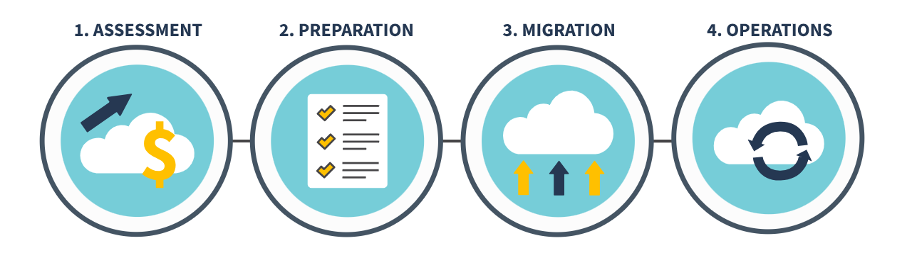
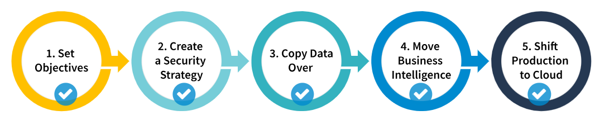
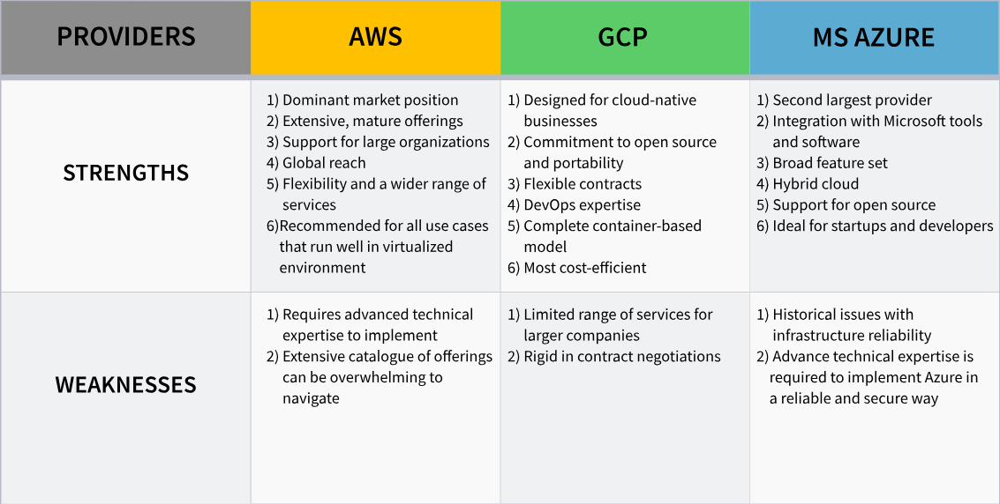

<h1>WHAT IS THE CLOUD?</h1>

<b>The cloud</b> provides a way of abstracting, pooling, and sharing computing resources—like servers, switches, routers, 
operating systems, and security software—across a network of devices on or off the premises. <b>Cloud computing</b> refers to the use of these resources over the Internet. 
Typically, users rent computational resources like storage space or CPU power, while the cloud provider actively manages the hardware (e.g. storage drives and servers) that provide those computational resources. Cloud providers also offer higher level services that analyze data,
support disaster recovery, or act as development environments—all of which run on cloud provider hardware

<h3>Main characteristics and benefits of cloud computing.</h3>
<ol>
    <li>
<b>Cost Efficiency:</b> Cloud computing provides a pay-as-you-go or consumption-based pricing model. Rather than paying upfront for a predefined amount of computing resources or hardware, you can rent what you need and pay only for the resources you use.
        This consumption-based model offers many benefits:
        <ul>
            <li>No up-front costs</li>
            <li>No need to purchase, understand, or manage costly infrastructure</li>
            <li>The ability to scale resources up and down, based on need</li>
            <li>The ability to change your mind about resource types or sizing</li>
        </ul>
    
Once a project is up and running, the cloud vendor should provide cost reporting, cost predictions based on current trends, and cost modeling based on historical data. As your service stabilizes, you may be able to further optimize costs by committing to a minimum spend or even reserving resources.

    </li>
    <li>
        
<b>Scalability:</b> is the ability to increase or decrease IT resources as needed to meet changing demand. Both vertical and horizontal scaling are supported in the cloud, depending on your client’s needs.

        <ul>
            <li>Vertical scaling involves increasing the size of each resource—for example, adding more CPU power or memory to existing servers.</li>
            <li>Horizontal scaling involves adding more resources to your existing clusters—most likely of the same size as existing servers.</li>
        </ul>
    </li>
    <li>
        
<b>Elasticity:</b> Here, elasticity refers to the ability to provide or remove resources on demand as your organization's needs change. Through a process called "auto-scaling," a cloud computing system can automatically add or remove resources to compensate for fluctuations in workload. 

    </li>
    <li>
        
<b>Service variety:</b> Cloud provider services can vary significantly and encompass a wide variety of capabilities. Cloud providers can be used for traditional IT infrastructures such as servers, storage, and networks. They also offer more advanced services and frameworks like artificial intelligence (AI) and the Internet of Things (IoT).

    </li>
    <li>
        
<b>Reliability:</b> The cloud provides a sense of confidence that your servers and data will always be there. Cloud computing providers offer data backup, disaster recovery, and data replication services to make sure your data is always safe.
In addition, cloud providers offer various resilience options for your servers: They provide data and insights to help monitor applications, respond to performance changes, and give a unified view of operational health.

    </li>
    <li>
        
<b>Security:</b> Cloud providers help your organization maintain a high level of security. Through a broad set of policies, technologies, controls, and expert technical skills, cloud providers offer a much better security toolkit than most organizations could achieve on premises

    </li>
</ol>
<h3>Deployment Models</h3>

Deployment models can differ in terms of location and owner. Maximizing the benefits of the cloud requires choosing the correct cloud model for your workloads and data.

<ol>
    <li><b>Private Cloud</b>
Private cloud service runs on dedicated hardware. It often serves as a bridge between the public cloud and legacy on-premises systems. A private cloud's capacity is static, based on how much storage has been paid for;
</li>
    <li><b>Public Cloud</b>
Public clouds do not require an independent data center space for system maintenance or the purchase of hardware or software. Moving to a public cloud is an economical solution for organizations seeking to avoid capital expenses. However, if you are considering migration, you will want to thoroughly assess your cloud provider's security model; the public cloud is only a good deal if it keeps your data secure.
</li>
    <li><b>Hybrid Cloud</b>
Hybrid clouds are computing environments that use a mixture of on-premises data storage, private cloud, and third-party public cloud services. These environments work together to perform a single task. 
</li>
    <li><b>Multi-cloud</b>
Multi-cloud is a strategy in which multiple computing and storage services are used in a single heterogeneous architecture. It aims to distribute cloud assets, software, and applications across several cloud-hosting environments, eliminating the need to rely on a single provider.
</li>
</ol>
<h1>Service models</h1>
<ol>
    <li><b>Infrastructure as a Service (IaaS): </b> It provides access to the hardware needed to run applications. IaaS essentially replicates a data center using on-prem legacy hardware in a cloud. Companies who opt to run solely on an IaaS computing model choose to do the heavy lifting of designing and maintaining their cloud service.</li>
    <li><b>Platform as a Service (PaaS): </b> Platform as a service offers an additional layer of abstraction over IaaS, providing necessary components beyond infrastructure. The platform layer typically includes operating systems, pre-built development tools, testing, runtime, middleware, and databases.</li>
    <li><b>Software as a Service (SaaS): </b> Software as a service delivers an entire software stack to users, who typically just pay for the subscription. The SaaS model requires no application coding and no hosting infrastructure. The provider is 100% responsible for system updates, security, and any other essential tasks. </li>
</ol>
<h2>WHEN TO USE SAAS, PAAS, AND IAAS</h2>

<ul>
    <b>Use SaaS</b>
    <li>For standard solutions requiring a low level of customization and internet access via multiple device types</li>
    <li>When you don't have the skills internally to install, run, and manage the software</li>
    <li>When it's more cost effective to let a specialist run the software</li>
    <li>When you're happy with the SaaS provider's data privacy, service and configuration/integration options</li>
</ul>
<ul>
    <b>Use PaaS</b>
    <li>When developers are comfortable using standardized building blocks</li>
    <li>When developers require the specialized capabilities it provides but no internal team wants to own the service</li>
    <li>For services outside your core business area, such as automation, deployment and monitoring</li>
</ul>
<ul>
    <b>Use IaaS</b>
    <li>When you need control over your high-performing applications</li>
    <li>When you don’t have the finances to invest in hardware</li>
    <li>When you want to purchase only what you consume or need</li>
    <li>When you need to be able to change out specific hardware and software easily</li>
</ul>

<ul>
    <b>Don't Use SaaS</b>
    <li>When you need a high level of configuration, customization, or specialist integrations</li>
    <li>When you can run it yourself more effectively</li>
    <li>When you have compliance requirements that don’t permit outside hosting</li>
    <li>When extensive experience of business process customization is required</li>
</ul>
<ul>
    <b>Don't Use PaaS</b>
    <li>If your project needs proprietary building blocks</li>
    <li>When you are using low level or legacy languages for development</li>
    <li>If the application requires you to customize hardware and software</li>
    <li>When applications generate a transaction volume that might make PaaS services cost prohibitive</li>
</ul>
<ul>
    <b>Don't Use IaaS</b>
    <li>If you are not interested in or able to handle the management of a virtual machine</li>
    <li>If the vendor does not meet your security standards</li>
</ul>
<h1>Cloud Ownership</h1>
<h2>ADOPTING A CLOUD SOLUTION</h2>

Cloud transformation is unique to every organization and requires a close examination of goals, data, and applications 
While organizations are unique, cloud transformation should follow the same vital steps: assessment, preparation, migration, and operation.

<h3>ASSESSMENT: CLOUD ECONOMICS</h3>

The first step is assessing the company’s needs and checking if moving to cloud would be economically beneficial.
In its most basic form, cloud economics is the study of the concepts, costs, and benefits of cloud computing.

<h4>Total Cost of Ownership</h4>

<b>The total cost of ownership</b> in cloud computing refers to the total cost of implementing, running, and provisioning cloud infrastructure.
TCO analysis helps organizations find out the difference between how much it takes to run current on-premises systems versus how much cloud adoption and operation would cost.
Besides that, an organization needs to capture all of the hidden and intangible costs of its current infrastructure and of a possible cloud solution.

<ul>
    <li><b>Cost of the current data center:</b>The first step is to estimate how much time, money and infrastructure is currently required in running a data center. To do it precisely, a company needs to make sure to include all aspects.</li>
    <li><b>Cost of the estimated cloud infrastucture:</b>After identifying the cost of the current data center, a company needs to figure out how much cloud infrastructure will cost.</li>
    <li><b>Cost of cloud migration execution: </b> the costs of implementing the IT operations migration to the cloud.</li>
    <li><b>Additional post-migration cost: </b>Many cloud providers charge a monthly infrastructure fee to keep a cloud environment running smoothly</li>
</ul>
<h3>PREPARATION: CLOUD MIGRATION STRATEGY</h3>
<h4>What Is Cloud Migration?</h4>

<b>Cloud migration</b> involves moving your applications and data store from on-premises hosting sites to the cloud. Cloud migration is similar to a physical relocation but instead of packing and transferring real objects, 
it entails moving data, apps, and IT processes from one data center to another. 

<b>A cloud migration strategy </b> provides the roadmap for getting this done and offers various benefits to organizations.

<h4>Considerations in Cloud Migration</h4>

When you migrate products to the cloud, you discover a new range of possibilities—previously unimaginable ways to interact with customers, use and share data, and design and develop products. 

When you or your clients prepare for the migration process, think about the questions below when building a strategy.

    <ol>
        <li>What do you gain from and lose becaouse of migration?</li>
        <li>Which cloud provider suits best?</li>
        <li>Which option hase a sufficient security level?</li>
        <li>How much agility is necessery?</li>
    </ol>
<h3>MIGRATION: APPROACHES</h3>

Cloud migration takes many different forms, and solutions may be a hybrid of several approaches.
Gartner defined seven application modernization approaches to cloud migration situations from the simplest to the most complex. 

<h4>Gartner 7Rs</h4>
<ol>
    <li><b>Retain: </b>Also known as “encapsulating,” is used when it is best to leave the application running “as-is” rather than modernizing it. It usually applies to legacy applications with constraints preventing their migration to a cloud. </li>
    <li><b>Rehost: </b>Also known as “encapsulating,” is used when it is best to leave the application running “as-is” rather than modernizing it. It usually applies to legacy applications with constraints preventing their migration to a cloud. This “no-code” approach is an effective way to get to the cloud quickly with minimal effort and cost. </li>
    <li><b>Repratform: </b>Also known as “lift and reshape,” replatforming is a relatively low-touch cloud migration approach.Application code changes are limited to what is necessary to adapt to the new platform.</li>
    <li><b>Refactor: </b>Refactoring involves optimizing existing code while retaining its external behavior.</li>
    <li><b>Rearchitect:</b>Also known as re-engineering.It is a significant body of work requiring time, money, and skilled and knowledgeable people. As a result, it gives better scalability and performance due to overarching changes in applications.</li>
    <li><b>Rebuild: </b>Rebuilding an application is rewriting it from scratch.</li>
    <li><b>Replace: </b>Also known as “drop and shop,”.The Rebuild and Replace approaches share the same drivers and both result in creating a new way to deliver the required functionality.</li>
</ol>
<h3>MIGRATION: PROCESS</h3>

ach company's needs are unique, cloud migrations will follow a slightly different path every time. 

<h3>CLOUD OPERATIONS</h3>

<b>Cloud Operations</b>or CloudOps is a term that refers to the network, security, performance, device management, help desk, and other responsibilities that keep cloud-native apps and underlying infrastructure fully operational.
As opposed to traditional operations, CloudOps tools and skill sets align more closely with development. They rely on automation with a focus on prevention and proactive mitigation rather than reactive detection and reporting. 

<h3>CLOUDOPS BEST PRACTICES</h3>
<ul>
<li><b>Ensure Transparency:</b> Your security or governance team must understand every aspect of your cloud journey. If teams fail to collaborate, they'll complicate the adoption process, and the final effect will be a lack of transparency and organizational cohesion. Instead of introducing more limitations, establish and implement appropriate guidelines from the start.</li>
<li><b>Automate Security: </b>Implement automation processes and test the configuration of cloud resources to reduce security concerns. As the organization's cloud footprint expands and evolves, automating security assessments and having clear compliance procedures assures consistency.</li>
<li><b>Implement Redundancy: </b>Continuous operations and minimal downtime are some of the goals of the CloudOps philosophy. Using automation and redundancy at both the cloud provider and application layers ensures that the application remains available despite updates or software changes.</li>
<li><b>Improve continuously: </b>An effective CloudOps strategy isn't a one-size-fits-all solution that can be implemented in just one step. The ultimate goal is to combine numerous teams with various skill sets into a fully integrated operation. To do so, you'll need to continuously work on communication methods, tools, processes, and budget management. Make a strategy for not only the first transition time but also future optimization possibilities.</li>
</ul>

<h1>PUBLIC CLOUD PLATFORMS
</h1>

Currently the top three cloud providers in the world are <b>Amazon Web Services, Google Cloud Platform, and Microsoft Azure.</b> These three platforms have some common features, such as auto-scaling, security, and compliance. 

<h2>AWS</h2>

Amazon was the first company to offer cloud infrastructure to developers at other companies.
The company offers a complete range of IaaS and PaaS services. Among the most popular are its Elastic Beanstalk, Elastic Block Store (EBS), Glacier storage, Relational Database Service (RDS), and DynamoDB NoSQL database. It also offers cloud services related to networking, analytics and machine learning, the Internet of Things (IoT), mobile services, development, cloud management, cloud security and more.

Two of the earliest AWS offerings are still among their most well-known,<b>Amazon Simple Storage Service (S3) and Amazon Elastic Compute Cloud (EC2).</b> 

<ul>
<li><b>S3 </b>is like a developer's version of Dropbox that can automatically scale across millions of gigabytes.</li>
<li><b>EC2</b> allows teams to rent machine instances that are analogous to setting up physical machines, but without the physical effort or up-front hardware purchases.</li>
</ul>

<b>AWS Lambda </b>is an event-driven, serverless computing platform service that runs code in response to events. Lambda costs less to maintain and operate than EC2, but the former is not suitable for code that runs longer than a few minutes, and migrating on-premises applications to 
Lambda will likely require significant code rewrites and testing.Over the years, Amazon has developed an ecosystem around their cloud offerings. Plus, Amazon launches new cloud features and changes at a fast pace, so there's always something new to consider.

<h2>GCP</h2>

Google has a reputation for designing simple-to-use consumer products that are also technically advanced.
Like Amazon and Microsoft, Google offers an extensive range of IaaS and PaaS services that span compute, storage, networking, big data, machine learning, developer tools and security. 
Some of its best-known cloud offerings include <b>Compute Engine, App Engine, Container Engine, Cloud Storage and BigQuery.</b>

When the millennial Snapchat founder started building their app in 2011, they found AWS too overwhelming and decided to use Google App Engine instead. 
Google had also created and/or contributed to many of the most popular open source projects, and it infuses its cloud offerings with that expertise. The big data capabilities are augmented by Google’s inexpensive cloud storage, which makes this cloud platform cost effective for storing large volumes of data.

<h2>MS AZURE</h2>

MS Azure cloud portfolio is exhaustive: in addition to its Azure IaaS and PaaS offerings, Microsoft also has several SaaS offerings, including its Office 365 products, the online versions of its Dynamics line of enterprise software and its online developer tools

<b>Azure Cosmos DB  </b>is one of the most popular cloud computing services offered by Azure. This fully managed NoSQL database service is designed to ensure single-digit millisecond response times. Businesses leverage this service to facilitate faster writes and reads across the globe.

Azure also has a wide range of networking capabilities, including support for multiple site-to-site connections and virtual networks, as well as the ability to connect virtual networks to each other across different regions.
Finally, Microsoft Azure has a very vibrant ecosystem of partnerships with other technology vendors. For example, it has relationships with Red Hat, Canonical, Citrix, HPE, Adobe, SAP, Cisco and many others, that enhance the services it is able to offer customers.

<h1>POPULAR CLOUD SERVICES
</h1>
<ul>
<b>Cloud Options for SQL Databases</b>
<li>Amazon Aurora</li>
<li>Azure SQL Database</li>
<li>Google Cloud SQL</li>
</ul>
<ul>
<b>Cloud Services for Storage</b>
<li>Amazon S3</li>
<li>Azure Blob Storage</li>
<li>Google Cloud Storage</li>
</ul>
<ul>
<b>Cloud Migration Solutions</b>
<li>Amazon EC2</li>
<li>Azure Virtual Machines</li>
<li>Google Compute Engine</li>
</ul>

<h1>KEY TAKEAWAYS
</h1>

Cloud computing allows pooling and sharing such resources as servers, operating systems, and software and using them 
over the Internet. Clouds are attractive for users as they are cost-efficient, flexible to one's needs, and reliable. Cloud technologies can be deployed on dedicated hardware and software, operated by a cloud provider, and combine characteristics based on the company's demands and possibilities.
There are several cloud service models, and three of the most commonly used are infrastructure-as-a-service (Iaas), platform-as-a-service Paas), and software-as-a-service (Saas). They differ in which parts of the service you and the cloud service provider are responsible for.

<ul>
<li>In Iaas, the vendor manages only hardware and virtualization, leaving the rest up to you.</li>
<li>In Paas, you manage configuration, functionality, and scaling, but your vendor operates other things.</li>
<li>In Saas, users have access to a whole software stack for the price of a subscription. You only manage the configuration.</li>
</ul>

