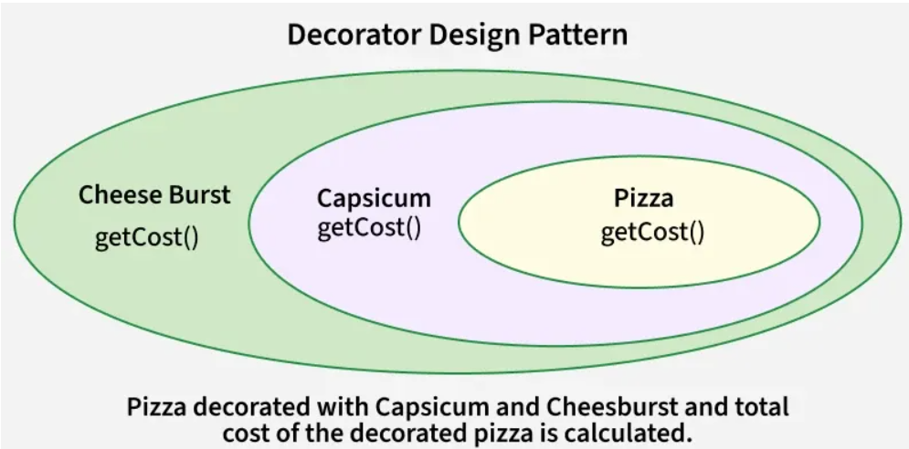

# Structural Pattern
## Decorator
`Decorator` is a structural design pattern that lets you attach new behaviors to objects by placing these objects inside special wrapper objects that contain the behaviors.

- This represents Pizza as the base component.
- Capsicum acts as the first decorator, wrapping the pizza and adding its own cost using getCost().
- Cheese Burst is another decorator that wraps the previous layer and adds additional cost.
- The final price is calculated as Pizza + Capsicum + Cheese Burst, demonstrating how the Decorator Pattern adds behavior dynamically.

#### Real-World Examples
**Coffee Shop Application:** A basic coffee object is enhanced with add-ons like milk, sugar, or whipped cream. Each add-on acts as a decorator that dynamically adds cost and behavior.
```js
class Coffee {
    getDescription() {
        throw new Error('Method not implemented.');
    }

    getCost() {
        throw new Error('Method not implemented.');
    }
}

class PlainCoffee extends Coffee {
    getDescription() {
        return 'Plain Coffee';
    }

    getCost() {
        return 2.0;
    }
}

class CoffeeDecorator extends Coffee {
    constructor(decoratedCoffee) {
        super();
        this.decoratedCoffee = decoratedCoffee;
    }

    getDescription() {
        return this.decoratedCoffee.getDescription();
    }

    getCost() {
        return this.decoratedCoffee.getCost();
    }
}

class MilkDecorator extends CoffeeDecorator {
    getDescription() {
        return this.decoratedCoffee.getDescription() + ', Milk';
    }

    getCost() {
        return this.decoratedCoffee.getCost() + 0.5;
    }
}

class SugarDecorator extends CoffeeDecorator {
    getDescription() {
        return this.decoratedCoffee.getDescription() + ', Sugar';
    }

    getCost() {
        return this.decoratedCoffee.getCost() + 0.2;
    }
}

function main() {
    // Plain Coffee
    let coffee = new PlainCoffee();
    console.log('Description: ' + coffee.getDescription());
    console.log('Cost: $' + coffee.getCost());

    // Coffee with Milk
    let milkCoffee = new MilkDecorator(new PlainCoffee());
    console.log('\nDescription: ' + milkCoffee.getDescription());
    console.log('Cost: $' + milkCoffee.getCost());

    // Coffee with Sugar and Milk
    let sugarMilkCoffee = new SugarDecorator(new MilkDecorator(new PlainCoffee()));
    console.log('\nDescription: ' + sugarMilkCoffee.getDescription());
    console.log('Cost: $' + sugarMilkCoffee.getCost());
}

main();
```
Output:
```js
Description: Plain Coffee
Cost: $2

Description: Plain Coffee, Milk
Cost: $2.5

Description: Plain Coffee, Milk, Sugar
Cost: $2.7
```


## Proxy
